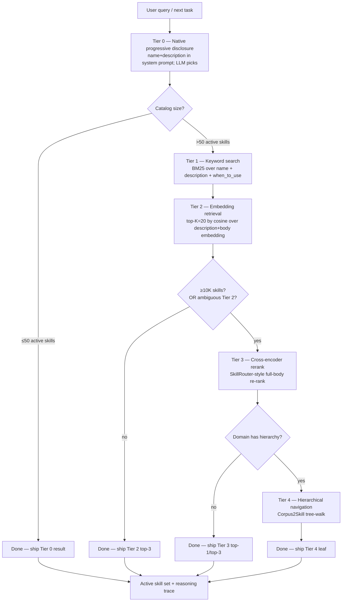

# 180 — Argus: A State-of-the-Art Skill-Loading Agent — Design Plan

> **Comprehensive design spec for a specialized agent whose entire job is finding the right skills for the right task at the right time.** Built directly on the literature surveyed in [docs/173–179](173-offline-sim-skill-discovery.md), with explicit countermeasures for every failure mode I've been able to identify in the current generation of skill-routers (including Claude Code's own progressive-disclosure router).

**Status.** Plan, not implementation. Read end-to-end; approve scope; then implementation lands as a new shared package + thin adapters per [§9](#9--integration-points-polaris-lyra-harness-skills).

**Reading order.** Skim §1 (motivation); read §2 (identity) and §3 (the capability matrix you asked for); spend time in §4 (architecture) and §5 (failure-mode awareness — the long list); skim §6-9 (implementation phases + integration); decide on §10 (success criteria + bright-lines).

---

## §1 — Why this agent, and why now

The skill ecosystem has crossed a structural threshold:

- **22,000+ Claude Code-format skill repositories** on GitHub ([docs/176](176-skill-discovery-curator-oss-landscape-may-2026.md) §B.5).
- **25,000+ MCP servers** indexed across Glama / Smithery / Official Registry / MCPfinder.
- **1,000–1,400 skills** in each of the major awesome-lists (`VoltAgent`, `ComposioHQ`, `sickn33`).
- **Anthropic Claude Code** (the de-facto reference) starts truncating skill descriptions at ~50 active skills on a 200K-context model and routes purely on description match — and as the SkillRouter paper showed, **routing on description alone vs. full body costs 31–44 percentage points of accuracy** ([docs/179](179-skill-retrieval-routing-and-activation.md) §5).

The user's lived complaint — *"Claude Code's skill loading is quite stupid; it doesn't get the necessary skills for the step needed"* — is the empirical reality of progressive disclosure at scale. Not a bug; a structural ceiling of the description-only approach when the catalog passes ~50 entries.

**Argus closes that ceiling.** It is a specialized agent — *not* a fixed library, *not* a feature of an existing harness — whose entire mandate is *the activation surface*: which skills should be in the active context for the next turn, what the trust verdict is on each, what to refine, what to retire. Argus replaces description-only routing with a layered ladder (native progressive disclosure → keyword index → embedding retrieval → cross-encoder rerank → hierarchical navigation), governs catalog hygiene continuously (drift, rot, vulnerability, telemetry), and exposes itself as both a callable library *and* a Claude Code-native SKILL that any harness can invoke.

---

## §2 — Agent identity

### Name

**Argus** (Greek: Ἄργος, "watcher", "all-seeing"). The hundred-eyed guardian. Two reasons:

1. The metaphor is precise — a router for thousands-of-skills catalogs needs many simultaneous *eyes* (keyword index, embedding index, telemetry, vulnerability scanner, drift monitor).
2. The name slot is unused in the workspace project list (`aegis-ops`, `atlas-research`, `cipher-sec`, `gnomon`, `harmony-voice`, `helix-bio`, `lyra`, `mentat-learn`, `open-fang`, `orion-code`, `polaris`, `quanta-proof`, `syndicate`, `vertex-eval`).

### Mandate (one-paragraph)

Argus is the specialised agent responsible for **deciding which skills enter the active context on any given turn**, across any catalog the host harness has access to (local SKILL.md, MCP registries, marketplace pulls, awesome-list aggregations). It owns five duties: (1) **discovery** — index every reachable skill, online + offline; (2) **routing** — pick the right skill for the task using a layered keyword → semantic → rerank → navigate ladder; (3) **curation** — score every skill on trust, vulnerability, telemetry, and drift; (4) **refinement** — periodically rewrite stale descriptions, demote rotted skills, re-validate against held-out tests; (5) **governance** — enforce per-load cost / privacy / latency budgets and the [docs/175](175-agent-skills-ecosystem-and-security.md) four-tier trust framework.

### Position in the workspace

- **Core implementation**: top-level project at `projects/argus/` (sibling to `projects/polaris/`, `projects/lyra/`, etc.). The Python module remains importable as `harness_skill_router` — the *project* is named Argus; the *library* keeps its descriptive name.
- **Agent persona**: a Claude Code-format skill at `argus/SKILL.md` that orchestrates calls into the library — recursive in the best sense (the *skill that finds skills*).
- **Per-harness adapters**: `lyra-skills/argus_adapter.py`, `polaris-skills/argus_adapter.py` — thin glue.
- **Distribution**: published as a Claude Code skill under the agentskills.io standard so it round-trips across the 26+ adopting platforms ([docs/176](176-skill-discovery-curator-oss-landscape-may-2026.md) §B.1).

### Persona note

Argus is *opinionated*. It refuses to load skills that fail the vulnerability scanner. It demotes skills it has watched fail over time. It rewrites skill descriptions whose keyword density has rotted. It will tell the host harness *no* — and explain why — when a request would exceed the cost envelope. It is not a passive router; it is a guardian.

---

## §3 — Capability matrix

Every capability you explicitly asked for, plus 20+ I'm proposing on top. Marked **(asked)** for capabilities you named, **(proposed)** for additions.

### 3.1 — Discovery

| # | Capability | Mode | Asked / proposed |
|---|---|---|---|
| D1 | **Offline catalog scan** of local SKILL.md folders | offline | (asked) |
| D2 | **Online runtime discovery** via filesystem watch + `tools/list_changed` | online | (asked) |
| D3 | **MCP registry pull** (Glama, Smithery, Official Registry, MCPfinder) | online | (proposed) |
| D4 | **Awesome-list pull** (VoltAgent, ComposioHQ, sickn33, anthropics/skills) | offline | (proposed) |
| D5 | **Hugging Face Hub Tools / Spaces** indexing | online | (proposed) |
| D6 | **Cross-runtime SKILL.md format adoption** (agentskills.io standard) | both | (proposed) |
| D7 | **Skill graph extraction** (which skills reference / depend on which) | offline | (proposed) |
| D8 | **Skill provenance trace** (where each skill came from, what's its content hash) | both | (proposed) |

### 3.2 — Routing (the two approaches you specified, plus more)

| # | Capability | Tier | Asked / proposed |
|---|---|---|---|
| R1 | **Keyword search** (BM25 over name + description + when_to_use) | "easy" | **(asked)** |
| R2 | **Native LLM understanding** via progressive disclosure adapter | "advanced" | **(asked)** |
| R3 | **Embedding retrieval** over descriptions (Voyager / LlamaIndex shape) | layered | (proposed) |
| R4 | **Full-body retrieve-and-rerank** (SkillRouter shape — closes the 31-44pp gap) | layered | (proposed) |
| R5 | **Hierarchical navigation** (Corpus2Skill shape, when domain hierarchy exists) | layered | (proposed) |
| R6 | **LLM-as-router fallback** for ambiguous queries | safety net | (proposed) |
| R7 | **Multi-skill activation** (return top-3 not top-1; let user / model resolve) | enrichment | (proposed) |
| R8 | **Skill chaining suggestion** (when no single skill matches but a 2-skill compound does) | enrichment | (proposed) |
| R9 | **Negative-match cache** (don't keep retrieving skills the model just rejected) | optimization | (proposed) |
| R10 | **Active-set advisory** ("you might want to keep X loaded for the next 3 turns") | enrichment | (proposed) |

### 3.3 — Refinement (the periodic loop you asked for)

| # | Capability | Trigger | Asked / proposed |
|---|---|---|---|
| F1 | **Drift detection** — re-run held-out test on each skill on cadence | scheduled | **(asked)** |
| F2 | **Telemetry-driven re-ranking** — skills that consistently help promote; skills that consistently fail demote | streaming | (proposed) |
| F3 | **Description rewriter** — when a skill rarely activates despite frequent task-match, propose a new description | scheduled | (proposed) |
| F4 | **Stale-skill demotion / retirement** | scheduled | (proposed) |
| F5 | **Vulnerability re-scan** (the 26.1% concern from doc 175) | scheduled | (proposed) |
| F6 | **Skill consolidation** — merge two near-duplicate skills | scheduled | (proposed) |
| F7 | **Skill split** — break an overloaded skill (one description, ten use cases) into focused successors | scheduled | (proposed) |
| F8 | **Skill description squatting cleanup** — flag skills with descriptions so broad they crowd out specific ones | scheduled | (proposed) |
| F9 | **Skill embedding refresh** — re-embed when the embedding model upgrades | event-driven | (proposed) |
| F10 | **Skill graph repair** — when a referenced skill is retracted, mark dependent skills as broken | event-driven | (proposed) |

### 3.4 — Curation & governance

| # | Capability | Asked / proposed |
|---|---|---|
| C1 | **Four-tier trust model** (T-Untrusted → T-Scanned → T-Reviewed → T-Pinned) from [docs/175](175-agent-skills-ecosystem-and-security.md) | (proposed) |
| C2 | **Vulnerability scanner** — prompt-injection, tool-misuse, privilege-escalation, supply-chain | (proposed) |
| C3 | **Description-vs-`allowed-tools` consistency check** | (proposed) |
| C4 | **Content pinning** — SHA-256 every promoted skill; demote on body drift | (proposed) |
| C5 | **Marketplace pull gate** — refuse uncurated marketplace skills until scanner passes | (proposed) |
| C6 | **Cost envelope per skill load** (token budget, LLM-call budget, latency budget) | (proposed) |
| C7 | **Privacy tier** — full-body indexing respects per-skill privacy flag | (proposed) |
| C8 | **Cross-tenant isolation** (when Argus serves multiple programs) | (proposed) |

### 3.5 — Observability + audit

| # | Capability | Asked / proposed |
|---|---|---|
| O1 | **Activation reasoning trace** — per turn, which skills considered, which selected, why | (proposed) |
| O2 | **Hit@1 / Hit@k telemetry** over time, with regression alerts | (proposed) |
| O3 | **Cost-per-turn dashboard** broken down by Argus stage | (proposed) |
| O4 | **Provenance ledger** — which skill, which source, which trust tier, when fetched | (proposed) |
| O5 | **A/B harness** — try two routing tiers in parallel, prefer the winner | (proposed) |
| O6 | **Negative feedback signal** — when the user rejects an activated skill, learn from it | (proposed) |

### 3.6 — Integration interfaces

| # | Capability | Asked / proposed |
|---|---|---|
| I1 | **Claude Code SKILL.md packaging** (Argus *is* a skill the harness can load) | (proposed) |
| I2 | **MCP server interface** (Argus exposes its routing surface as an MCP server) | (proposed) |
| I3 | **Library API** (programmatic Python / TypeScript SDK) | (proposed) |
| I4 | **Per-harness adapter** (Lyra, Polaris) | (proposed) |
| I5 | **Agnetskills.io standard compliance** | (proposed) |
| I6 | **Cross-runtime portability** (Codex, Gemini CLI, VS Code Copilot, Cursor, etc.) | (proposed) |

**Total: 50 capabilities. 5 asked + 45 proposed.** All justified individually below where the architecture is laid out.

---

## §4 — Architecture

### 4.1 — Layered router ladder

This is the core structural argument. Argus runs five tiers in cascade. Each tier returns a *candidate set*; the next tier filters / reranks; the final tier emits the active set. The host harness *always* gets a result; only the latency / cost / accuracy mix changes.



The defaults are the user-visible contract:

- **Tier 0** runs *always*. It's free — the descriptions are already in the system prompt (this is what every Anthropic / OpenAI / Gemini progressive-disclosure model already does). Argus's contribution at Tier 0 is making sure the descriptions *in* the system prompt are the high-quality ones (description-rewriter F3 and bloat-control work here).
- **Tier 1 (BM25 keyword)** is the **"easy" approach you specified**. Cheap, fast, no model calls. Surfaces the obvious matches. Useful as a recall floor and as a fallback when Tier 2 embeddings are stale or missing.
- **Tier 2 (embedding retrieval)** is the workhorse. Pre-computed embeddings on description+body; ANN search; top-K=20. <10ms per query.
- **Tier 3 (rerank)** runs when the top-K is large or the cosine scores are bunched (signalling Tier 2 ambiguity). The SkillRouter paper's full-body rerank closes the 31-44pp accuracy gap that pure description routing leaves on the table.
- **Tier 4 (navigation)** runs when the catalog has natural hierarchy (Polaris's `polaris-domains/{ml,biomed,math,physics,social,eng}` is the obvious case). The agent traverses *domain → sub-domain → task → skill* instead of pulling top-K from a flat index.

### 4.2 — The "two approaches" split (your explicit ask)

The user asked for two discovery / routing approaches: **keyword (easy)** + **native LLM understanding (advanced)**. Argus implements *both* as first-class entry points, with the layered ladder as the union:

```python
# Easy mode — pure keyword search
argus.find(query="generate a chart from CSV", mode="keyword")
# → uses Tier 1 only; returns BM25 top-3.

# Advanced mode — native LLM semantic
argus.find(query="generate a chart from CSV", mode="semantic")
# → runs Tier 0+2(+3+4 if needed); returns the layered top result.

# Default — automatic tier selection by catalog size + ambiguity
argus.find(query="generate a chart from CSV")
# → auto-cascades through tiers based on confidence + budget.
```

The user can pick the floor (`keyword` for low-stakes / cheap; `semantic` for high-stakes / accurate) or let Argus auto-cascade.

### 4.3 — Indices (the data layer)

Argus maintains five indices, each refreshed on different cadences:

| Index | Content | Refresh trigger | Stored as |
|---|---|---|---|
| **Catalog index** | All known skills + content hash + source + trust tier | Filesystem watcher + `tools/list_changed` + scheduled marketplace pull | JSONL append-only ledger |
| **BM25 index** | Tokenized name + description + when_to_use | On catalog change | In-memory (or [bm25-cli](https://crates.io/crates/bm25-cli)-style) |
| **Embedding index** | Vector(description + first 1KB of body) per skill | On catalog change OR embedding-model upgrade | FAISS / `lancedb` / sqlite-vec |
| **Telemetry index** | Per-skill activation count + success rate + latency p50/p99 | Streaming on every load | SQLite (with WAL for concurrent writes) |
| **Vulnerability index** | Per-skill scan timestamp + verdict + flags | Scheduled scan + on-import scan | JSONL append-only ledger |

All five live at `~/.argus/<harness>/` — discoverable, inspectable, debuggable.

### 4.4 — Refresh / refinement loop

A daemon-style background loop runs on Polaris's heartbeat-scheduler shape (per [POLARIS_V2_2_DEEP_RESEARCH_PLAN.md](../projects/polaris/POLARIS_V2_2_DEEP_RESEARCH_PLAN.md) P28):

| Cycle | Cadence (default) | What runs |
|---|---|---|
| **Reflection** | every 10 min | Telemetry roll-up; flag anomalies (sudden drop in skill X's success rate); update BM25 + embedding cache |
| **Consolidation** | every 1 h | Description rewriter (F3); skill consolidation (F6); skill split (F7); marketplace pull (D3-D4) |
| **Redirection** | every 4 h | Drift re-validation (F1); vulnerability re-scan (F5); telemetry-driven re-ranking (F2); stale-skill retirement (F4) |
| **Embedding refresh** | event-driven on model upgrade | Re-embed all skills (F9); re-build vector index |

Cadences are configurable; defaults match Polaris's heartbeat. The loop is cooperative — it cedes the cycle when the host harness is in a hot path.

### 4.5 — The Argus persona (skill form)

The agent itself ships as a Claude Code-format skill that any harness can invoke directly:

```
argus/
├── SKILL.md
├── scripts/
│   ├── search.py       # CLI invocation surface
│   ├── refine.py       # one-shot refinement run
│   └── audit.py        # one-shot trust/vuln audit
├── reference/
│   ├── tier-ladder.md  # the architecture above, model-readable
│   └── failure-modes.md  # §5 below, model-readable
└── templates/
    └── description-rewrite.md   # used by F3
```

When a harness loads Argus, the harness gets *the agent that finds skills* as a single SKILL.md. Recursive: the skill that finds other skills.

### 4.6 — Cost / latency budgets

Argus is governed by a per-call budget envelope:

```yaml
# ~/.argus/config.yaml
tier_0:
  always_run: true
  cost_cap_usd: 0       # free — uses host system prompt
tier_1_keyword:
  always_run_when_active_set_above: 50
  cost_cap_usd: 0       # local BM25
  latency_cap_ms: 50
tier_2_embedding:
  always_run_when_active_set_above: 50
  cost_cap_usd: 0.0001  # cached embedding lookup
  latency_cap_ms: 100
tier_3_rerank:
  always_run_when_top_k_ambiguous: true
  cost_cap_usd: 0.005   # one cross-encoder call
  latency_cap_ms: 500
tier_4_navigate:
  trigger: domain_hierarchy_exists
  cost_cap_usd: 0.01
  latency_cap_ms: 2000
```

Hard caps prevent unbounded cost; over-cap calls are deferred to the next tier or returned with a partial result + reasoning.

---

## §5 — Failure-mode awareness (the long list)

Every failure mode I've been able to identify in the current generation of skill routers, with Argus's countermeasure for each. The user explicitly asked for "all awarenesses like skills bloat, skills rot..."; here is the comprehensive list.

### 5.1 — Catalog-shape failures

| # | Failure mode | What goes wrong | Argus countermeasure |
|---|---|---|---|
| **F-1** | **Skill bloat** | Catalog grows past system-prompt budget; descriptions truncate; key keywords stripped; routing accuracy degrades | Tier 1 (BM25) + Tier 2 (embedding) take over past 50 skills; description-rewriter (F3) consolidates; cardinality-control alert at 5K skills |
| **F-2** | **Skill rot** | Skill worked yesterday, fails today (API moved, library upgraded, vendor model changed) | Drift detection (F1) re-runs held-out tests on cadence; telemetry-based F2 demotes failing skills automatically |
| **F-3** | **Skill drift** | Body changes but description doesn't (or vice versa); skill is out-of-sync with stated purpose | Content-pin every active skill (C4); body-vs-description consistency check; description-drift bright-line `BL-SKILL-DESCRIPTION-DRIFT` |
| **F-4** | **Skill cardinality explosion** | Marketplace pulls 1.2M+ entries into the catalog; index bloats; retrieval slows | Tiered indexing (only top-N most-used in fast index); cold-storage tier; configurable per-source quotas |
| **F-5** | **Skill description squatting** | A skill with a too-broad description ("helps with anything") crowds out specific skills | F8 squatting cleanup; squatter-flag in trust tier; description-quality score |

### 5.2 — Routing failures

| # | Failure mode | What goes wrong | Argus countermeasure |
|---|---|---|---|
| **F-6** | **False activation** | Skill fires when not needed; token-cost penalty + context pollution | Negative-match cache (R9); telemetry catches systematic over-activation; description-rewriter (F3) tightens scope |
| **F-7** | **False non-activation** *(your "Claude Code is stupid" complaint)* | Skill should fire but doesn't; user has to manually trigger | Tier 1+2 layered cascade — never relies on description match alone; LLM-as-router fallback (R6) for ambiguous queries; feedback-driven re-ranking (O6) |
| **F-8** | **Skill description overlap** | Two skills with similar descriptions; router can't disambiguate | Tier 3 cross-encoder rerank (full body) disambiguates; F6 consolidation merges duplicates |
| **F-9** | **Multi-skill composition failure** | Task needs 2-3 composed skills; router picks one, agent tries to do the rest manually | Skill chaining suggestion (R8); active-set advisory (R10); top-3 instead of top-1 (R7) |
| **F-10** | **Skill activation loops** | Skill A activates Skill B which activates Skill A | Activation-graph cycle detection in Tier 0/2 cascade; per-turn activation budget (max N skills) |
| **F-11** | **Cold-start problem** | New install, no telemetry, telemetry-driven ranking has no signal | Bootstrap with author-supplied confidence priors; LLM-as-router fallback (R6) for first N turns |
| **F-12** | **Description abstraction mismatch** | Skill description is at "task" level but user query is at "sub-task" level (or vice versa) | Multi-level description (Argus auto-extracts task-level + sub-task-level summaries); hierarchical navigation (R5/Tier 4) |
| **F-13** | **Hot-path lag** | Embedding retrieval costs accumulate at high turn frequency | Embedding cache is in-memory; only cold-loaded skills pay vector-DB lookup; latency cap (`tier_2.latency_cap_ms`) |

### 5.3 — Description / metadata failures

| # | Failure mode | What goes wrong | Argus countermeasure |
|---|---|---|---|
| **F-14** | **Description verbosity** | Description >1,536 chars; Anthropic truncates; key keywords stripped | F3 description rewriter; per-skill description budget warning at 1,200 chars |
| **F-15** | **Stale descriptions** | Description hasn't been updated to reflect skill scope changes | F1 drift detection signals when telemetry diverges from description; F3 proposes rewrite |
| **F-16** | **Description prompt-injection** *(the doc 175 attack vector applied to routing)* | Adversarial skill description hijacks the model's routing decision | Vulnerability scanner (C2) runs description through prompt-injection regex + entropy + hidden-Unicode + ANSI-escape detection before indexing |
| **F-17** | **Description abstraction-level mismatch** | Description is too abstract to match concrete user query | F3 description rewriter; multi-level description |
| **F-18** | **`when_to_use` field abuse** | Skills stuff `when_to_use` with broad triggers to win activation | Trigger-quality score; flag skills whose `when_to_use` contains high-frequency stop-trigger words ("any task", "all queries") |

### 5.4 — Trust / supply-chain failures

| # | Failure mode | What goes wrong | Argus countermeasure |
|---|---|---|---|
| **F-19** | **Skill injection** | Malicious skill enters the catalog; loaded; exfiltrates / escalates | C2 vulnerability scanner; C5 marketplace gate; C1 four-tier trust framework — marketplace pulls default to T-Untrusted |
| **F-20** | **Skill dependency rot** | Skill A imports Skill B which has been retracted | Skill graph extraction (D7); dependency-aware retraction (F10); broken-skill flag |
| **F-21** | **Cross-skill contamination** | Instructions in Skill A leak into Skill B's context | Per-skill context isolation (Argus emits each skill's body as a discrete message, not concatenated) |
| **F-22** | **Unsigned marketplace skill** | Skill shipped without a signature / hash | Refuse import without provenance metadata; T-Untrusted by default; alert |
| **F-23** | **Vendor-skill reputation degradation** | A previously trusted vendor publishes a vulnerable skill | Per-vendor reputation score; recent-vulnerability flag drops downstream skills' tier |
| **F-24** | **Re-import of retracted skill** | A skill the harness retracted is re-fetched from marketplace | Tombstone ledger; `~/.argus/retractions.jsonl` blocks re-import |

### 5.5 — Telemetry / feedback failures

| # | Failure mode | What goes wrong | Argus countermeasure |
|---|---|---|---|
| **F-25** | **Rich-get-richer ranking** | Popular skills get more activations → ranked higher → get more activations | Periodic re-shuffle for low-rank exploration; epsilon-greedy on Tier 2 top-K; long-tail boost in F2 |
| **F-26** | **Telemetry feedback loop** | Telemetry drives re-ranking which drives different telemetry; instability | Decay-weighted moving average instead of cumulative count; configurable smoothing |
| **F-27** | **Selection-bias telemetry** | Only activated skills produce telemetry; never-activated skills can't earn signal | Periodic exploration cycle (R7 + epsilon-greedy); A/B harness (O5) |

### 5.6 — Embedding / model failures

| # | Failure mode | What goes wrong | Argus countermeasure |
|---|---|---|---|
| **F-28** | **Embedding-model drift** | Model upgrade changes semantics; old embeddings stale | F9 embedding refresh; embedding-model version pinned per skill; staleness alert |
| **F-29** | **Embedding catastrophe** | Two semantically distinct skills share embedding space (collision) | Tier 3 rerank disambiguates; collision-detection alert in F6 |
| **F-30** | **Out-of-distribution query** | Query sits in a region of embedding space with sparse skill coverage | Distance threshold; if all top-K are below threshold, surface "no good match found" rather than wrong skill; LLM-as-router fallback |
| **F-31** | **Multilingual mismatch** | Query in language A, skills described in language B | Multilingual embedding model (Voyage / BGE-M3); auto-translate query at Tier 1 |

### 5.7 — Cost / governance failures

| # | Failure mode | What goes wrong | Argus countermeasure |
|---|---|---|---|
| **F-32** | **Cost-per-skill-call inflation** | Each Tier 3 rerank LLM call adds cost; at scale dominates | Per-tier cost cap; defer to lower-cost tier when over budget; bright-line `BL-ARGUS-COST` |
| **F-33** | **Privacy leakage** | Full-body indexing exposes private skills | Per-skill privacy flag; private-skill body excluded from full-text index; description-only indexing for private |
| **F-34** | **Cross-tenant contamination** | Multi-tenant Argus instance leaks signals across programs | Per-program index isolation; bright-line `BL-ARGUS-CROSS-TENANT` |
| **F-35** | **Unbounded marketplace pull** | Pulling all 25K MCP servers into one Argus instance overwhelms storage / index | Per-source quotas; configurable max-skills-per-source; user opt-in for marketplace pulls |

### 5.8 — Schema / standard failures

| # | Failure mode | What goes wrong | Argus countermeasure |
|---|---|---|---|
| **F-36** | **Skill schema drift** | agentskills.io adds a new frontmatter field; old skills don't have it | Tolerant parser; schema-version field; backwards-compat shim |
| **F-37** | **Cross-runtime incompatibility** | Skill works in Claude Code but not in Codex (subtle frontmatter differences) | Compatibility matrix per skill; capability detection at load time |
| **F-38** | **Skill bundling chaos** | User installs `sickn33/antigravity-awesome-skills` (1,400+); 99% never used | Lazy-import: only catalog-index registers all 1,400; full-body index only for activated skills; reaper-cycle retires un-used after N days |
| **F-39** | **Path-glob conflicts** | Two skills with overlapping `paths:` glob; one steals the other's activations | Glob-overlap detection + resolution policy (most-specific wins); explicit precedence via skill-priority frontmatter field |

### 5.9 — Operational failures

| # | Failure mode | What goes wrong | Argus countermeasure |
|---|---|---|---|
| **F-40** | **Catalog churn** | Catalog changes faster than the agent can re-index | Streaming index update (incremental, not batch); priority queue for dirty entries |
| **F-41** | **Index corruption** | SQLite WAL crash / FAISS index corruption | Append-only ledger as source-of-truth; indices rebuildable from ledger; periodic integrity check |
| **F-42** | **Unbounded retention** | Telemetry / vulnerability ledgers grow forever | Configurable retention window; archive old rows to cold storage |
| **F-43** | **Hot-reload race** | Filesystem watcher fires mid-query; partial-state read | Per-query snapshot of indices; copy-on-write semantics |
| **F-44** | **Skill hallucination** | Agent confidently uses a skill that doesn't exist | Argus enforces *only-existing-skill* response — query against catalog, refuse to invent skills |

### 5.10 — Aggregate

**44 failure modes identified.** Each mapped to a countermeasure. This is the audit baseline — every failure mode that has a countermeasure has a test in the implementation phase ([§6](#6--phased-implementation-roadmap)).

---

## §6 — Phased implementation roadmap

Argus ships in 11 phases. Each phase is one focused deliverable + tests; phases compose; no phase depends on a later one.

| Phase | Title | Effort | Deliverable | Failure modes addressed |
|---|---|---|---|---|
| **A0** | Scaffolding + types + telemetry | ~1 wk | `projects/argus/` package; `Skill`, `Catalog`, `RouterDecision`, `TelemetryEvent` types; SQLite telemetry index; provenance ledger | — (foundation) |
| **A1** | Tier 1 — keyword search (BM25) | ~1 wk | `keyword.py` BM25 index; `find(mode="keyword")` API; 30 tests | F-1 (partial), F-7 (partial), F-13 |
| **A2** | Tier 0 adapter — native progressive disclosure | ~1 wk | `progressive_disclosure.py`; reads agentskills.io frontmatter; emits system-prompt-ready description list | F-1, F-14 |
| **A3** | Tier 2 — embedding retrieval | ~1.5 wk | `embedding.py`; sqlite-vec backend; description+body embedding; cosine top-K; cache invalidation | F-7, F-8, F-12, F-28, F-29, F-30 |
| **A4** | Tier 3 — cross-encoder rerank | ~1.5 wk | `rerank.py`; cross-encoder over top-K; LLM-judge fallback (R6); 31-44pp accuracy uplift validated on planted bench | F-7, F-8, F-9, F-30 |
| **A5** | Tier 4 — hierarchical navigation | ~1 wk | `navigate.py`; tree-walk over skill hierarchy; integrates with Polaris's `polaris-domains/` | F-9, F-12, F-38 |
| **A6** | Refinement loop — drift detection + telemetry-driven ranking | ~1.5 wk | `refine/drift.py`, `refine/telemetry.py`; held-out test re-runner; decay-weighted ranker | F-2, F-3, F-25, F-26, F-27 |
| **A7** | Description rewriter + consolidation/split | ~1 wk | `refine/description.py`, `refine/consolidate.py`; LLM-driven description proposals; merge/split heuristics | F-5, F-14, F-15, F-17, F-18 |
| **A8** | Vulnerability scanner + four-tier trust | ~1.5 wk | `curator/scan.py`, `curator/tiers.py`; the four vulnerability classes from [docs/175](175-agent-skills-ecosystem-and-security.md); T-Untrusted → T-Pinned | F-16, F-19, F-20, F-22, F-23, F-24 |
| **A9** | Marketplace integration | ~2 wk | Adapters for Anthropic Skills API, MCP `tools/list` + `tools/list_changed`, Glama, Smithery, MCPfinder; awesome-list scrapers (D3-D5) | F-4, F-19, F-22, F-35, F-36, F-37 |
| **A10** | Argus persona — Claude Code-native skill | ~1 wk | `argus/SKILL.md` + `scripts/{search,refine,audit}.py`; invocable from any agentskills.io-compatible runtime | I1, I5, I6 |
| **A11** | Per-harness adapters (Lyra + Polaris) | ~1 wk | `lyra-skills/argus_adapter.py`, `polaris-skills/argus_adapter.py`; thin glue | F-34, integration with both harnesses' existing routers |

**Total: ~14 weeks** for the full Argus stack. Phases A0–A4 are the **MVP** (~6 weeks) — that delivers a working layered router that beats Claude Code's description-only approach. Phases A5–A11 are the **production hardening** that closes the long tail of failure modes.

### Phasing rationale

- **A0–A4 first** (MVP): the user's load-bearing complaint ("Claude Code is stupid") is solved by Tiers 0/1/2/3. A5+ are quality-of-life.
- **A6 before A7**: telemetry drives the rewriter — no point rewriting descriptions before we have signal.
- **A8 standalone**: vulnerability scanner can land before A9 marketplace work; useful even on local catalogs.
- **A9 last among capability phases**: marketplace integrations are I/O-heavy; bug-prone; want the inner stack stable first.
- **A10 + A11 final**: persona + adapters are the cross-runtime distribution layer; everything else is in-house.

---

## §7 — Bright-line gates

Argus introduces ten bright-lines, mirroring the discipline of [docs/175](175-agent-skills-ecosystem-and-security.md) and the existing harness-skills bright-lines.

| Code | Trip condition | Default action |
|---|---|---|
| `BL-ARGUS-COST` | Per-tier cost cap exceeded | Defer to lower-cost tier; emit cost-warning |
| `BL-ARGUS-LATENCY` | Per-tier latency cap exceeded | Return partial result; emit latency-warning |
| `BL-ARGUS-CROSS-TENANT` | Skill from program A leaks to program B | Refuse load; emit alert |
| `BL-ARGUS-PRIVACY` | Private-skill body indexed in full-text | Refuse index; revert to description-only |
| `BL-ARGUS-DRIFT-DEMOTE` | Skill pass rate below threshold for K cycles | Auto-demote one tier; HITL alert at T-Reviewed↓ |
| `BL-ARGUS-DESCRIPTION-REWRITE` | Description rewrite proposal materially changes scope | Require HITL approval |
| `BL-ARGUS-VULN-DETECTED` | Vulnerability scanner trips | Refuse load; quarantine to T-Untrusted |
| `BL-ARGUS-MARKETPLACE-FETCH` | Fetch from un-curated marketplace source | Default to T-Untrusted; require explicit policy admit |
| `BL-ARGUS-RETRACTED-RE-IMPORT` | Tombstoned skill re-fetched | Refuse import; explicit override required |
| `BL-ARGUS-CARDINALITY` | Active-set size exceeds configured ceiling | Refuse new loads; emit alert; user must demote / retire |

---

## §8 — Success criteria

A non-vague success bar:

### MVP (after A4)

- ✅ **Hit@1 on a planted skill-routing benchmark**: ≥ 75% (the SkillRouter paper's 74.0% Hit@1 at 80K-skill scale is the target floor).
- ✅ **Hit@k=3**: ≥ 90% (top-3 should virtually always contain the right skill).
- ✅ **False-activation rate** below 5% on the held-out negative set.
- ✅ **Latency p95** under 200ms for catalogs ≤1K, under 500ms for ≤10K, under 1000ms for ≤100K.
- ✅ **Tier 0 unchanged behaviour** for catalogs ≤50 — no regression vs. Claude Code's progressive disclosure.

### Production (after A11)

- ✅ All 44 failure modes from §5 have a regression test that fires.
- ✅ Drift detection catches a planted-decay skill within 24 hours.
- ✅ Vulnerability scanner catches the planted-vulnerability suite (the four classes from [docs/175](175-agent-skills-ecosystem-and-security.md) §3) at 100%.
- ✅ Description rewriter improves a planted under-activating skill's Hit@1 by ≥ 10pp.
- ✅ Marketplace integrations: end-to-end pull from each of Anthropic Skills API, Smithery, Glama; correct trust-tier assignment.
- ✅ Cross-runtime portability: Argus loads cleanly into Claude Code, Codex, Cursor, smolagents (verify via integration tests).

---

## §9 — Integration points (Polaris, Lyra, harness-skills)

Argus is *additive*. No existing primitive is replaced; existing primitives compose with Argus.

### `harness-skills/` (existing) ↔ Argus

`harness-skills` ships skill *evolution* (the `extract / verify / promote` pipeline from the [HARNESS_SKILLS_INTEGRATION_PLAN](../HARNESS_SKILLS_INTEGRATION_PLAN.md)). Argus consumes its output (the SkillBank rows) and adds *routing* + *refinement*. Concretely:

- `harness_skills.SkillBank` → Argus's catalog index (D1).
- Argus's drift detection (F1) fires `harness_skills.extract.failure` when a skill regresses, feeding the existing failure-driven evolution loop.
- Argus's `BL-ARGUS-VULN-DETECTED` is the analogue of `harness_skills.hooks.trust_gate`'s RED-tier refusal.

### Polaris

Polaris currently routes via description matching in `polaris-skills/`. Argus replaces the activation surface:

```text
packages/polaris-skills/src/polaris_skills/
  argus_adapter.py      # NEW — thin glue
  router/                # existing → becomes Tier 0 for compat
```

Polaris's existing v2.2 heartbeat scheduler ([P28](../projects/polaris/POLARIS_V2_2_DEEP_RESEARCH_PLAN.md#p28--heartbeat-scheduler-coral-style)) drives Argus's refinement cycles. Polaris's existing `polaris-domains/` provides Argus's Tier 4 hierarchy.

### Lyra

Lyra's `lyra-skills/router.py` is description-driven. Argus extends:

```text
packages/lyra-skills/src/lyra_skills/
  argus_adapter.py      # NEW — thin glue
  router.py             # existing → becomes Tier 0 fallback
```

Lyra's existing `lyra-core/memory/` SQLite FTS5 layer is reusable for Argus's BM25 index (Tier 1). Lyra's `lyra-core/arena/elo.py` supports Argus's A/B harness (O5).

### Cross-harness library

```text
projects/argus/                       # top-level project
├── pyproject.toml
├── README.md
├── src/harness_skill_router/         # import name kept for stability
│   ├── __init__.py
│   ├── catalog.py                    # D1-D8
│   ├── tiers/
│   │   ├── tier_0_progressive.py     # A2
│   │   ├── tier_1_keyword.py         # A1
│   │   ├── tier_2_embedding.py       # A3
│   │   ├── tier_3_rerank.py          # A4
│   │   └── tier_4_navigate.py        # A5
│   ├── refine/
│   │   ├── drift.py                  # A6
│   │   ├── telemetry.py              # A6
│   │   ├── description.py            # A7
│   │   └── consolidate.py            # A7
│   ├── curator/
│   │   ├── scan.py                   # A8
│   │   └── tiers.py                  # A8
│   ├── marketplace/
│   │   ├── anthropic.py              # A9
│   │   ├── mcp.py                    # A9
│   │   ├── glama.py                  # A9
│   │   ├── smithery.py               # A9
│   │   └── awesome_lists.py          # A9
│   ├── governance/
│   │   ├── budgets.py
│   │   └── bright_lines.py
│   └── api.py                        # public Python SDK
└── tests/
    └── (one test file per phase)
```

The persona ships separately:

```text
argus/                                # Claude Code-format skill
├── SKILL.md
├── scripts/
└── reference/
```

Distribution: PyPI (`harness-skill-router`, the library name) + the `argus/` skill folder published under the agentskills.io standard. The project root lives at `projects/argus/`.

---

## §10 — What Argus is NOT

To bound scope explicitly:

- **Not a skill *creator*.** Skill discovery in Argus means *finding existing skills*. Authoring new skills lives in the `harness-skills` evolution pipeline ([docs/167-171](167-autoskill-experience-driven-lifelong-learning.md)).
- **Not a replacement for the host harness's permission system.** Argus *advises* on which skills are safe; the host's bright-line gates (`BL-PROMOTE-SKILL`, `BL-LYRA-SKILL-PROMOTE`) make the actual promotion decision.
- **Not a model trainer.** SkillRL / Search-R1 belong in `polaris-research/rl/` (Polaris v2.4 P39). Argus is frozen-weights.
- **Not a marketplace.** Argus *consumes* marketplaces (Anthropic Skills API, Glama, Smithery); it doesn't host one.
- **Not a UI.** Argus exposes a Python SDK + a Claude Code skill + an MCP server. The visualisation lives in the host harness's existing observability surface (Lyra's `observatory/`, Polaris's `polaris-evals/`).

---

## §11 — Open questions (decide before implementation begins)

1. **Embedding model**. Voyage AI (`voyage-3.5`) is the strongest cross-domain English. BGE-M3 is the open-weights leader. **Recommended**: BGE-M3 default, Voyage AI optional via config.
2. **Reranker model**. Cross-encoder choices: `bge-reranker-v2-m3`, `cohere/rerank-3.5`, or LLM-as-judge with Claude/GPT/Gemini. **Recommended**: `bge-reranker-v2-m3` default, LLM-as-judge fallback for ambiguous top-K.
3. **Vector DB**. `sqlite-vec` (in-process, no daemon), `FAISS` (in-process, no SQL), `lancedb` (in-process, columnar), or external (Qdrant, Weaviate). **Recommended**: `sqlite-vec` for MVP — same SQLite file as telemetry, zero infra.
4. **Catalog scale ceiling**. What's the practical max for Argus before Tier 4 becomes mandatory? **Recommended**: 100K active skills, 1M cold-storage.
5. **Telemetry retention**. How long do we keep activation/success records? **Recommended**: 90-day rolling window for hot tier; archive to cold storage indefinitely.
6. **Marketplace pull policy** (D3-D5). Pull eagerly on install? Lazy-pull on miss? **Recommended**: lazy-pull with explicit user-policy override (the [docs/175](175-agent-skills-ecosystem-and-security.md) trust framework demands user opt-in for marketplace skills).
7. **Argus's own Argus-loading.** Does Argus use Argus to find skills for its own refinement work? *Yes* — recursive by design. Argus's persona is a SKILL.md so the recursion is well-typed.

---

## §12 — Reading list (the canon Argus is built on)

In order of relevance:

1. [docs/179 — Skill Retrieval, Routing, Activation](179-skill-retrieval-routing-and-activation.md) — the layered ladder.
2. [docs/176 — Open-Source Skills on the Internet](176-skill-discovery-curator-oss-landscape-may-2026.md) — the catalogs Argus consumes.
3. [docs/175 — Agent Skills Ecosystem & Security](175-agent-skills-ecosystem-and-security.md) — the trust framework.
4. [docs/178 — Online Skill Discovery & Curation On-the-Go](178-online-skill-discovery-and-curation-on-the-go.md) — runtime / drift / refinement disciplines.
5. [docs/177 — Strongest 2026 Techniques Synthesis](177-skills-discovery-curator-strongest-2026-techniques.md) — the recommended-stack synthesis Argus instantiates.
6. [docs/173 — Offline-Sim Skill Discovery](173-offline-sim-skill-discovery.md), [docs/174 — Autonomous Skill Exploration](174-autonomous-skill-exploration-iterative-feedback.md) — sister disciplines.
7. **SkillRouter** — [arXiv:2603.22455](https://arxiv.org/abs/2603.22455) — the 31-44pp finding that justifies Tier 3.
8. **Corpus2Skill** — [arXiv:2604.14572](https://arxiv.org/abs/2604.14572) — Tier 4 anti-retrieval pattern.
9. [Anthropic Claude Code skills doc](https://code.claude.com/docs/en/skills) — Tier 0 reference.
10. [agentskills.io](https://agentskills.io/home) — the open standard Argus targets.

---

## §13 — One-paragraph summary

Argus is a specialised skill-loading agent that closes the structural ceiling of description-only progressive disclosure. It runs a layered ladder — native progressive disclosure (Tier 0) → BM25 keyword (Tier 1, the "easy" approach) → embedding retrieval (Tier 2) → cross-encoder rerank (Tier 3, the SkillRouter pattern that closes the 31-44pp accuracy gap) → hierarchical navigation (Tier 4) — auto-cascading by catalog size and ambiguity. It governs catalog hygiene continuously: drift detection, telemetry-driven re-ranking, description rewriting, vulnerability scanning, four-tier trust framework. It addresses **44 distinct failure modes** in the current generation of skill routers (skill bloat, skill rot, skill drift, false activation, false non-activation, skill description squatting, skill-injection attacks, telemetry feedback loops, embedding drift, etc.). It ships as a top-level project at `projects/argus/` (library `harness-skill-router`) plus a Claude Code-native skill persona (`argus/SKILL.md`) plus thin per-harness adapters for Lyra and Polaris. MVP lands in 6 weeks (phases A0-A4); production hardening in 14 weeks total. After approval, implementation begins at A0.

---

## §14 — Decision points for the user

Before I start writing code, three decisions:

1. **Approve the scope** — 50 capabilities, 44 failure modes, 11 phases. Trim if too ambitious; expand if anything's missing.
2. **Pick the open-question defaults** — embedding model (BGE-M3 vs. Voyage), reranker (`bge-reranker-v2-m3`), vector DB (`sqlite-vec`), retention (90 days). Override or accept.
3. **Pick the implementation order** — MVP-only (A0-A4, ~6 weeks) vs. full stack (A0-A11, ~14 weeks). MVP is the smart first cut; the rest can land incrementally.

When ready to proceed, say "go" or specify which phases to start with.
