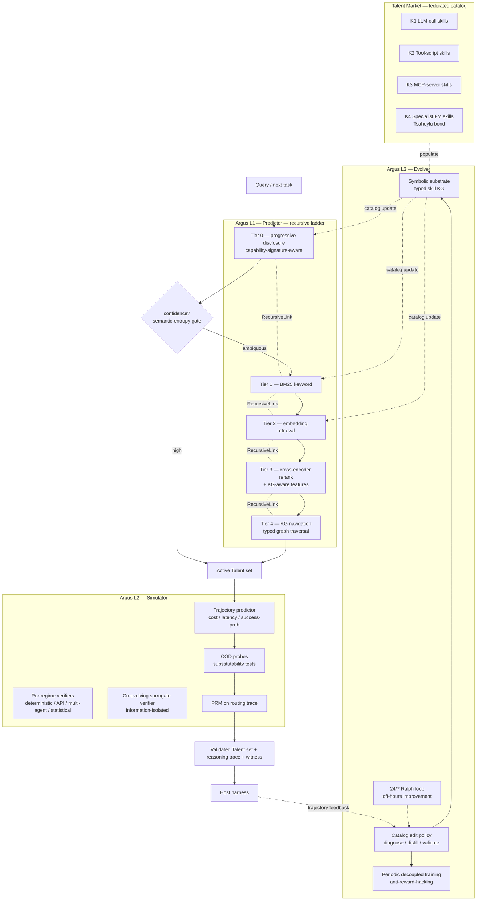

# 194 — Argus Omega: Enhanced Skill-Loading Agent — Borrowing the Strongest Ideas from the Corpus

> **Delta-plan on top of [180-argus-skill-router-agent-design](180-argus-skill-router-agent-design.md).** Argus v1.0 was already a defensible design — 5-tier cascade, 50 capabilities, 44 mapped failure modes, 11-phase roadmap. This document is what changes when you read the rest of the docs corpus end-to-end and ask: *what would Argus look like if every relevant insight from across the catalog were folded in?* The answer is **five structural reframes plus ~30 concrete enhancements**, none of which require throwing away v1.0 — every change composes additively on the existing layered ladder.

**Status.** Plan, not implementation. Read end-to-end; merge with v1.0; pick which subset to ship in the next 6–14 weeks.

**Reading order.** §1 (why a sequel). §2 (the five reframes — the load-bearing changes). §3 (the ~30 tactical enhancements, grouped by source-doc theme). §4 (updated architecture). §5 (new capabilities — additive to v1.0's 50). §6 (new failure modes). §7 (updated phasing — delta on A0–A11). §8 (bright lines). §9 (success criteria). §10 (one-paragraph summary).

---

## §1 — Why a sequel

Argus v1.0 ([180](180-argus-skill-router-agent-design.md)) closed the description-only-routing ceiling that produced the user's "Claude Code is stupid at skill loading" complaint. Five tiers, BM25 → embedding → rerank → navigate, telemetry-driven re-ranking, four-tier trust framework, vulnerability scanner. That design is *correct*; it is also *narrow* in five specific ways the rest of the corpus illuminates:

1. **The cascade is text-mediated.** Each tier produces a candidate set as text/JSON; the next tier reads that text. This is the same "pay the vocabulary projection on every hop" cost that [189-recursive-multi-agent-systems](189-recursive-multi-agent-systems.md) showed text-mediated MAS pays. Argus v1.0's cascade can be re-cast as a *recursive computation* with latent links, eliminating the per-hop decode cost.
2. **The ladder is a ladder, not a capability hierarchy.** Argus v1.0 routes; it doesn't *plan*, *simulate trajectories*, or *evolve its own catalog under evidence*. [190-agentic-world-modeling-taxonomy](190-agentic-world-modeling-taxonomy.md)'s L1/L2/L3 progression — Predictor → Simulator → Evolver — is the missing structural axis.
3. **Skills are bundles, not portable identities.** Argus v1.0 treats a skill as `{name, description, body, allowed-tools}`. [191-onemancompany-skills-to-talent](191-onemancompany-skills-to-talent.md) shows that promoting skills to **Talents** (with capability signatures, reputation, lifecycle) and decoupling Talent from Container (runtime) unlocks substitutability and HR-lifecycle governance the v1.0 design only gestures at.
4. **The catalog is LLM-skill-only.** Argus v1.0 routes among LLM-shaped skills (text-in, text-out, optional tool calls). [103-eywa-heterogeneous-fm-collaboration](103-eywa-heterogeneous-fm-collaboration.md) shows that the same federation pattern that works for cross-LLM also works for cross-modality FMs (Chronos, TabPFN, Depth Anything, AlphaFold). Argus's catalog should include non-LLM specialist FMs as first-class entries.
5. **The verifier is a regex.** Argus v1.0's vulnerability scanner is rule-based; its drift detector is a held-out test runner; its description rewriter is one-shot. [169-coevoskills-co-evolutionary-verification](169-coevoskills-co-evolutionary-verification.md), [170-skillrl-recursive-skill-augmented-rl](170-skillrl-recursive-skill-augmented-rl.md), [192-world-r1-3d-constraints-t2v](192-world-r1-3d-constraints-t2v.md) point to a *co-evolving* verifier and an RL-trained activation policy with periodic-decoupled-training-style anti-reward-hacking gates.

These five gaps are not edge cases — they're the structural shape of the next agent generation. Every other top paper in the May 2026 drop ([189], [190], [191], [192]) attacks one or more of them. Argus Omega folds all five into the v1.0 architecture without breaking compatibility.

The pitch in one sentence: **Argus v1.0 is a skill router; Argus Omega is a skill router + planner + simulator + evolver + federation host with formal guarantees.**

---

## §2 — The five reframes

Each reframe maps to a primary source paper plus 2–4 supporting docs. Each is implementation-ready: the source paper has the recipe, Argus inherits the recipe at a specific layer.

### Reframe 1 — Argus is a recursive language model with latent inter-tier links

**Source: [189-recursive-multi-agent-systems](189-recursive-multi-agent-systems.md). Supporting: [88-confidence-driven-router](88-confidence-driven-router.md), [156-heavyskill-parallel-reasoning-deliberation](156-heavyskill-parallel-reasoning-deliberation.md), [32-recurrent-depth-implicit-reasoning](32-recurrent-depth-implicit-reasoning.md).**

Argus v1.0's cascade is N tiers passing text-summary candidate sets between them. The structure is identical to a multi-agent system passing text between agents, and inherits the same cost: the m·|V|·d_h vocabulary projection on every hop, plus the gradient-vanishing problem if you ever want to train the router end-to-end.

**The fix.** Replace the text handoff between tiers with a **RecursiveLink** — a residual MLP (Inner Link) or residual + linear projection (Outer Link) that maps the previous tier's last-hidden state into the next tier's input embedding. Only the links are trainable (~13M params total across the cascade); all rerankers, embedders, and BM25 indices stay frozen. End-to-end cross-entropy on the final activation decision back-propagates through every link.

**Concrete consequences.**
- Tier handoff cost drops from O(m·|V|·d_h) to O(m·d_h²) per transition — empirically a 25–75% reduction in cascade cost.
- The cascade is **end-to-end trainable** on a single signal (skill activated → task succeeded). Argus learns its own thresholds; the threshold-hyperparameters from v1.0 (`when_top_k_ambiguous`, `when_active_set_above_50`) become emergent properties.
- Theorem 4.1 of [189] applies: gradient flow stays Ω(1) under the residual structure even when the tier outputs are entropy-confident, so RL post-training (see Reframe 5) is stable at recursion depths > 1.
- Pareto-improving recursion: deeper cascade *reduces* total cost while *increasing* accuracy.

**Mapping to Argus structure.**
- `tiers/tier_1_keyword.py` → outputs last-hidden of size d_h (cheap: pooled BM25 score vector + token embedding).
- `tiers/tier_2_embedding.py` → consumes the previous tier's last-hidden as a query bias; produces its own last-hidden.
- `tiers/tier_3_rerank.py` → cross-encoder takes a fused last-hidden + raw query.
- `tiers/tier_4_navigate.py` → graph-traversal policy reads last-hidden as state.
- `recursive_link.py` → 4× Outer Links (between tiers), 1× Inner Link (per-tier internal latent autoregression).

This is a clean drop-in: v1.0's cascade is the topology; Omega just changes the wires from text to latent.

### Reframe 2 — Argus is a 3 × 4 capability × regime grid

**Source: [190-agentic-world-modeling-taxonomy](190-agentic-world-modeling-taxonomy.md). Supporting: [11-verifier-evaluator-loops](11-verifier-evaluator-loops.md), [16-plan-and-solve](16-plan-and-solve.md), [37-neuro-symbolic-ai](37-neuro-symbolic-ai.md), [128-knowledge-graphs-as-substrate](128-knowledge-graphs-as-substrate.md).**

Argus v1.0 is purely a routing layer — it answers "which skills should be in the active context for the next turn?" That is L1 (Predictor) in [190]'s taxonomy. The taxonomy demands more: L2 (Simulator) composes skills into trajectory plans and predicts task outcome under intervention; L3 (Evolver) revises the catalog when predictions fail against new evidence.

**The fix.** Lift Argus to a three-layer capability stack:

- **Argus L1 — Predictor.** v1.0's cascade. Given a query, return the top-K best-matching skills.
- **Argus L2 — Simulator.** Given a query and an L1 candidate set, simulate the *trajectory* of executing each candidate or candidate sequence: predicted token count, predicted tool call count, predicted intermediate states, predicted final outcome. Run the **Counterfactual Outcome Deviation (COD)** test: if swapping skill A for skill B doesn't move the predicted trajectory, A and B are operationally substitutable and one can be retired.
- **Argus L3 — Evolver.** The catalog itself is editable under evidence. When L2 predictions diverge from L1 candidates' actual outcomes, diagnose where (which skill, which subtask, which trust tier), update the catalog (description rewrite, skill split, skill consolidation, retirement), validate against held-out probes, persist the update, and govern: prevent silent overwriting of verified skills.

Plus the orthogonal **regime axis** (the four governing-law columns of [190]):

- **Deterministic regime** — file ops, deterministic CLI tools. Verification: program semantics. (Most v1.0 skills.)
- **API-contract regime** — external HTTP services with declared contracts. Verification: contract checks + replay.
- **Multi-agent regime** — skills that orchestrate other agents (subagent delegation). Verification: trajectory-level success ([21-llm-as-judge-trajectory-eval](21-llm-as-judge-trajectory-eval.md)).
- **Statistical regime** — skills that wrap statistical surrogates (ML models, FMs). Verification: held-out distributional fit + uncertainty estimates.

**Concrete consequences.**
- Argus surfaces a **capability tier** for every skill: L1 (matched by router), L2 (passed simulator probe), L3 (catalog asset under active evolution governance). Most v1.0 skills sit at L1; promotion happens via simulator validation.
- The **COD test** becomes a continuous catalog-health metric: skills with COD ≈ 0 against active counterparts are flagged for consolidation (F6 in v1.0); skills with COD > threshold but rare activation are flagged for description rewrite (F3 in v1.0).
- Per-regime verification pipelines: deterministic skills get smoke tests; API-contract skills get contract checks with replay; multi-agent skills get trajectory-level LLM-judge eval; statistical skills get distributional fit checks.
- The L3 layer requires a **symbolic substrate** ([190] §2 thesis, plus [37-neuro-symbolic-ai](37-neuro-symbolic-ai.md), [128-knowledge-graphs-as-substrate](128-knowledge-graphs-as-substrate.md)): the catalog is a typed knowledge graph (skill nodes, dependency edges, conflict edges, supersession edges) so that "revise the model" maps cleanly to "edit specific named structures."

**Mapping to Argus structure.**
- `argus/l1/` → existing v1.0 cascade.
- `argus/l2/simulator.py` → trajectory predictor; takes a candidate skill set and a query, returns predicted (cost, latency, success-probability, intermediate states).
- `argus/l2/cod.py` → counterfactual outcome deviation probes; runs every N invocations on a sample of (query, skill_A, skill_B) triples.
- `argus/l3/evolver.py` → catalog edit policy with diagnose / distill / validate stages from [190]'s L3 boundary conditions.
- `argus/regimes/{deterministic,api,multi_agent,statistical}.py` → per-regime verifier modules.
- `argus/catalog/graph.py` → typed knowledge-graph store of the catalog.

### Reframe 3 — Skills are Talents on Containers, with HR lifecycle and formal guarantees

**Source: [191-onemancompany-skills-to-talent](191-onemancompany-skills-to-talent.md). Supporting: [4-skills](04-skills.md), [167-autoskill-experience-driven-lifelong-learning](167-autoskill-experience-driven-lifelong-learning.md), [169-coevoskills](169-coevoskills-co-evolutionary-verification.md), [185-memory-integration-playbook](185-memory-integration-playbook.md).**

Argus v1.0 treats a skill as a `{name, description, body, allowed-tools}` bundle. [191] shows that promoting the bundle to a **Talent** — portable identity package with capability signature, reputation, persistent memory of past performance — and decoupling identity (Talent) from runtime (Container) unlocks lifecycle governance the v1.0 design only sketches.

**The fix.** Three changes, layered:

1. **Skill → Talent promotion.** Every Argus skill grows a Talent envelope: identity (name, role, version), system prompt, working principles, tool configurations, skill scripts, domain knowledge files, **capability signature** (benchmark-validated profile: PRDBench score, domain pass rates, peer-review ratings, COD probe results, drift score). The Talent is the unit of staffing; the body is one of its assets.

2. **Talent–Container interface.** A Container is any runtime that satisfies six typed interfaces: Lifecycle, Execution, Memory, Tool, Communication, Reflection/Review. Same Talent runs across Containers (Claude Code, Codex, OpenClaw, smolagents) without modification; same Container hosts any Talent. Argus stops being a Claude-Code-specific skill router and becomes a *cross-runtime* skill federation host.

3. **HR lifecycle with formal guarantees.** v1.0's F4 stale-skill demotion / retirement becomes a full **HR cycle** ([191] §3.5): every N invocations, run a review on each Talent (completion quality, pass rate, collaboration); 3 consecutive failed reviews → **PIP** (description rewrite, scope reduction, tighter supervision via lower k_rev); 1 failed review under PIP → automated **offboarding** (deprovision, log gap, re-recruit from the Talent Market). Top performers get **promoted**: refined capability signature published back to the marketplace.

Plus **seven formal correctness guarantees** ([191] §A.5–A.11) on the cascade (which is now an E²R-style tree search over candidate skill sets):
1. DAG invariant (no cycles in tier dependencies)
2. Mutual exclusion (one skill activated per slot at a time)
3. Schedule idempotency (re-running the same skill schedule produces no duplicate work)
4. Review termination (k_rev = 3 hard bound on review loops)
5. Cascade completeness (rejected skill triggers complete re-routing)
6. Dependency completeness (failed dependency cascades or blocks correctly)
7. Recovery correctness (crash recovery preserves cascade state)

**Concrete consequences.**
- The **Talent Market** abstraction: Argus's catalog is a registry of Talents with capability signatures; community-contributed, AI-recommended-assembled, internally-promoted. Each entry is reviewable, replaceable, retireable.
- **Cross-runtime portability.** v1.0's I6 capability is upgraded from "compatible with several runtimes" to "*Talent runs unchanged across all six-interface-compliant Containers*."
- **Bounded-time and deadlock-free routing.** The seven guarantees give Argus's cascade the same provable properties [191]'s E²R Tree Search has — important for production deployments where the user can't tolerate a runaway router.
- **Capability signatures as Tier 0 metadata.** Native progressive disclosure (Tier 0) gets richer signal: instead of just `{name, description}`, the system prompt sees `{name, description, capability_signature, reputation_tier}`. The LLM picks better when it knows the skill has a 92% pass rate on similar tasks vs 47%.

### Reframe 4 — The catalog is heterogeneous; non-LLM FMs are first-class entries

**Source: [103-eywa-heterogeneous-fm-collaboration](103-eywa-heterogeneous-fm-collaboration.md). Supporting: [104-glm-5v-turbo-native-multimodal-agents](104-glm-5v-turbo-native-multimodal-agents.md), [7-model-context-protocol](07-model-context-protocol.md), [140-traditional-ml-genai-hybrid](140-traditional-ml-genai-hybrid.md).**

Argus v1.0 routes among LLM-shaped skills. [103] proves cross-modality heterogeneity (LLM + Chronos + TabPFN) outperforms cross-vendor heterogeneity (GPT + Claude) by a wide margin on scientific tasks: +6.6% utility, −30% tokens, −10% latency *simultaneously* — a Pareto improvement. [98-diversity-collapse-mas](98-diversity-collapse-mas.md) confirms the negative half of this: mixing LLMs alone collapses to similar reasoning.

**The fix.** Argus's catalog admits four skill kinds, each with its own activation contract:

- **K1: LLM-call skills.** v1.0's default. Body = prompt + tool list. Activation = inline body inclusion in next turn.
- **K2: Tool-script skills.** Body = deterministic Python/shell. Activation = exposed as a tool the LLM may call.
- **K3: MCP-server skills.** Body = pointer to an MCP server. Activation = MCP `tools/list_changed` registration. Schema-typed inputs/outputs.
- **K4: Specialist FM skills (the Eywa pattern).** Body = pointer to a non-LLM foundation model (Chronos, TabPFN, Depth Anything, AlphaFold, GraphCast, ChGNet). Activation via **Tsaheylu bond**: a query compiler ϕ_k that converts LLM intent into structured FM invocation, plus a response adapter ψ_k that converts FM output into language-consumable form. Both implemented as MCP server hooks per [103] §3.

Plus a **per-step delegation policy** C : task_state → {LLM, K2, K3, K4}: when the task input has informative non-language structure (time-series, tabular, geometric), Argus routes to the appropriate K4 specialist; otherwise stays on K1.

**Concrete consequences.**
- Time-series-shaped sub-tasks route to Chronos via MCP, not to an LLM doing arithmetic in tokens.
- Tabular-shaped sub-tasks route to TabPFN; geometric/3D to Depth Anything; molecular to AlphaFold.
- Argus's catalog grows two new dimensions: **modality signature** (text / time-series / tabular / 3D / molecular / etc.) and **specialist signature** (which FM family covers this task domain).
- The Tsaheylu bond pattern is reusable: any FM with a declared schema joins the federation by writing a 50-line MCP wrapper. Skill authoring extends from prompt-writing to FM-wrapping.

### Reframe 5 — Argus has a co-evolving verifier and an RL-trained activation policy with periodic-decoupled anti-reward-hacking

**Source: [169-coevoskills-co-evolutionary-verification](169-coevoskills-co-evolutionary-verification.md), [170-skillrl-recursive-skill-augmented-rl](170-skillrl-recursive-skill-augmented-rl.md), [192-world-r1-3d-constraints-t2v](192-world-r1-3d-constraints-t2v.md), [165-ralph-autonomous-loop](165-ralph-autonomous-loop.md). Supporting: [97-qwen-prm](97-qwen-prm.md), [80-knowrl](80-knowrl.md), [21-llm-as-judge-trajectory-eval](21-llm-as-judge-trajectory-eval.md), [14-reflexion](14-reflexion.md), [171-skill-self-evolution-2026-synthesis](171-skill-self-evolution-2026-synthesis.md).**

Argus v1.0's verifier is rule-based (vulnerability scanner = regex + entropy + Unicode/ANSI checks); its drift detector is a held-out test runner; its description rewriter is one-shot LLM rewriting. The corpus has stronger recipes for each.

**The fix.** Four concurrent improvements:

1. **Co-evolving surrogate verifier ([169-coevoskills](169-coevoskills-co-evolutionary-verification.md)).** Run a *separate* LLM as Argus's verifier, with information isolation: it sees only task instructions + skill outputs, never the held-out tests. This surrogate evolves alongside the routing policy. [169]'s ablation: dropping the surrogate verifier costs 30 percentage points on long-horizon improvement. Argus Omega adds a `verifier/surrogate.py` module that issues a binary accept/reject on every (query, skill, output) triple and feeds the signal to the activation policy.

2. **Process Reward Model on routing decisions ([97-qwen-prm](97-qwen-prm.md)).** Train a lightweight PRM on Argus's *routing trace* (not the skill execution): for each (query, skill_set) decision, predict whether downstream task succeeds. Consensus-filter training examples (ground-truth oracle + surrogate verifier agreement) to build a high-confidence PRM. Replaces v1.0's binary success/fail telemetry with continuous per-decision quality.

3. **SkillRL activation policy ([170-skillrl](170-skillrl-recursive-skill-augmented-rl.md), [80-knowrl](80-knowrl.md)).** RL-train Argus's activation policy with task-success reward, using GRPO-style group-relative advantages. The policy is the recursive ladder (Reframe 1), so all gradients flow through the RecursiveLinks. Reward shape: trajectory-level task success + per-step PRM signal − cost penalty − cross-skill conflict penalty.

4. **Periodic decoupled training to prevent ranking collapse ([192-world-r1](192-world-r1-3d-constraints-t2v.md)).** Pure task-success reward will push Argus to over-activate "safe" skills (the routing analog of World-R1's static-scene collapse). Mitigation: every K RL steps, **disable the reward signal** and run a brief exploration phase on a randomly-sampled query subset, where the policy is updated only against the surrogate verifier (not task success). This prevents reward-hacking by collapsing-to-popular-skills, the same way World-R1 prevents collapse-to-static-scenes.

Plus **24/7 autonomous improvement** ([165-ralph-autonomous-loop](165-ralph-autonomous-loop.md), [167-autoskill](167-autoskill-experience-driven-lifelong-learning.md), [171-skill-self-evolution-2026-synthesis](171-skill-self-evolution-2026-synthesis.md)): during low-traffic periods, Argus runs:
- Refresh telemetry rollups → re-rank.
- Run COD probes on a sample of catalog pairs → flag substitutables.
- Run drift validation on stale skills.
- Rewrite descriptions of under-activating skills.
- Pull marketplace updates; vulnerability-scan; auto-tier.
- Run RL micro-batches against the surrogate verifier + cached telemetry traces.

**Concrete consequences.**
- The **activation policy itself becomes a learned object** rather than a hyperparameter-tuned cascade.
- The **verifier evolves over time** rather than being a fixed regex set; new attack vectors get caught structurally.
- The **catalog improves continuously** during off-hours rather than only on user-triggered runs.
- The **anti-reward-hacking gate** prevents the most insidious failure mode of self-improving routers: collapse to a small popular subset.

---

## §3 — The 30 tactical enhancements (grouped by source-doc theme)

The five reframes are the structural changes; these are the implementation details that the corpus volunteers as concrete patterns. Each is one-paragraph, with source citation.

### Group A — Routing sophistication

- **A.1 Semantic-entropy confidence gating** ([88-confidence-driven-router](88-confidence-driven-router.md)). v1.0 escalates Tier 2 → Tier 3 on "cosine bunched" heuristic. Replace with semantic entropy over the top-K skill candidates: cluster candidates by bidirectional NLI on their `when_to_use` text; high cluster count → genuinely ambiguous → escalate. ~40% reduction in cross-encoder calls at matched accuracy.
- **A.2 Preference-trained router ([87-routellm](87-routellm.md)).** Train Argus's router on Arena-style skill-pair preferences from harness-usage logs ("for query Q, did Skill A or Skill B succeed?"). 2–3× cost savings at matched accuracy. Polaris/Lyra usage logs are the signal source.
- **A.3 FrugalGPT skill cascade ([86-frugalgpt](86-frugalgpt.md)).** v1.0's cascade is fixed; promote it to a *FrugalGPT-style* cost-ordered cascade with learned early-exit thresholds per skill class. Composes with Reframe 1's RecursiveLink: the RL policy *learns* the early-exit thresholds as part of the activation decision.
- **A.4 LLM-as-judge fallback for OOD queries ([21-llm-as-judge-trajectory-eval](21-llm-as-judge-trajectory-eval.md), [88-confidence-driven-router](88-confidence-driven-router.md)).** When all top-K cosine scores fall below an OOD threshold, defer to an LLM-judge tier that reads the query + descriptions of the broader catalog. Already in v1.0 as R6; Omega adds calibration: the judge's verdict feeds the PRM training set.
- **A.5 HeavySkill parallel deliberation for ambiguous queries ([156-heavyskill-parallel-reasoning-deliberation](156-heavyskill-parallel-reasoning-deliberation.md)).** When cascade confidence is low, spawn K independent routing attempts (Tier 0 + Tier 2 + Tier 3 in parallel with different prompts/seeds), then a single deliberator reads all K and synthesizes. Outperforms majority voting; recovers HM@4 ≈ P@K cases where one of K disagreed with the rest but was correct.
- **A.6 Plan/execute mode bifurcation ([3-plan-mode](03-plan-mode.md)).** In plan mode, Argus surfaces *all relevant skills with brief rationale* (broad, accept latency); in execute mode, it returns the single tightest active set (narrow, optimize cost). Different routing tier weights per mode.

### Group B — Memory, attribution, and case-based reasoning

- **B.1 Cognitive weight on every skill ([151-memtier](151-memtier-why-flat-memory-breaks-at-72-hours.md)).** Attach a [-1, +1] weight to every catalog entry, updated on every invocation: positive when a referenced tool succeeds, negative on failure. Replaces v1.0's binary success/fail telemetry with continuous credit.
- **B.2 Three-tier SkillBank organization ([170-skillrl](170-skillrl-recursive-skill-augmented-rl.md)).** Reorganize the catalog into General (apply anywhere), Task-specific (heuristics per domain), Mistakes (failure lessons with avoidance strategies). Adaptive retrieval gates each tier independently; compresses context 10–20% vs flat catalogs.
- **B.3 Case-based reasoning over past task → skill set ([107-memento-cbr-memory](107-memento-cbr-memory.md), [109-memento-results-and-harness](109-memento-results-and-harness.md)).** When routing a new query, retrieve the top-3 most-similar past queries (over a long-running episodic store), look up which skills succeeded for them, prior-bias the cascade toward those skills. Concrete CBR primitive: skill-affinity priors at Tier 0.
- **B.4 Reflexion-style failure lessons ([14-reflexion](14-reflexion.md)).** After a skill fails (tool error, timeout, malformed output), synthesize a verbal lesson: "Skill X failed because Y. Next time, do Z." Append to a per-skill failure history that the router consults on re-queries. Avoids repeat failures; improves robustness.
- **B.5 Multi-session affinity memory ([10-multi-session-continuity](10-multi-session-continuity.md), [9-memory-files](09-memory-files.md), [185-memory-integration-playbook](185-memory-integration-playbook.md)).** Persist per-user / per-project skill-coupling priors across sessions. "User has historically used skills X, Y, Z together for task class T." Cross-session boost in Tier 0 system-prompt priors.
- **B.6 Skill-affinity graph in episodic memory ([184-strongest-memory-techniques-synthesis-may-2026](184-strongest-memory-techniques-synthesis-may-2026.md), [186-mnema-witness-lattice](186-mnema-witness-lattice.md)).** Build a co-activation graph: which skills frequently appear in the same successful trajectory. Use as a soft prior in multi-skill activation (R7) and skill chaining suggestion (R8).

### Group C — Knowledge-graph substrate and hybrid retrieval

- **C.1 Typed skill knowledge graph as Tier 4 substrate ([128-knowledge-graphs-as-substrate](128-knowledge-graphs-as-substrate.md), [129-kg-rag-hybrid-retrieval](129-kg-rag-hybrid-retrieval.md)).** v1.0's Tier 4 hierarchical navigation uses a tree. Promote to a *typed knowledge graph* with edges `depends_on`, `conflicts_with`, `supersedes`, `composes_with`, `substitutes_for`. Graph traversal answers compatibility queries the tree cannot.
- **C.2 HippoRAG v2 PPR + dense fusion for catalog scale ≥ 200 ([184-strongest-memory-techniques-synthesis-may-2026](184-strongest-memory-techniques-synthesis-may-2026.md), [129-kg-rag-hybrid-retrieval](129-kg-rag-hybrid-retrieval.md)).** Layer Personalized PageRank over the skill KG plus dense embedding retrieval; fuse via Reciprocal Rank Fusion. Captures multi-hop relationships embeddings miss; +30–50% on multi-hop skill queries.
- **C.3 Cross-encoder reranking with KG-aware features ([133-reranking-for-agentic-retrieval](133-reranking-for-agentic-retrieval.md)).** v1.0's Tier 3 rerank uses cross-encoder on text alone. Add KG-derived features: edge-distance to currently-active skills, conflict-edge presence, supersession status. 10–30% precision lift over text-only reranking.
- **C.4 Semantic indexing with skill-domain entity extraction ([134-semantic-indexing](134-semantic-indexing.md)).** Beyond name+description+body, index extracted entities (tool names, API endpoints, file types, domain concepts). Query-time entity match raises BM25 (Tier 1) recall on domain-specific queries.

### Group D — Trust, provenance, and adversarial defense

- **D.1 Witness-lattice provenance for routing decisions ([186-mnema-witness-lattice](186-mnema-witness-lattice.md), [188-witness-provenance-memory-techniques-synthesis](188-witness-provenance-memory-techniques-synthesis.md)).** Every Argus routing decision emits a tamper-evident witness: query hash + cascade trace + selected skill set + capability signature versions + timestamp, signed by Argus's instance key. Compliance, replay, and audit trail are now first-class.
- **D.2 Cryptographic content pinning extended to capability signatures ([175-agent-skills-ecosystem-and-security](175-agent-skills-ecosystem-and-security.md), [187-multi-agent-shared-memory-landscape](187-multi-agent-shared-memory-landscape.md)).** v1.0's C4 SHA-256 the body. Omega extends to: SHA the capability signature too; any change to either triggers re-tier. Plus signed marketplace pulls — unsigned skills auto-flagged.
- **D.3 Structural anti-poisoning beyond regex ([82-poisonedrag](82-poisonedrag.md), [22-guardrails-prompt-injection](22-guardrails-prompt-injection.md)).** v1.0's F-16 description-prompt-injection check is regex + entropy. Add structural defenses: content-hash on initial review; per-skill embedding-stability check (re-embed and verify drift < threshold); ensemble of detection models rather than single-model regex.
- **D.4 Temporal validity tags ([184](184-strongest-memory-techniques-synthesis-may-2026.md), [186](186-mnema-witness-lattice.md)).** Every skill gets `valid_at` and `invalid_at` timestamps. When a tool vendor ships a breaking API change, mark old skill versions as stale rather than deleting. Query-time filter: only `now() ∈ [valid_at, invalid_at)` skills are ranked.

### Group E — Verification depth (per-regime)

- **E.1 Trajectory-level eval, not per-call ([21-llm-as-judge-trajectory-eval](21-llm-as-judge-trajectory-eval.md), [38-claw-eval](38-claw-eval.md)).** v1.0's telemetry is per-call success/fail. Promote to per-trajectory: "did using skill X improve the whole trajectory?" Multi-step success is a stronger signal than per-step.
- **E.2 Process Reward Model for skill-quality scoring ([97-qwen-prm](97-qwen-prm.md)).** Train a PRM on Argus's routing decisions (Reframe 5 details above).
- **E.3 Three-stage validation: offline simulator → ground-truth oracle → LLM-as-judge ([173-offline-sim-skill-discovery](173-offline-sim-skill-discovery.md), [177-skills-discovery-curator-strongest-2026-techniques](177-skills-discovery-curator-strongest-2026-techniques.md)).** Cheap offline simulator catches most failures (false negatives are free); ground-truth oracle promotes survivors; LLM-as-judge fallback for non-instrumented domains. Stacked, this beats any single-mode validation on cost-quality.
- **E.4 Self-critique on activation ([18-chain-of-verification-self-refine](18-chain-of-verification-self-refine.md), [25-agentic-rag](25-agentic-rag.md)).** After Argus picks a skill set, before returning to the host harness, run a brief self-critique: "Is this set right for the query? What's missing? What's redundant?" Catches near-miss errors before they reach execution.
- **E.5 Counterfactual ablation probes for catalog hygiene ([190-agentic-world-modeling-taxonomy](190-agentic-world-modeling-taxonomy.md)).** Periodically: "if I removed skill X from the active set on these 100 historical queries, would success drop?" Skills with COD ≈ 0 become consolidation candidates.

### Group F — Catalog growth and curation

- **F.1 Offline-sim pre-gate for new skill admission ([173-offline-sim-skill-discovery](173-offline-sim-skill-discovery.md)).** New skills run in an offline simulator (deterministic stubs of common tools) before promotion. Catches obvious failures cheaply; only survivors reach ground-truth gates.
- **F.2 Diversity-aware top-K activation ([98-diversity-collapse-mas](98-diversity-collapse-mas.md)).** When returning top-3, apply MMR-style or determinantal-point-process diversity penalty so the three are structurally diverse, not three near-duplicates.
- **F.3 Online skill discovery during low traffic ([178-online-skill-discovery-and-curation-on-the-go](178-online-skill-discovery-and-curation-on-the-go.md), [165-ralph-autonomous-loop](165-ralph-autonomous-loop.md)).** Off-hours: Argus pulls marketplace updates, runs vulnerability scans, refreshes embeddings, runs RL micro-batches. Continuous improvement.
- **F.4 Description rewriter with retrieval grounding ([177-skills-discovery-curator-strongest-2026-techniques](177-skills-discovery-curator-strongest-2026-techniques.md), [171-skill-self-evolution-2026-synthesis](171-skill-self-evolution-2026-synthesis.md)).** v1.0's F3 rewrites descriptions when skill rarely activates despite frequent task-match. Omega: ground the rewrite on actual successful query examples retrieved from telemetry — the new description should match the queries the skill actually handled well.

### Group G — Operational polish

- **G.1 Hooks framework around skill load ([5-hooks](05-hooks.md)).** Pre/post skill-load hooks for validation, telemetry, masking, schema check. Standardizes the cross-cutting concerns.
- **G.2 Plan-mode skill broadening ([3-plan-mode](03-plan-mode.md), [16-plan-and-solve](16-plan-and-solve.md)).** In plan mode, Argus loads a wider skill set with brief descriptions; in execute mode, narrowed to the chosen subset.
- **G.3 Todo/scratchpad reasoning trace ([12-todo-scratchpad-state](12-todo-scratchpad-state.md)).** Argus's per-turn reasoning ("considered skills A, B, C; picked A because…") is externalized as a scratchpad the user can inspect mid-trajectory.
- **G.4 Container-aware prompt construction ([191](191-onemancompany-skills-to-talent.md), [104-glm-5v-turbo](104-glm-5v-turbo-native-multimodal-agents.md)).** Different Containers have different system-prompt formats; the Talent's body is rendered per-Container at activation. Single Talent, many runtime renderings.

That's 30 tactical enhancements layered on top of the five structural reframes.

---

## §4 — Updated architecture

The architecture changes additively. v1.0's ladder is the L1 floor of Omega's three-layer stack.

**Layer responsibilities:**

- **L1 (Predictor)** — five-tier cascade with RecursiveLinks between tiers; Tier 0 sees capability signatures, not just descriptions; Tier 4 traverses typed KG, not tree.
- **L2 (Simulator)** — for each L1 candidate set, predicts trajectory cost/latency/success-probability; runs COD probes for substitutability; per-regime verifier issues a structured verdict; surrogate verifier (information-isolated) issues an independent signal; PRM scores routing-trace quality.
- **L3 (Evolver)** — diagnoses prediction-vs-actual failures, edits the catalog (rewrite / consolidate / split / retire / promote), validates against held-out probes, persists, governs (no silent overwriting).
- **Federation** — four kinds of skills (K1–K4) populate the catalog; specialist FMs join via Tsaheylu bond over MCP.
- **Periodic decoupled training** — every K RL steps, disable reward, run pure exploration on surrogate-verifier signal; prevents ranking collapse.
- **24/7 Ralph loop** — off-hours, runs catalog hygiene, embedding refresh, RL micro-batches against cached telemetry.
- **Witness lattice** — every routing decision is signed and logged for replay.

The cascade is the same shape as v1.0; everything else is additive layers above and federation below.

---

## §5 — New capabilities (additive to v1.0's 50)

| # | Capability | Source | Layer |
|---|---|---|---|
| **D9** | Specialist FM federation via Tsaheylu bond (K4 skill kind) | [103](103-eywa-heterogeneous-fm-collaboration.md) | Federation |
| **D10** | Per-step delegation policy C(s): LLM vs K2 vs K3 vs K4 | [103](103-eywa-heterogeneous-fm-collaboration.md) | L1 / Federation |
| **D11** | Modality signature on every catalog entry | [103](103-eywa-heterogeneous-fm-collaboration.md), [104](104-glm-5v-turbo-native-multimodal-agents.md) | L1 |
| **D12** | Container-aware Talent rendering (single Talent → many Container prompts) | [191](191-onemancompany-skills-to-talent.md) | L1 |
| **R11** | RecursiveLink between tiers (latent inter-tier communication) | [189](189-recursive-multi-agent-systems.md) | L1 |
| **R12** | Semantic-entropy gating at each tier transition | [88](88-confidence-driven-router.md) | L1 |
| **R13** | Preference-trained activation policy | [87](87-routellm.md) | L1 |
| **R14** | HeavySkill parallel-deliberation for ambiguous queries | [156](156-heavyskill-parallel-reasoning-deliberation.md) | L1 |
| **R15** | Plan/execute mode bifurcation (broad / narrow routing) | [3](03-plan-mode.md) | L1 |
| **R16** | Case-based reasoning prior at Tier 0 (past similar query → past skill set) | [107](107-memento-cbr-memory.md), [109](109-memento-results-and-harness.md) | L1 |
| **R17** | Diversity-aware top-K activation (MMR / DPP) | [98](98-diversity-collapse-mas.md) | L1 |
| **F11** | Co-evolving surrogate verifier on activation outputs | [169](169-coevoskills-co-evolutionary-verification.md) | L2 |
| **F12** | Process Reward Model on routing decisions | [97](97-qwen-prm.md) | L2 |
| **F13** | Trajectory-level skill evaluation (not per-call) | [21](21-llm-as-judge-trajectory-eval.md), [38](38-claw-eval.md) | L2 |
| **F14** | COD probes for skill substitutability | [190](190-agentic-world-modeling-taxonomy.md) | L2 |
| **F15** | Self-critique pass before activation finalization | [18](18-chain-of-verification-self-refine.md), [25](25-agentic-rag.md) | L2 |
| **F16** | Cognitive weight on every catalog entry (continuous credit) | [151](151-memtier-why-flat-memory-breaks-at-72-hours.md) | L2 |
| **F17** | Three-tier SkillBank reorganization (General / Task-specific / Mistakes) | [170](170-skillrl-recursive-skill-augmented-rl.md) | L2 |
| **F18** | Reflexion-style failure lesson appended per skill | [14](14-reflexion.md) | L2 |
| **F19** | Three-stage validation: offline-sim → oracle → LLM-judge | [173](173-offline-sim-skill-discovery.md), [177](177-skills-discovery-curator-strongest-2026-techniques.md) | L2 |
| **C9** | Witness-lattice signed audit trail per routing decision | [186](186-mnema-witness-lattice.md), [188](188-witness-provenance-memory-techniques-synthesis.md) | All |
| **C10** | Capability signature SHA-pinning + drift-triggered re-tier | [175](175-agent-skills-ecosystem-and-security.md), [187](187-multi-agent-shared-memory-landscape.md) | L3 |
| **C11** | Temporal validity (`valid_at` / `invalid_at`) | [184](184-strongest-memory-techniques-synthesis-may-2026.md), [186](186-mnema-witness-lattice.md) | L3 |
| **C12** | Structural anti-poisoning (ensemble + embedding stability + content-hash) | [82](82-poisonedrag.md), [22](22-guardrails-prompt-injection.md) | L3 |
| **C13** | Talent capability signatures with benchmark-validation | [191](191-onemancompany-skills-to-talent.md) | L3 |
| **C14** | HR lifecycle (review → PIP → offboarding) with 7 formal guarantees | [191](191-onemancompany-skills-to-talent.md) | L3 |
| **C15** | Talent Market (community + AI-recommended-assembled + internal-promotion) | [191](191-onemancompany-skills-to-talent.md) | Federation |
| **F20** | Periodic decoupled training (anti-ranking-collapse) | [192](192-world-r1-3d-constraints-t2v.md) | L3 |
| **F21** | SkillRL activation policy with GRPO | [170](170-skillrl-recursive-skill-augmented-rl.md), [80](80-knowrl.md) | L3 |
| **F22** | 24/7 Ralph autonomous loop | [165](165-ralph-autonomous-loop.md), [178](178-online-skill-discovery-and-curation-on-the-go.md) | L3 |
| **O7** | Trajectory-level cost dashboard (per-trajectory, not per-call) | [21](21-llm-as-judge-trajectory-eval.md), [24](24-observability-tracing.md) | Observability |
| **O8** | KG-substrate visualizer (skill graph with conflict / supersession edges) | [128](128-knowledge-graphs-as-substrate.md), [134](134-semantic-indexing.md) | Observability |
| **O9** | Witness replay UI (replay any past routing decision deterministically) | [186](186-mnema-witness-lattice.md), [188](188-witness-provenance-memory-techniques-synthesis.md) | Observability |
| **I7** | Cross-Container portability via the six typed interfaces | [191](191-onemancompany-skills-to-talent.md) | Integration |

**Total Omega capabilities: v1.0's 50 + 33 additions = 83.** All justified by source-doc evidence; all additive, no v1.0 capability removed.

---

## §6 — New failure modes (additive to v1.0's 44)

| # | Failure mode | Argus Omega countermeasure |
|---|---|---|
| **F-45** | **Ranking-collapse reward hacking** — RL pushes policy toward popular skills regardless of fit | F20 periodic decoupled training; surrogate-verifier-only exploration phase every K steps |
| **F-46** | **Surrogate verifier collusion with policy** — verifier learns to accept whatever policy emits | Information isolation: surrogate sees only task + output, never test labels; periodic re-init of surrogate |
| **F-47** | **Latent-link distributional drift** — RecursiveLink's input distribution shifts as cascade evolves | Embedding-stability monitoring per link; periodic re-fitting on fresh trace data |
| **F-48** | **L2 simulator over-confident on novel queries** — predicts trajectory the policy hasn't seen | OOD detection on simulator inputs; high-uncertainty queries skip L2 and ask L1 directly |
| **F-49** | **L3 evolver overwrites verified skills** — bug in catalog edit policy retracts a working skill | Governance gate: any change to T-Pinned skill requires HITL or override token; rollback on regression |
| **F-50** | **CoD test false negative** — two skills appear substitutable on probes but diverge on rare tail queries | Stratified COD sampling across query distribution; never retire on COD alone, only flag for HITL |
| **F-51** | **Talent capability-signature staleness** — signature was right at promotion, no longer true | Periodic signature refresh on review cycle; SHA-mismatch triggers re-validation |
| **F-52** | **Container interface mismatch** — Talent works on Claude Code, fails on Codex due to subtle interface diff | Compatibility matrix per Talent + Container pair; activation refused if compat unverified |
| **F-53** | **Talent Market poisoning** — adversary publishes a Talent with inflated capability signature | Re-validation on import; capability signature re-derived on Argus's own benchmark before Tier promotion |
| **F-54** | **K4 specialist FM unavailability** — federated FM goes offline mid-trajectory | Per-K4 fallback policy: Tsaheylu bond declares fallback K1/K2 path; activation cost includes availability probability |
| **F-55** | **Tsaheylu compiler ϕ_k drift** — schema change in FM not reflected in compiler | Schema-version pinning per K4; `tools/list_changed` triggers compiler re-fit |
| **F-56** | **Knowledge-graph cycles** — `composes_with` and `conflicts_with` edges create logically impossible cliques | DAG enforcement on KG; cycle detection on edge insertion; cycle alerts for HITL resolution |
| **F-57** | **Witness-lattice tampering** — adversary modifies past routing decisions in audit trail | Cryptographic chaining (each witness hash references prior); independent witness verifier process |
| **F-58** | **Periodic-decoupled phase exploits** — adversary injects skills during exploration window when reward is disabled | Rate-limit catalog admission during decoupled phase; sign every new admission with policy hash |
| **F-59** | **Trajectory-eval observation bias** — only completed trajectories are scored; abandoned trajectories silently degrade signal | Score abandoned trajectories at abort point; weight by abort-position |
| **F-60** | **Reflexion lesson contamination** — failure-lesson text becomes prompt-injection vector | Lesson text is structured-only (no free-form text in prompt); rendered as tags in metadata |

That's 16 new failure modes for a total of **60 mapped failure modes** in Argus Omega.

---

## §7 — Updated phasing (delta phases on A0–A11)

v1.0's 11 phases (A0–A11) ship the cascade, refinement, vulnerability scanner, marketplace integration, persona, and adapters. Omega adds **delta phases B0–B12** on top, each implementable independently after the v1.0 phase it depends on.

| Δ-Phase | Title | Depends on | Effort | Deliverable | Reframe |
|---|---|---|---|---|---|
| **B0** | RecursiveLink scaffold + per-tier last-hidden API | A4 | ~1 wk | `recursive_link.py`; per-tier `.last_hidden()` API; latent-cascade smoke test | R1 |
| **B1** | RecursiveLink training (Inner + Outer warm-start) | B0 | ~1.5 wk | `train/inner.py` (cosine warm-start), `train/outer.py` (E2E CE on activation success); held-out validation | R1 |
| **B2** | Semantic-entropy gating + plan/execute mode | B0 | ~1 wk | Gating module replacing `cosine_bunched` heuristic; plan/execute mode flag | A.1, A.6 |
| **B3** | Talent envelope + capability signatures | A0 | ~1.5 wk | Talent schema; signature derivation on first-N invocations; signature SHA pinning | R3 |
| **B4** | Six typed Container interfaces | B3 | ~1 wk | `container/interfaces.py` (Lifecycle, Execution, Memory, Tool, Communication, Reflection); per-Container compat matrix | R3 |
| **B5** | E²R cascade with 7 formal guarantees | A1–A4 | ~2 wk | `cascade/e2r.py` replacing v1.0's tier dispatcher; formal-property tests; circuit breakers (k_rev, t_max, B) | R3 |
| **B6** | L2 trajectory simulator + per-regime verifiers | A4 | ~2 wk | `l2/simulator.py`; `regimes/{deterministic,api,multi_agent,statistical}.py`; OOD detector | R2 |
| **B7** | COD probes (counterfactual outcome deviation) | B6 | ~1 wk | `l2/cod.py`; stratified sampling; consolidation flagging | R2 |
| **B8** | Surrogate verifier (information-isolated) + PRM training | B6 | ~2 wk | `verifier/surrogate.py`; `prm/train.py`; consensus-filtered training set | R5, F.2 |
| **B9** | SkillRL activation policy + GRPO trainer | B0–B8 | ~3 wk | `policy/skillrl.py`; GRPO loop; group-relative advantage; KL to reference policy | R5 |
| **B10** | Periodic decoupled training | B9 | ~0.5 wk | Reward-disable scheduler in `policy/skillrl.py`; exploration-phase cadence config | R5 (anti-hacking) |
| **B11** | Tsaheylu federation: K3 + K4 skill kinds + per-step delegation | A9 | ~2 wk | `federation/k3_mcp.py`, `federation/k4_specialist.py`; ϕ_k / ψ_k for Chronos + TabPFN as reference impl; delegation policy C(s) | R4 |
| **B12** | Witness lattice + cryptographic provenance | A0 | ~1 wk | `witness/lattice.py`; signed routing decisions; replay UI in `audit.py` | C9, F-57 |
| **B13** | Typed skill KG + KG-aware Tier 4 | A5 | ~2 wk | `catalog/graph.py` (typed nodes, typed edges, DAG check); Tier 4 KG traversal; F-56 cycle detection | C.1, F-56 |
| **B14** | HippoRAG-PPR + dense fusion + cross-encoder w/ KG features | B13 | ~1.5 wk | `tiers/tier_2_hipporag.py`; RRF fusion; KG-aware cross-encoder features at Tier 3 | C.2, C.3 |
| **B15** | Co-activation graph + multi-session affinity memory | A6 | ~1 wk | `memory/affinity.py`; per-user / per-project skill-coupling priors; CBR retrieval | B.3, B.5, B.6 |
| **B16** | 24/7 Ralph loop integration | A6, B6, B8 | ~1 wk | `ralph/loop.py`; off-hours scheduler; integrates F1, F3, F5, vulnerability re-scan, RL micro-batches | F22 |

**Total Omega delta: ~22 weeks** for full B0–B16. **Omega-MVP** = B0 + B2 + B6 + B12 (~6 weeks): latent cascade + gating + simulator + witness. After B0+B2 alone (~3 weeks) you already have RecursiveLink-mediated cascade with semantic-entropy gating; after B6+B7 you have the L2 simulator; after B8+B9+B10 you have the RL-trained policy with anti-hacking gate.

**Recommended phasing:**

1. **Stage 1 (v1.0 MVP, weeks 1–6):** A0–A4 — ships v1.0's working layered router. (Existing plan.)
2. **Stage 2 (Omega quick wins, weeks 7–10):** B0 + B2 + B12 — latent cascade + semantic-entropy gating + witness lattice. Already a substantial upgrade.
3. **Stage 3 (v1.0 production hardening, weeks 11–16):** A5–A8 — adds navigation, refinement, vulnerability scanner. (Existing plan.)
4. **Stage 4 (Omega L2/L3, weeks 17–22):** B3–B7 — Talent envelope + Container interfaces + E²R + simulator + COD.
5. **Stage 5 (Omega RL, weeks 23–28):** B8–B10 — surrogate verifier + PRM + SkillRL with anti-hacking.
6. **Stage 6 (Omega federation + KG, weeks 29–34):** B11 + B13 + B14 — Tsaheylu + KG substrate + HippoRAG.
7. **Stage 7 (Omega ops, weeks 35–38):** B15 + B16 + A9–A11 — affinity memory + Ralph loop + marketplace + persona + adapters.

Total: **~38 weeks (9 months)** for the full Omega stack.

**Stop-anywhere structure:** every stage delivers user-visible value; you can stop after Stage 2, Stage 4, or Stage 6 and still ship a coherent system better than v1.0 alone.

---

## §8 — Bright lines (delta on v1.0's ten)

v1.0 has 10 bright lines (`BL-ARGUS-COST` through `BL-ARGUS-CARDINALITY`). Omega adds:

| Code | Trip condition | Default action |
|---|---|---|
| `BL-OMEGA-LATENT-DRIFT` | RecursiveLink output distribution drifts > threshold | Re-fit warm-start; alert |
| `BL-OMEGA-SIMULATOR-OOD` | L2 simulator's input falls outside training distribution | Skip L2; emit OOD-warning; defer to L1 alone |
| `BL-OMEGA-EVOLVER-OVERWRITE` | L3 catalog edit affects T-Pinned skill | Refuse; require HITL approval |
| `BL-OMEGA-COD-RETIRE` | COD test alone triggers skill retirement | Refuse; require additional review-cycle evidence |
| `BL-OMEGA-CAPABILITY-SIG-MISMATCH` | Talent's capability-signature SHA differs from registered | Re-validate; demote tier on confirmed mismatch |
| `BL-OMEGA-CONTAINER-INCOMPAT` | Talent activated on un-validated Container | Refuse; emit compat-warning |
| `BL-OMEGA-TALENT-MARKET-POISON` | Imported Talent fails own-benchmark on first-validation | Quarantine to T-Untrusted; refuse activation |
| `BL-OMEGA-K4-UNAVAILABLE` | Federated FM K-4 unreachable mid-cascade | Activate fallback K1/K2 path; emit availability-warning |
| `BL-OMEGA-WITNESS-CHAIN-BREAK` | Witness lattice cryptographic chain has gap | Halt routing; alert; integrity audit |
| `BL-OMEGA-DECOUPLED-EXPLOIT` | Catalog admission rate spikes during decoupled phase | Rate-limit; alert; signature audit on new admissions |
| `BL-OMEGA-KG-CYCLE` | Skill-KG cycle detected on edge insertion | Refuse insertion; alert HITL |
| `BL-OMEGA-HR-INFINITE-PIP` | Same Talent enters PIP > 2 times | Force offboarding; remove from Talent Market |

That's **22 total bright lines** (10 v1.0 + 12 Omega).

---

## §9 — Success criteria

### Omega-MVP (after Stage 2 — B0 + B2 + B12)

- ✅ **Cascade cost reduction**: ≥30% fewer tokens at matched Hit@1 vs v1.0.
- ✅ **Semantic-entropy gate accuracy**: escalates on ≥90% of true-ambiguous queries; skips on ≥70% of unambiguous (target: 40% reduction in cross-encoder calls).
- ✅ **Witness lattice integrity**: 100% of routing decisions produce a verifiable witness; replay reproduces decision exactly.
- ✅ **No regression on v1.0 metrics** (Hit@1 ≥ 75%, Hit@k=3 ≥ 90%, false-activation < 5%).

### Omega-L2 (after Stage 4 — Talent + Container + E²R + simulator + COD)

- ✅ **Trajectory-level success uplift**: ≥10pp over v1.0 on multi-step PRDBench-style tasks.
- ✅ **COD probe coverage**: ≥80% of catalog has ≥3 COD probes per skill in 30-day window.
- ✅ **Substitutability detection**: 90% precision on planted substitutable-pair benchmark.
- ✅ **Cross-Container portability**: Talent runs unmodified across Claude Code + Codex + Cursor + smolagents.
- ✅ **Formal-guarantee tests**: all 7 formal properties of E²R verified by property-based tests.

### Omega-RL (after Stage 5 — surrogate + PRM + SkillRL + anti-hacking)

- ✅ **PRM correlation with task success**: Pearson ≥ 0.7 on held-out trace.
- ✅ **SkillRL gain over preference-tuned policy**: ≥5pp Hit@1 absolute improvement.
- ✅ **Periodic decoupled training prevents collapse**: top-10 skill activation diversity stays ≥80% of catalog over 1M activations (vs ≤30% without decoupling).
- ✅ **Surrogate verifier independence**: dropping ground-truth tests for 1 week of RL doesn't move policy quality > 5pp (proves verifier-policy independence per [169] criterion).

### Omega-full (after Stage 7)

- ✅ **All 60 failure modes (44 v1.0 + 16 Omega) have regression tests that fire**.
- ✅ **Federation: K4 specialist FM activation** (Chronos for time-series, TabPFN for tabular) with Tsaheylu bond produces +6.6% utility / −30% tokens on heterogeneous benchmark (matches [103] claim).
- ✅ **24/7 Ralph loop**: catalog-quality metrics improve monotonically over 30 days without user intervention.
- ✅ **Talent Market**: end-to-end import-validate-tier-activate loop on a community Talent works without HITL on T-Reviewed inputs.

---

## §10 — Open questions (decide before Stage 2)

In addition to v1.0's seven open questions:

8. **RecursiveLink hidden-dim choice.** Match the largest tier's hidden dim, average them, or learn a per-link projection? **Recommended:** per-link projection (Outer Link's W₃) for cross-tier flexibility; Inner Link uses native dim.
9. **Surrogate verifier model.** Same family as the host LLM, different family, or fine-tuned small model? **Recommended:** different family (e.g. Qwen if host is Claude) per [169]'s information-isolation argument.
10. **PRM scale.** 100M-param reward head, 1B-param dedicated PRM, or LLM-as-judge as PRM? **Recommended:** 1B-param dedicated PRM for cost; LLM-as-judge for cold-start training labels.
11. **K4 specialist FMs to ship in Omega-MVP federation.** Chronos + TabPFN (the [103] reference set), or extend to Depth Anything / AlphaFold? **Recommended:** Chronos + TabPFN only in v0; extend incrementally.
12. **HR review cadence.** Every 3 invocations (per [191]), every 10, every 100? **Recommended:** every 30 invocations or 7 days, whichever first; per-Talent override.
13. **Witness lattice signing key management.** Per-instance, per-tenant, or shared? **Recommended:** per-instance ephemeral + per-tenant root; rotate ephemeral every 24h.
14. **Periodic decoupled training cadence.** [192] uses every 100 RL steps; what's right for Argus? **Recommended:** every 100 RL steps initially; tune via diversity-monotonicity probe.
15. **L3 evolver autonomy.** Fully autonomous or HITL-gated? **Recommended:** autonomous within T-Untrusted/T-Scanned tiers; HITL-gated for T-Reviewed/T-Pinned promotions.

---

## §11 — Reading list (the canon Argus Omega is built on)

Beyond v1.0's 10-paper canon, in order of Reframe → tactical relevance:

**Reframe 1 (recursive cascade):** [189-recursive-multi-agent-systems](189-recursive-multi-agent-systems.md), [32-recurrent-depth-implicit-reasoning](32-recurrent-depth-implicit-reasoning.md), [88-confidence-driven-router](88-confidence-driven-router.md), [156-heavyskill-parallel-reasoning-deliberation](156-heavyskill-parallel-reasoning-deliberation.md).

**Reframe 2 (capability × regime grid):** [190-agentic-world-modeling-taxonomy](190-agentic-world-modeling-taxonomy.md), [11-verifier-evaluator-loops](11-verifier-evaluator-loops.md), [16-plan-and-solve](16-plan-and-solve.md), [37-neuro-symbolic-ai](37-neuro-symbolic-ai.md), [128-knowledge-graphs-as-substrate](128-knowledge-graphs-as-substrate.md).

**Reframe 3 (Talent / Container / HR lifecycle):** [191-onemancompany-skills-to-talent](191-onemancompany-skills-to-talent.md), [4-skills](04-skills.md), [167-autoskill-experience-driven-lifelong-learning](167-autoskill-experience-driven-lifelong-learning.md), [185-memory-integration-playbook](185-memory-integration-playbook.md).

**Reframe 4 (heterogeneous federation):** [103-eywa-heterogeneous-fm-collaboration](103-eywa-heterogeneous-fm-collaboration.md), [104-glm-5v-turbo-native-multimodal-agents](104-glm-5v-turbo-native-multimodal-agents.md), [7-model-context-protocol](07-model-context-protocol.md), [140-traditional-ml-genai-hybrid](140-traditional-ml-genai-hybrid.md).

**Reframe 5 (co-evolving verifier + RL policy + anti-hacking):** [169-coevoskills-co-evolutionary-verification](169-coevoskills-co-evolutionary-verification.md), [170-skillrl-recursive-skill-augmented-rl](170-skillrl-recursive-skill-augmented-rl.md), [192-world-r1-3d-constraints-t2v](192-world-r1-3d-constraints-t2v.md), [97-qwen-prm](97-qwen-prm.md), [80-knowrl](80-knowrl.md), [165-ralph-autonomous-loop](165-ralph-autonomous-loop.md), [171-skill-self-evolution-2026-synthesis](171-skill-self-evolution-2026-synthesis.md).

**Cross-cutting:** [21-llm-as-judge-trajectory-eval](21-llm-as-judge-trajectory-eval.md), [129-kg-rag-hybrid-retrieval](129-kg-rag-hybrid-retrieval.md), [133-reranking-for-agentic-retrieval](133-reranking-for-agentic-retrieval.md), [184-strongest-memory-techniques-synthesis-may-2026](184-strongest-memory-techniques-synthesis-may-2026.md), [186-mnema-witness-lattice](186-mnema-witness-lattice.md), [188-witness-provenance-memory-techniques-synthesis](188-witness-provenance-memory-techniques-synthesis.md), [86-frugalgpt](86-frugalgpt.md), [87-routellm](87-routellm.md), [82-poisonedrag](82-poisonedrag.md), [98-diversity-collapse-mas](98-diversity-collapse-mas.md), [107-memento-cbr-memory](107-memento-cbr-memory.md), [109-memento-results-and-harness](109-memento-results-and-harness.md), [14-reflexion](14-reflexion.md), [25-agentic-rag](25-agentic-rag.md), [173-offline-sim-skill-discovery](173-offline-sim-skill-discovery.md), [177-skills-discovery-curator-strongest-2026-techniques](177-skills-discovery-curator-strongest-2026-techniques.md), [193-recursive-world-organizations-synthesis](193-recursive-world-organizations-synthesis.md).

---

## §12 — One-paragraph summary

Argus Omega is the v1.0 design plus five structural reframes drawn from the May 2026 corpus: **(1) the cascade becomes a recursive language model with latent inter-tier RecursiveLinks**, eliminating the per-hop vocabulary-projection cost and making the router end-to-end trainable ([189](189-recursive-multi-agent-systems.md)); **(2) Argus is lifted from a router to a 3 × 4 capability × regime grid** — L1 Predictor / L2 Simulator / L3 Evolver × Deterministic / API-contract / Multi-agent / Statistical regimes — with a Counterfactual Outcome Deviation test as the substitutability metric and a typed skill knowledge graph as the L3 substrate ([190](190-agentic-world-modeling-taxonomy.md)); **(3) skills become Talents on Containers with HR lifecycle and seven formal correctness guarantees**, decoupling identity from runtime and yielding bounded-time, deadlock-free routing ([191](191-onemancompany-skills-to-talent.md)); **(4) the catalog admits non-LLM specialist FMs as first-class K4 entries** via the Tsaheylu (compiler ϕ_k + adapter ψ_k) bond pattern over MCP, federating cross-modality heterogeneity that outperforms cross-vendor heterogeneity ([103](103-eywa-heterogeneous-fm-collaboration.md)); **(5) the activation policy is RL-trained with a co-evolving information-isolated surrogate verifier, a Process Reward Model on routing decisions, and periodic-decoupled-training as the anti-ranking-collapse safeguard** ([169](169-coevoskills-co-evolutionary-verification.md), [170](170-skillrl-recursive-skill-augmented-rl.md), [192](192-world-r1-3d-constraints-t2v.md), [165](165-ralph-autonomous-loop.md)). On top of those five, the design folds in 30 tactical enhancements (semantic-entropy gating, preference-trained routing, FrugalGPT cascade, HeavySkill parallel deliberation, plan/execute mode bifurcation, cognitive weights, three-tier SkillBank, case-based reasoning over past tasks, Reflexion failure lessons, multi-session affinity memory, KG-aware reranking, HippoRAG PPR fusion, witness-lattice signed audit trail, capability-signature SHA pinning, temporal validity, structural anti-poisoning, trajectory-level eval, three-stage validation pipeline, self-critique on activation, COD probes for catalog hygiene, offline-sim pre-gate, diversity-aware top-K, 24/7 Ralph loop, hooks framework, container-aware prompt rendering, KG visualizer, witness replay UI). The result is **83 capabilities and 60 mapped failure modes**, layered on v1.0's 50 + 44 — and shippable in **stop-anywhere stages**: Omega-MVP (3 delta-phases, ~3 weeks on top of v1.0 MVP) brings latent cascade + semantic-entropy gating + witness lattice; full Omega lands in ~38 weeks. Argus v1.0 closed the description-only routing ceiling; Argus Omega closes the *router-as-router* ceiling — the next ceiling, where the question stops being "which skill?" and becomes "which Talent, on which Container, with which trajectory prediction, under which evolver-governed catalog state?"

---

## §13 — Decision points

Three decisions before Stage 2 begins:

1. **Approve the five reframes** — recursive cascade, capability × regime grid, Talent/Container/HR, heterogeneous federation, co-evolving verifier + SkillRL + anti-hacking. Trim if too ambitious; expand if anything's missing.
2. **Pick Omega-MVP scope** — minimal (B0 + B2 + B12, ~3 weeks) vs. moderate (B0–B4, ~6 weeks) vs. full Stage 2 (B0 + B2 + B12, deployed) with parallel Stage-4 prototyping.
3. **Pick the new open-question defaults** — RecursiveLink projection per-link, surrogate verifier different family, PRM 1B-param, K4 federation Chronos + TabPFN only, HR cadence every 30 invocations / 7 days, periodic decoupled every 100 RL steps, L3 autonomy bounded by trust tier.

When ready to proceed, say "go Omega" or specify which reframes / delta-phases to start with.
