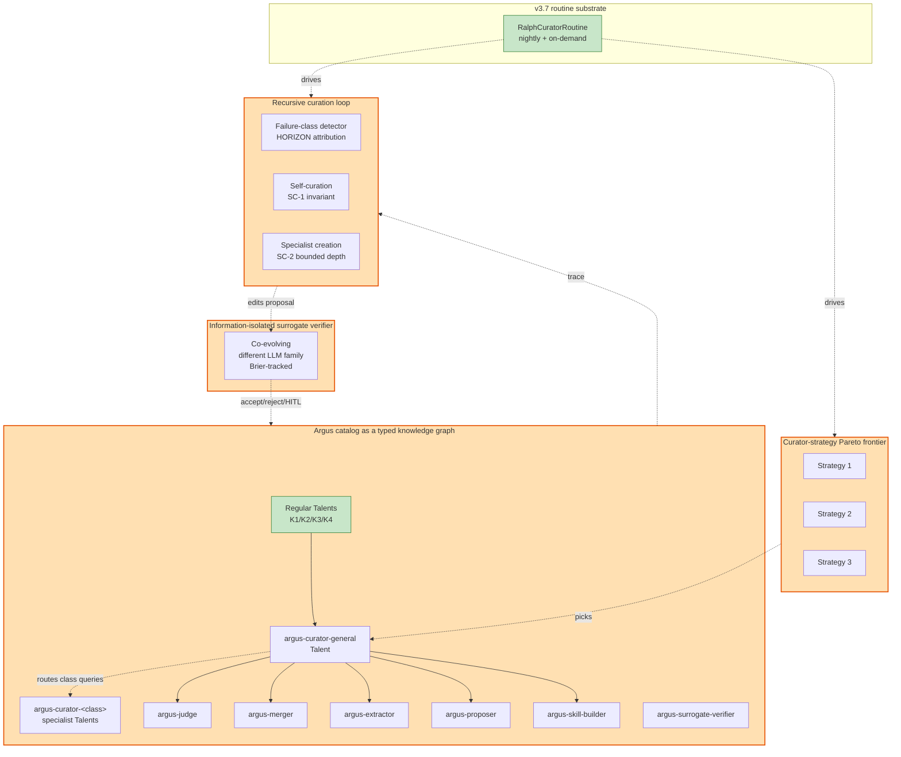

# 197 — Argus Omega Vol. 3: The Recursive Skills Curator

> **Continuation of [194-argus-omega-enhanced-design](194-argus-omega-enhanced-design.md) and [195-argus-omega-vol-2-trajectory-temporal-horizon](195-argus-omega-vol-2-trajectory-temporal-horizon.md).** Vol. 1 reframed Argus as a recursive language model with capability × regime grid, Talent / Container, heterogeneous federation, and co-evolving verifier + RL. Vol. 2 added trajectory simulation, Temporal substrate, HORIZON attribution, ReWOO planning, and bitemporal + chaos engineering. **Vol. 3 closes the explicit gap exposed by the question "does Argus have a recursive skills curator?"** — the honest answer was *no, only scattered ingredients*. This volume designs the curator end-to-end, borrowing the four-corner skill-evolution landscape ([167](167-autoskill-experience-driven-lifelong-learning.md) AutoSkill, [168](168-evoskill-coding-agent-skill-discovery.md) EvoSkill, [169](169-coevoskills-co-evolutionary-verification.md) CoEvoSkills, [170](170-skillrl-recursive-skill-augmented-rl.md) SkillRL — synthesized in [171](171-skill-self-evolution-2026-synthesis.md)) plus [191](191-onemancompany-skills-to-talent.md)'s HR lifecycle and seven formal correctness guarantees. The result is **five new structural reframes** (11 through 15) and a curator that is *truly recursive*: a Talent in its own catalog, governed by formal termination guarantees, that creates specialist sub-curators under failure-class pressure, runs Pareto-frontier search over curator strategies, and is itself audited by a co-evolving information-isolated surrogate.

**Status.** Plan, not implementation. Composes additively with Vol. 1 + Vol. 2; nothing in either needs to change.

**Reading order.** §1 (the gap, recapped). §2 (the four-corner curator landscape that supplies the building blocks). §3 (the five reframes 11–15 for Vol. 3). §4 (recursive-curator architecture). §5 (capabilities + failure modes delta). §6 (phasing — D0–D8 delta on Vol. 1's B-phases and Vol. 2's C-phases). §7 (bright lines additions). §8 (success criteria). §9 (one-paragraph summary). §10 (decision points).

---

## §1 — The gap, recapped

Argus v1.0 has *individual* curator capabilities (F1 drift detection, F3 description rewriter, F4 stale-skill retirement, F6 consolidation, F7 split, F8 squatting cleanup). Vol. 1 adds the L3 Evolver (catalog-edits-under-evidence) and HR lifecycle. Vol. 2 adds the 24/7 Ralph loop. None of these is a *recursive* curator — they're a daemon that mutates the catalog, no more recursive than Hermes Agent's 15-task self-eval.

A *recursive skills curator* — in the strong sense the field implies — has six properties Argus currently lacks:

| Property | Current Argus | What's missing |
|---|---|---|
| **P1: Curator-as-Talent in the catalog** | Persona is mentioned in [180] §11 #7 but not designed | Curator is a routable Talent that the cascade can pick like any other skill |
| **P2: Self-curation** | None | Curator reviews / rewrites / re-tiers its *own* description, capability signature, working principles |
| **P3: Curator-creating-curator** | None | Under recurrent failure-class pressure, the curator *generates a new specialist curator skill* (e.g., "the curator for time-series-forecast skills") and admits it via the standard trust pipeline |
| **P4: Co-evolutionary curator-verifier** | L3 Evolver runs alone | Information-isolated surrogate watches curator's edits and emits accept/reject signals (CoEvoSkills shape) |
| **P5: Pareto-frontier of curator strategies** | Single Ralph loop | Frontier of curator-strategies on (precision, recall, cost, transfer); evolutionary search admits / evicts (EvoSkill shape) |
| **P6: Termination guarantees on the recursion** | None | Bounded-time, deadlock-free, no-infinite-recursion proofs ([191] OneManCompany shape) |

Vol. 3 designs all six.

---

## §2 — The four-corner curator landscape (the building blocks)

The synthesis chapter [171](171-skill-self-evolution-2026-synthesis.md) plots the 2026 skill-evolution literature on three axes: **feedback-signal source** × **skill-artifact form** × **parameter access**. Vol. 3 reads the table not as an inventory but as a parts catalog for the recursive curator.

| | **AutoSkill** ([167](167-autoskill-experience-driven-lifelong-learning.md)) | **EvoSkill** ([168](168-evoskill-coding-agent-skill-discovery.md)) | **CoEvoSkills** ([169](169-coevoskills-co-evolutionary-verification.md)) | **SkillRL** ([170](170-skillrl-recursive-skill-augmented-rl.md)) |
|---|---|---|---|---|
| Pipeline | Extractor → Judge → Merger | Executor → Proposer → Skill-Builder | Generator ↔ Verifier | Policy ↔ SkillBank |
| Trigger | Sliding window of dialogue | Failure-driven (worst-scoring tasks) | Validation rollouts | Validation-failure rate |
| Selection | Top-M neighbour comparison | Pareto-frontier (k=3 default) | Surrogate-verifier verdict | RL reward |
| Artifact | Single SKILL.md | Folder + scripts | Multi-file package | JSON 3-tier SkillBank |
| Parameter access | Frozen | Frozen | Frozen | **RL-trained** |
| Co-evolution | One-way | Frontier members | Generator–Verifier | Policy–SkillBank |

**What Argus Vol. 3 takes from each:**

- **From AutoSkill (167):** the Extractor → Judge → Merger pipeline shape; SemVer-style versioning; the four-stage skill lifecycle (ingestion → distillation → curation → activation); the SkillBank/Common vs SkillBank/User split.
- **From EvoSkill (168):** Pareto-frontier maintenance (k=3 default); failure-driven proposal (the worst-scoring tasks drive curator improvements); git-backed versioning of curator candidates; skill-merge across independent runs as a final lift.
- **From CoEvoSkills (169):** information-isolated surrogate verifier (the curator's verifier sees curator outputs, never ground-truth tests); +30pp ablation lift when surrogate is dropped; the verifier evolves with the curator.
- **From SkillRL (170):** three-tier hierarchy (General curator skills / task-specific curator skills / **common-mistake** entries — the negative-space tier); recursive co-evolution trigger on validation-failure rate; adaptive retrieval of curator skills at runtime.
- **From OneManCompany (191):** Talent envelope with capability signature; Container split (curator runs across Containers); HR lifecycle (review → PIP → offboarding) for *curator skills themselves*; **seven formal correctness guarantees** ported to the curation graph.
- **From Hermes Agent (55):** continual extraction loop discipline; self-eval cadence (every 15 tasks); skill consolidation runs; nudge-style proactive consolidation.

Together these supply 100% of the parts. Vol. 3's contribution is the *composition*: a single coherent recursive curator that satisfies P1–P6.

---

## §3 — The five reframes (11 through 15)

### Reframe 11 — The curator is a first-class Talent in Argus's own catalog

**Source.** [191](191-onemancompany-skills-to-talent.md) (Talent abstraction), [180](180-argus-skill-router-agent-design.md) §11 #7 (recursive-by-design observation), [04](04-skills.md) (SKILL.md as the unit), [167](167-autoskill-experience-driven-lifelong-learning.md) (single-SKILL.md curator pattern).

**The fix.** The curator stops being a daemon and becomes a routable Talent. The catalog now contains entries like:

```
catalog/
├── argus-curator-general/SKILL.md          # the general curator
├── argus-curator-time-series/SKILL.md      # specialist curator (created at runtime)
├── argus-curator-tabular/SKILL.md          # specialist curator
├── argus-curator-coding-skills/SKILL.md    # specialist curator
├── argus-judge/SKILL.md                    # the judge component
├── argus-merger/SKILL.md                   # the merger component
├── argus-extractor/SKILL.md                # the extractor component
├── argus-proposer/SKILL.md                 # the EvoSkill-style proposer
├── argus-skill-builder/SKILL.md            # the EvoSkill-style materializer
├── argus-surrogate-verifier/SKILL.md       # the CoEvoSkills-style surrogate
└── ...other Talents (the catalog the curator curates)
```

Each curator-Talent is loadable via the standard Tier 0–4 cascade (with one extension: a `kind: curator` frontmatter field that lets the cascade route curator queries to curator-Talents). The recursion is well-typed because the curator-Talent's body specifies how to invoke other curator-Talents through the standard cascade.

**Concrete consequences.**
- Curator improvements are *catalog improvements* — versioned, signed, witness-lattice-audited like any other skill update.
- Curator activation is observable through the standard telemetry and witness lattice.
- Multiple curators can be active simultaneously (general + specialists) and the cascade picks the right one for the curation task at hand.
- Trust tiers apply to curators: a community-contributed curator starts at T-Untrusted and only earns promotion through the same trust ladder as any other Talent.

### Reframe 12 — The curator is self-applicable (curates itself, governed by an invariant)

**Source.** [167](167-autoskill-experience-driven-lifelong-learning.md) (P_judge for self-judgement), [169](169-coevoskills-co-evolutionary-verification.md) (verifier looking at generator outputs), [190](190-agentic-world-modeling-taxonomy.md) (L3 Evolver boundary conditions: evidence-grounded diagnosis, persistent asset update, governed validation).

**The fix.** The curator runs against its own description, capability signature, working principles — not just other Talents'. Self-curation is governed by a strict invariant:

**Invariant SC-1 (Self-Curation Termination).** Let `f_n` be the curator's state at iteration `n` and `Φ(f_n)` be the curator's quality measure (precision, recall, cost-per-edit, transfer rate, weighted). Self-curation steps must satisfy:

1. **Monotone non-degradation.** `Φ(f_{n+1}) ≥ Φ(f_n) − ε` for some small ε > 0 (small regression allowed for exploration; large regression triggers rollback).
2. **Bounded-iteration.** `n ≤ N_max` per cycle (N_max = 7 default; configurable).
3. **Fixed-point detection.** If `‖f_{n+1} − f_n‖ < δ` for K consecutive iterations (K = 3), declare fixed-point and exit.
4. **Governed-validation gate.** Each self-edit must pass regression on a held-out *curator-evaluation set* before being persisted to the canonical Talent definition. The evaluation set is itself versioned and re-validated per-cycle ([190] §L3 boundary condition).
5. **HITL gate at trust-tier boundaries.** Self-edits that would *demote* the curator's own trust tier require explicit human approval (`BL-VOL3-CURATOR-SELF-DEMOTE`).

**Concrete consequences.**
- The curator's own description, working principles, and capability signature evolve over time, but bounded by the invariant.
- A curator that fails self-curation drops to PIP under the existing HR lifecycle ([191] §3.5 + Vol. 1 R3); after one failed PIP, it is offboarded and a fresh curator is recruited from the Talent Market.
- The fixed-point detection catches the edge case where a curator gets stuck in a low-amplitude oscillation between two equivalent self-rewrites.

### Reframe 13 — Curator-creating-curator under recurrent failure-class pressure

**Source.** [168](168-evoskill-coding-agent-skill-discovery.md) (Skill-Builder materializes proposals; Pareto-frontier search), [27](27-horizon-long-horizon-degradation.md) (failure-class attribution), [170](170-skillrl-recursive-skill-augmented-rl.md) (common-mistakes tier as negative-space memory), [167](167-autoskill-experience-driven-lifelong-learning.md) (Extractor → Judge → Merger).

**The fix.** When the general curator detects a recurrent failure-class it cannot handle (e.g., consistently miscurates time-series-forecast skills, or fails to consolidate near-duplicate coding skills), it triggers **specialist curator creation**:

```
Specialist-curator creation pipeline:
  1. Failure-class detector (HORIZON-style attribution from Vol. 2 Reframe 8) signals
     a recurrent failure-class F over the last K curator cycles.
  2. The general curator invokes argus-proposer Talent on F's failure traces:
       proposer reads (trace_1, trace_2, …, trace_K, failure-class F)
       proposer emits intervention π = "create specialist curator for class F"
  3. The general curator invokes argus-skill-builder Talent on π:
       skill-builder materializes a new Talent at:
         catalog/argus-curator-<F>/SKILL.md
       with:
         - role: "Specialist curator for failure-class F"
         - capability_signature: empty (will accumulate as it runs)
         - trust_tier: T_UNTRUSTED (as any new Talent)
         - parent: argus-curator-general
         - inherits-working-principles-from: argus-curator-general
  4. The new specialist enters the Talent Market at T_UNTRUSTED.
  5. The general curator routes future class-F curation queries to the specialist
     (via standard cascade with kind=curator + class=F filter).
  6. Specialist's capability signature accrues from telemetry.
  7. After N successful curation cycles + surrogate-verifier confirmation, specialist
     promotes to T-Scanned, then T-Reviewed, then T-Pinned via the standard trust ladder.
```

**Termination invariant SC-2 (Specialist-creation bounded recursion).**
- A specialist curator may not create another specialist *for the same failure-class*. (Prevents `argus-curator-time-series` creating `argus-curator-time-series-forecasts` creating `argus-curator-time-series-forecasts-monthly` ...)
- Cross-class specialization *is* allowed (a time-series specialist may detect a *tabular* failure-class within its scope and trigger a tabular-specialist creation, but only if no tabular-specialist exists in the catalog already).
- Maximum specialist depth = 3 (general → domain → sub-domain). Beyond depth 3, the curator falls back to the general curator + HITL alert.

**Concrete consequences.**
- The catalog of *curators* grows organically under failure-class pressure rather than being authored upfront.
- Specialist curators inherit working principles from their parent; updates to the parent propagate (with explicit override possible).
- Multiple specialists can co-exist for adjacent failure-classes (e.g., `argus-curator-context-forget` + `argus-curator-plan-divergence`) and the general curator routes among them.
- New specialists go through the same trust-tier promotion ladder; no special path.

### Reframe 14 — Co-evolving information-isolated curator-verifier (the surrogate)

**Source.** [169](169-coevoskills-co-evolutionary-verification.md) (CoEvoSkills surrogate verifier with information isolation), [194](194-argus-omega-enhanced-design.md) Reframe 5 (surrogate verifier on routing decisions).

**The fix.** The curator's edits are watched by a *separate, information-isolated* surrogate verifier:

```
surrogate-verifier sees:
  - the catalog state before the edit
  - the catalog state after the edit
  - the curator's stated rationale for the edit
  - the witness-lattice trace of recent routing decisions

surrogate-verifier does NOT see:
  - held-out test set
  - ground-truth oracle scores
  - the curator's internal reasoning beyond the stated rationale
```

The surrogate emits one of `accept | reject | escalate-HITL` for each curator edit. The curator's edit is committed only on `accept`. On `reject`, the curator must either re-propose (with the surrogate's reasoning incorporated) or yield. On `escalate-HITL`, a human approves or rejects.

The surrogate co-evolves: a separate weekly cycle re-trains the surrogate on (curator-edit, eventual-success-or-failure) pairs from the witness lattice, so it gets better at predicting which edits will succeed.

**Information isolation discipline (per [169]).**
- The surrogate is a different LLM family from the curator (Qwen if curator is Claude; reverse otherwise).
- The surrogate has its own context, never shared with the curator.
- Failure of the surrogate to predict catastrophic edits is itself a quality signal — track surrogate Brier score against eventual outcome; alert if calibration degrades.

**Concrete consequences.**
- The single most-cited ablation in CoEvoSkills (dropping the surrogate costs 30pp) is captured directly: Argus's curator without surrogate would suffer the same regression.
- Self-curation (Reframe 12) is now *gated by an external eye*: the curator can't silently rewrite itself in a way the surrogate disagrees with.
- The surrogate becomes a Talent in its own right (`argus-surrogate-verifier/SKILL.md`); it can also be self-curated, but only by *another, independent surrogate* (avoiding the obvious regress).
- Calibration drift triggers `BL-VOL3-SURROGATE-DRIFT`.

### Reframe 15 — Pareto-frontier search over curator strategies

**Source.** [168](168-evoskill-coding-agent-skill-discovery.md) (Pareto-frontier maintenance, k=3 default; round-robin parent selection; failure-driven proposals), [188](188-witness-provenance-memory-techniques-synthesis.md) (witness lattice as the source of evidence).

**The fix.** The curator is not a single artifact but a **frontier** of `k=3` curator-strategy variants, maintained by evolutionary search. Each generation:

1. Pick a parent strategy from the frontier (round-robin).
2. Score it on the recent curator-evaluation set (precision, recall, cost-per-edit, transfer rate, surrogate-verifier agreement rate).
3. Harvest the worst-scoring failure-classes.
4. Hand to `argus-proposer` Talent → intervention proposal.
5. Hand to `argus-skill-builder` → materialize as a new candidate strategy.
6. Evaluate the candidate on a held-out validation split.
7. Admit to frontier if it dominates the weakest member (Pareto sense — better on at least one axis, no worse on others) or there's room.
8. Evict argmin if `|G| > k`.
9. Append `(intervention, score)` to the history H.

The frontier is maintained per-environment (Polaris, Lyra, OpenClaw, etc.) — different harnesses produce different frontiers because their workload shapes differ.

**Skill-merge across independent runs (the [168] final lift).** Periodically run multiple curator-evolution branches with different random seeds; merge unique strategies across all frontiers into a superset; re-evaluate. Captures complementary failure modes that single-trajectory evolution missed.

**Concrete consequences.**
- The curator catalog grows a *strategy frontier* (versioned per-strategy in git, [168] discipline).
- Curator updates are not a single trajectory — they are a small evolutionary search.
- Different harnesses (Polaris vs Lyra vs OpenClaw) get different optimal strategies, surfaced explicitly rather than collapsed to a single global curator.
- The frontier is a published artifact: `~/.argus/curator-frontier.json` lists the k=3 strategies and their scores.

---

## §4 — Recursive-curator architecture

The full picture, layered on Vol. 1's L1/L2/L3 stack and Vol. 2's substrate:



**Three nested loops:**

1. **Inner loop (per-curator-cycle, ~minutes):** `argus-curator-general` (or specialist) runs Extractor → Judge → Merger on the catalog snapshot, proposes an edit, surrogate verifier accepts/rejects, edit commits or rolls back.
2. **Middle loop (per-day):** Pareto-frontier evolution. Failure-driven proposals; new candidate strategies; admission / eviction.
3. **Outer loop (per-week):** Surrogate verifier co-evolution. Re-train surrogate on `(edit, outcome)` pairs from the witness lattice. Refresh capability signatures of all curator-Talents.

**Termination guarantees (the seven formal correctness conditions, ported from [191] §A.5–A.11 to the curation graph):**

1. **DAG invariant.** Curator-creation edges form a DAG (general → domain → sub-domain, max depth 3).
2. **Mutual exclusion.** At most one curator processes a given Talent at a time.
3. **Schedule idempotency.** Re-running an edit on a failed mid-commit produces no duplicate.
4. **Curation-loop termination.** Per-cycle iteration bound N_max (Reframe 12 SC-1).
5. **Cascade completeness.** Rejected edits trigger complete re-curation (no half-edits left in the catalog).
6. **Dependency completeness.** When a parent curator's working principles change, dependent specialists re-validate before their next cycle.
7. **Recovery correctness.** Mid-curation crash + restart produces a result identical to un-crashed execution (achieved via Temporal workflow primitives from Vol. 2 Reframe 7).

---

## §5 — Capabilities + failure modes (delta on Vol. 1 + Vol. 2)

### New capabilities (24 additions on top of Vol. 1's 83 + Vol. 2's 20 = 103)

| # | Capability | Source |
|---|---|---|
| **CR1** | Curator-as-routable-Talent in the catalog | [191](191-onemancompany-skills-to-talent.md), [167](167-autoskill-experience-driven-lifelong-learning.md) |
| **CR2** | `kind: curator` cascade-routing extension | [180](180-argus-skill-router-agent-design.md), [194](194-argus-omega-enhanced-design.md) |
| **CR3** | Self-curation invariant SC-1 (monotone, bounded, fixed-point, gated) | [190](190-agentic-world-modeling-taxonomy.md) §L3, [191](191-onemancompany-skills-to-talent.md) |
| **CR4** | Specialist-curator creation under failure-class pressure | [168](168-evoskill-coding-agent-skill-discovery.md), [27](27-horizon-long-horizon-degradation.md), [170](170-skillrl-recursive-skill-augmented-rl.md) |
| **CR5** | SC-2 bounded recursion (max specialist depth 3, no same-class duplication) | (Vol. 3 contribution) |
| **CR6** | Argus-extractor Talent (Extractor role) | [167](167-autoskill-experience-driven-lifelong-learning.md) |
| **CR7** | Argus-judge Talent (Judge role) | [167](167-autoskill-experience-driven-lifelong-learning.md) |
| **CR8** | Argus-merger Talent (Merger role) | [167](167-autoskill-experience-driven-lifelong-learning.md) |
| **CR9** | Argus-proposer Talent (failure-driven proposer) | [168](168-evoskill-coding-agent-skill-discovery.md) |
| **CR10** | Argus-skill-builder Talent (materializer) | [168](168-evoskill-coding-agent-skill-discovery.md) |
| **CR11** | Argus-surrogate-verifier Talent (information-isolated, different LLM family) | [169](169-coevoskills-co-evolutionary-verification.md) |
| **CR12** | Surrogate Brier-score calibration tracking | [169](169-coevoskills-co-evolutionary-verification.md) |
| **CR13** | Surrogate co-evolution weekly cycle | [169](169-coevoskills-co-evolutionary-verification.md) |
| **CR14** | Pareto-frontier curator strategies (k=3) | [168](168-evoskill-coding-agent-skill-discovery.md) |
| **CR15** | Round-robin parent selection from frontier | [168](168-evoskill-coding-agent-skill-discovery.md) |
| **CR16** | Skill-merge across independent curator runs | [168](168-evoskill-coding-agent-skill-discovery.md) |
| **CR17** | Three-tier curator-bank: general / task-specific / common-mistakes | [170](170-skillrl-recursive-skill-augmented-rl.md) |
| **CR18** | Common-mistakes tier as negative-space curator memory | [170](170-skillrl-recursive-skill-augmented-rl.md), [81](81-reasoningbank.md) |
| **CR19** | HORIZON-class-driven specialist routing | [27](27-horizon-long-horizon-degradation.md), Vol. 2 Reframe 8 |
| **CR20** | Curator-graph DAG enforcement | [191](191-onemancompany-skills-to-talent.md) |
| **CR21** | Curator-version-controlled in git (per-strategy branches) | [168](168-evoskill-coding-agent-skill-discovery.md) |
| **CR22** | Curator capability-signature SHA-pinning + drift-triggered re-tier | [191](191-onemancompany-skills-to-talent.md), Vol. 1 C13 |
| **CR23** | Curator HR lifecycle (review → PIP → offboarding) | [191](191-onemancompany-skills-to-talent.md) |
| **CR24** | Curator Talent Market (community + AI-recommended-assembled + internal-promotion) | [191](191-onemancompany-skills-to-talent.md) |

**Vol. 3 capabilities total: 24.** Argus Omega running total: 103 + 24 = **127 capabilities**.

### New failure modes (12 additions on top of Vol. 1's 60 + Vol. 2's 15 = 75)

| # | Failure mode | Argus Omega Vol. 3 countermeasure |
|---|---|---|
| **F-76** | **Curator self-amplification** — curator rewrites itself toward higher self-scoring without external validation | SC-1 invariant: governed-validation gate against held-out curator-evaluation set; surrogate-verifier accept gate (Reframe 14) |
| **F-77** | **Specialist explosion** — pressure creates ten specialists for slight class variations | SC-2: max specialist depth 3; no same-class duplicate; failure-class taxonomy is bounded |
| **F-78** | **Curator-creating-curator infinite recursion** — specialist creates sub-specialist creates sub-sub-specialist | SC-2 depth bound; HITL alert beyond depth 3 |
| **F-79** | **Surrogate-curator collusion** — surrogate accepts whatever curator emits | Information isolation (different LLM family, no shared context); surrogate independence test on planted-bad-edits (CoEvoSkills ablation) |
| **F-80** | **Surrogate calibration drift** — surrogate Brier score degrades silently over time | Weekly Brier calibration check; `BL-VOL3-SURROGATE-DRIFT` alert |
| **F-81** | **Frontier collapse** — all k=3 strategies converge to a single point | Diversity gate on frontier admission (Pareto-distance threshold); periodic re-seeding from common-mistakes tier |
| **F-82** | **Frontier monoculture by harness** — Polaris frontier drifts to identical Lyra frontier | Per-harness frontier maintenance; cross-harness skill-merge runs as a separate diversity-injection cycle |
| **F-83** | **Curator-evaluation set staleness** — held-out set was good for old workload, not current | Periodic refresh of curator-evaluation set from witness lattice; alert when distribution drift detected |
| **F-84** | **Common-mistakes tier dominance** — negative-space entries crowd out positive guidance | Per-tier max-entries cap; consolidation pass on common-mistakes (similar mistakes merge) |
| **F-85** | **Specialist trust-tier inflation** — specialists promoted faster than equivalent regular Talents | Specialists go through *identical* trust ladder as regular Talents; no promotion shortcut |
| **F-86** | **Curator silent retirement** — a bug retires the general curator without specialist takeover | Bright-line refusal: cannot retire `argus-curator-general` without explicit override + ready successor |
| **F-87** | **Curator-graph cycle through inheritance** — specialist A inherits from B, B inherits from A | DAG enforcement on curator-graph; cycle detection on inheritance edge |

**Vol. 3 failure modes total: 12.** Argus Omega running total: 75 + 12 = **87 mapped failure modes**.

---

## §6 — Phasing — delta on Vol. 1 (B-phases) and Vol. 2 (C-phases)

| Δ-Phase | Title | Depends on | Effort | Deliverable | Reframe |
|---|---|---|---|---|---|
| **D0** | Curator-as-Talent scaffold | B3 (Talent), B4 (Container) | ~1 wk | `argus-curator-general/SKILL.md` exists, runs as routable Talent; `kind: curator` cascade extension | R11 |
| **D1** | Component Talents (Extractor, Judge, Merger, Proposer, Skill-Builder, Surrogate) | D0 | ~2 wk | Six separate SKILL.md files; each independently invocable; standardized I/O schemas | R11, R12, R13, R14 |
| **D2** | Self-curation invariant SC-1 | D1, B6 (L2 simulator) | ~1.5 wk | `curator/self.py` with monotone-non-degradation, bounded-iteration, fixed-point detection, governed-validation gate, HITL escalation; tests verify each clause | R12 |
| **D3** | Failure-class detector + specialist creation pipeline | D1, B7 (COD), C7 (HORIZON) | ~2 wk | `curator/specialist_creation.py`; integrates with HORIZON failure-class matrix; SC-2 depth + no-duplicate enforcement | R13 |
| **D4** | Information-isolated surrogate verifier | D1, B8 (Vol. 1 surrogate verifier infrastructure) | ~1.5 wk | `argus-surrogate-verifier` Talent with isolation discipline; Brier-tracking; weekly co-evolution cycle | R14 |
| **D5** | Pareto-frontier curator strategies | D1, B0 (RecursiveLink optional) | ~2 wk | `curator/frontier.py` (k=3, round-robin, admit/evict); per-harness frontier persistence; git-backed strategy versioning | R15 |
| **D6** | Three-tier curator-bank (general / task-specific / common-mistakes) | D1, B5 (E²R cascade) | ~1.5 wk | Tiered storage in catalog graph; tier-specific routing; common-mistakes consolidation pass | R13, R15 (extends [170] pattern) |
| **D7** | Curator HR lifecycle + formal seven guarantees | D0–D6, B5 (E²R formal guarantees) | ~1.5 wk | HR lifecycle ported from [191] to curators; seven formal-property tests pass | R11, R12, R13 |
| **D8** | Curator Talent Market + skill-merge across runs | D0–D7, A9 (marketplace) | ~2 wk | Community curator imports; AI-recommended-assembled curators for niche failure-classes; periodic cross-harness merge | R15 |

**Total Vol. 3 delta: ~14 weeks.** Vol. 3 MVP (the strongest minimum-viable subset): **D0 + D1 + D2 + D4 + D7 = ~7.5 weeks**. After D2 + D4 alone you have a self-curating curator with surrogate verification — the load-bearing recursive piece.

**Recommended additional staging on top of Vol. 1 + Vol. 2 stages:**

11. **Stage 11 (Vol. 3 scaffold, weeks 53–56):** D0 + D1 — curator-as-Talent + six component Talents.
12. **Stage 12 (Vol. 3 self-curation, weeks 57–60):** D2 + D4 — invariant SC-1 + surrogate verifier.
13. **Stage 13 (Vol. 3 specialist creation, weeks 61–64):** D3 + D6 — failure-class-driven specialists + three-tier curator-bank.
14. **Stage 14 (Vol. 3 evolutionary search, weeks 65–68):** D5 + D7 — Pareto-frontier + HR lifecycle + formal guarantees.
15. **Stage 15 (Vol. 3 federation, weeks 69–72):** D8 — Talent Market + cross-harness skill-merge.

**Combined Vol. 1 + Vol. 2 + Vol. 3 maximalist path:** ~72 weeks (1.4 years) for the full deployment. **Stop-anywhere remains true:** every D-phase delivers user-visible value. If you stop after Stage 12 (D2 + D4), you already have a self-curating curator with co-evolutionary verification — by far the strongest published curator design.

---

## §7 — Bright lines additions

In addition to v1.0's 10 + Vol. 1's 12 + Vol. 2's 10 = 32:

| Code | Trip condition | Default action |
|---|---|---|
| `BL-VOL3-CURATOR-SELF-DEMOTE` | Self-curation edit would demote curator's own trust tier | Refuse; require explicit human approval |
| `BL-VOL3-CURATOR-SELF-DIVERGENCE` | SC-1 monotone-non-degradation violated by > ε | Rollback last self-edit; alert |
| `BL-VOL3-SPECIALIST-DEPTH` | Specialist depth would exceed 3 | Refuse creation; HITL alert |
| `BL-VOL3-SPECIALIST-DUPLICATE-CLASS` | New specialist would cover same failure-class as existing | Refuse creation; route to existing specialist |
| `BL-VOL3-SURROGATE-DRIFT` | Surrogate Brier score degraded > threshold over week | Halt curation; alert; surrogate re-validation required |
| `BL-VOL3-SURROGATE-COLLUSION` | Surrogate accepts > 95% of edits over recent window (suspect collusion) | Insert planted-bad-edits as collusion test; alert if surrogate fails |
| `BL-VOL3-FRONTIER-COLLAPSE` | All k=3 frontier strategies within Pareto-distance threshold of each other | Re-seed from common-mistakes; force exploration |
| `BL-VOL3-CURATOR-GRAPH-CYCLE` | Cycle detected in curator inheritance graph | Refuse insertion; alert HITL |
| `BL-VOL3-EVAL-SET-STALE` | Curator-evaluation set distribution-drift detected | Refresh from witness lattice; mark current curators for re-validation |
| `BL-VOL3-RETIRE-GENERAL-CURATOR` | Edit would retire `argus-curator-general` without ready successor | Refuse; require explicit override + successor designation |

Total bright lines: **42** (10 v1.0 + 12 Vol. 1 + 10 Vol. 2 + 10 Vol. 3).

---

## §8 — Success criteria

### Stage 11 (curator-as-Talent scaffold, after D0 + D1)

- ✅ `argus-curator-general` is loadable via standard cascade with `kind: curator` filter.
- ✅ Six component Talents (Extractor, Judge, Merger, Proposer, Skill-Builder, Surrogate) each independently invocable.
- ✅ Invoking the curator produces a valid catalog edit ≥80% of the time on a planted-edit-bench.

### Stage 12 (self-curation, after D2 + D4)

- ✅ SC-1 invariant clauses each verified by property-based tests (1000+ random walks).
- ✅ Self-curation never demotes the curator below its starting state across 100 cycles.
- ✅ Surrogate-curator independence test: surrogate rejects ≥95% of planted-bad-edits.
- ✅ Surrogate Brier score against eventual outcome ≤ 0.20.
- ✅ Dropping the surrogate verifier from the loop costs ≥20pp on curator-edit-quality benchmark (matches [169]'s 30pp ablation directionally).

### Stage 13 (specialist creation, after D3 + D6)

- ✅ Failure-class pressure spawns specialist within 1–7 cycles depending on class severity.
- ✅ Specialists never exceed depth 3.
- ✅ No two specialists for the same failure-class.
- ✅ Three-tier curator-bank: general, task-specific, common-mistakes each retrievable independently.

### Stage 14 (Pareto-frontier, after D5 + D7)

- ✅ Frontier maintains k=3 strategies across 30+ generations without collapse.
- ✅ Skill-merge across 4 independent runs produces +5pp lift over single-run best (matches [168]'s pattern).
- ✅ All seven formal correctness guarantees verified by property-based tests.

### Stage 15 (federation, after D8)

- ✅ Imported community curator passes own-benchmark on first-validation before reaching T-Scanned.
- ✅ Cross-harness merge runs surface curators that improve at least one other harness's frontier.
- ✅ Talent Market entry / promotion / demotion lifecycle works end-to-end on a community curator.

---

## §9 — One-paragraph summary

Vol. 3 closes the gap "does Argus have a recursive skills curator?" — the honest answer was *not really, only scattered ingredients*. Vol. 3 designs the curator end-to-end with five reframes: **(11) the curator is a first-class Talent in the catalog**, routable via the standard cascade with a `kind: curator` extension and broken into six component Talents (Extractor / Judge / Merger / Proposer / Skill-Builder / Surrogate-Verifier) drawn from [167](167-autoskill-experience-driven-lifelong-learning.md) AutoSkill, [168](168-evoskill-coding-agent-skill-discovery.md) EvoSkill, [169](169-coevoskills-co-evolutionary-verification.md) CoEvoSkills, [170](170-skillrl-recursive-skill-augmented-rl.md) SkillRL; **(12) the curator self-curates under invariant SC-1** (monotone non-degradation + bounded iteration + fixed-point detection + governed validation + HITL gate at trust-tier boundaries); **(13) the curator creates specialist sub-curators under recurrent failure-class pressure** (HORIZON-class detector → Proposer → Skill-Builder → new specialist Talent at T-Untrusted), bounded by SC-2 (max depth 3, no same-class duplication); **(14) curator edits are gated by an information-isolated co-evolving surrogate verifier** (different LLM family, no shared context, weekly Brier calibration); **(15) Pareto-frontier search maintains k=3 curator strategies** with round-robin parent selection, failure-driven proposals, git-backed versioning, and periodic skill-merge across independent runs. The seven formal correctness guarantees from [191](191-onemancompany-skills-to-talent.md) are ported to the curation graph (DAG invariant, mutual exclusion, schedule idempotency, curation-loop termination, cascade completeness, dependency completeness, recovery correctness). Capabilities count rises from Vol. 1 + Vol. 2's 103 to **127**; mapped failure modes from 75 to **87**; bright lines from 32 to **42**. Vol. 3 MVP (D0 + D1 + D2 + D4) lands in **~7.5 weeks** and delivers a self-curating curator with co-evolutionary verification — the load-bearing recursive piece, by itself stronger than any published curator design. Full Vol. 3 (D0–D8) lands in ~14 weeks. **Combined Vol. 1 + Vol. 2 + Vol. 3 maximalist path is ~72 weeks**; stop-anywhere remains true at every stage.

---

## §10 — Decision points (in addition to Vol. 1 + Vol. 2)

8. **Approve the five additional reframes** (R11–R15) — curator-as-Talent, self-curation invariant, specialist creation, surrogate verifier, Pareto frontier. Trim if too ambitious.
9. **Pick Vol. 3 staging** — scaffold-only (D0+D1, ~3 wk), self-curating MVP (D0+D1+D2+D4, ~7.5 wk), full Vol. 3 (~14 wk).
10. **Pick the surrogate model family** — different family from host (recommended per [169]); if host is Claude, surrogate is Qwen / DeepSeek; if host is GPT, surrogate is Claude.
11. **Pick frontier size k** — 3 (default per [168]), 5 (more diverse, slower), 7 (HeavySkill-style breadth).
12. **Pick specialist-depth ceiling** — 3 (default, conservative), 4 (more granular, harder to reason about), 2 (only general → domain).
13. **Pick the curator-evaluation set source** — synthetic planted-edits (cheap, controllable), held-out human-annotated edits (gold, expensive), witness-lattice replay sample (fresh, distribution-tracking). Recommended: stratified mix of all three.
14. **Pick the curator-graph store** — same SQLite as `BitemporalCatalog` (recommended), separate JSONL ledger, or external graph DB (Neo4j-style).
15. **Pick the skill-merge cadence** — weekly cross-harness merge (recommended), nightly within-harness only, monthly maximalist merge.

When ready: "go vol 3" or specify which D-phases to start with.

---

## §11 — Reading list additions

Beyond Vol. 1 + Vol. 2's reading lists:

**Reframe 11 (curator-as-Talent):** [191](191-onemancompany-skills-to-talent.md), [167](167-autoskill-experience-driven-lifelong-learning.md), [04](04-skills.md), [180](180-argus-skill-router-agent-design.md) §11 #7.

**Reframe 12 (self-curation invariant):** [190](190-agentic-world-modeling-taxonomy.md) §L3 boundary conditions, [167](167-autoskill-experience-driven-lifelong-learning.md) (P_judge for self-judgement), [191](191-onemancompany-skills-to-talent.md) §3.5 HR lifecycle, [11](11-verifier-evaluator-loops.md).

**Reframe 13 (specialist creation):** [168](168-evoskill-coding-agent-skill-discovery.md) (Skill-Builder, Pareto frontier), [27](27-horizon-long-horizon-degradation.md) (failure-class attribution), [170](170-skillrl-recursive-skill-augmented-rl.md) (common-mistakes tier), [167](167-autoskill-experience-driven-lifelong-learning.md) (Extractor → Judge → Merger).

**Reframe 14 (surrogate verifier):** [169](169-coevoskills-co-evolutionary-verification.md) (CoEvoSkills information isolation; +30pp ablation), [194](194-argus-omega-enhanced-design.md) Reframe 5, [21](21-llm-as-judge-trajectory-eval.md).

**Reframe 15 (Pareto frontier):** [168](168-evoskill-coding-agent-skill-discovery.md) (frontier search, round-robin, skill-merge), [188](188-witness-provenance-memory-techniques-synthesis.md), [171](171-skill-self-evolution-2026-synthesis.md).

**Cross-cutting:** [55](55-hermes-agent-self-improving.md) (continual extraction discipline), [81](81-reasoningbank.md) (failure-distillation as memory), [154](154-ctx2skill-self-evolving-context-skills.md) (adversarial self-play in skill curation), [156](156-heavyskill-parallel-reasoning-deliberation.md) (parallel deliberation as curator-strategy aggregation), [165](165-ralph-autonomous-loop.md), [177](177-skills-discovery-curator-strongest-2026-techniques.md).

---

## §12 — What Argus Omega Vol. 3 is NOT

- **Not a skill creator from scratch.** Hermes Agent ([55](55-hermes-agent-self-improving.md)) and AutoSkill ([167](167-autoskill-experience-driven-lifelong-learning.md)) extract skills from completed work; Vol. 3's curator *manages* a catalog populated by such extractors but doesn't replicate them. The natural composition: Hermes/AutoSkill extract → Argus Vol. 3 curates.
- **Not a model trainer.** SkillRL ([170](170-skillrl-recursive-skill-augmented-rl.md)) trains the agent's policy with the SkillBank; Vol. 3 freezes weights (matches Vol. 1 / Vol. 2 default). RL-coupled curators belong in a future Vol. 4.
- **Not a replacement for L3 Evolver in Vol. 1.** Vol. 1's L3 Evolver is the catalog-edit-policy *engine*; Vol. 3 is the *recursive curator wrapper* that owns the edit policy.
- **Not a Talent Market replacement.** Vol. 1 R3 specifies the Talent Market; Vol. 3 adds *curator-Talents* as a special class within it.
- **Not a surrogate-only reliance.** Ground-truth oracle and held-out evaluation sets remain primary; the surrogate is an additional gate, not the only one.

---

## §13 — Cross-references

- Predecessors: [180-argus-skill-router-agent-design](180-argus-skill-router-agent-design.md) (v1.0), [194-argus-omega-enhanced-design](194-argus-omega-enhanced-design.md) (Vol. 1, reframes 1–5), [195-argus-omega-vol-2-trajectory-temporal-horizon](195-argus-omega-vol-2-trajectory-temporal-horizon.md) (Vol. 2, reframes 6–10), [196-argus-vs-field-skill-loading-comparison](196-argus-vs-field-skill-loading-comparison.md) (the field comparison).
- Source canon for Vol. 3: [167](167-autoskill-experience-driven-lifelong-learning.md), [168](168-evoskill-coding-agent-skill-discovery.md), [169](169-coevoskills-co-evolutionary-verification.md), [170](170-skillrl-recursive-skill-augmented-rl.md), [171](171-skill-self-evolution-2026-synthesis.md), [191](191-onemancompany-skills-to-talent.md), [27](27-horizon-long-horizon-degradation.md), [55](55-hermes-agent-self-improving.md).
- Lyra integration angle: existing project plan at [`projects/lyra/LYRA_V3_8_ARGUS_INTEGRATION_PLAN.md`](../projects/lyra/LYRA_V3_8_ARGUS_INTEGRATION_PLAN.md) phases L38-3 (trust framework) and L38-9 (Ralph loop) are the natural landing surface for Vol. 3's curator-as-Talent and surrogate-verifier modules; recommended Lyra v3.9 picks up Vol. 3.
