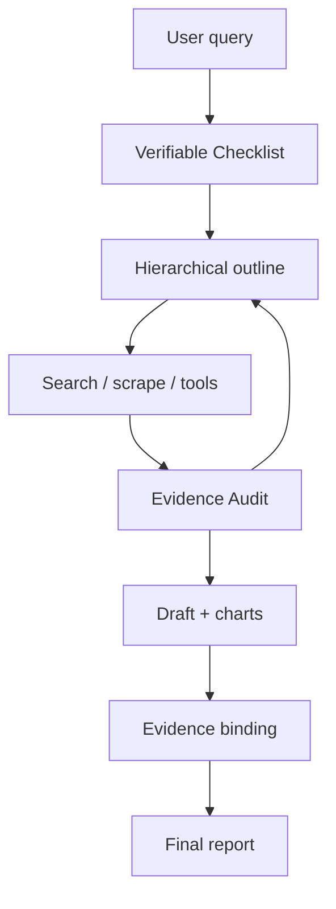
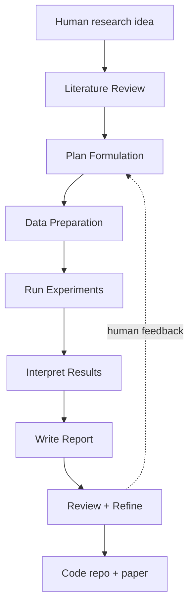
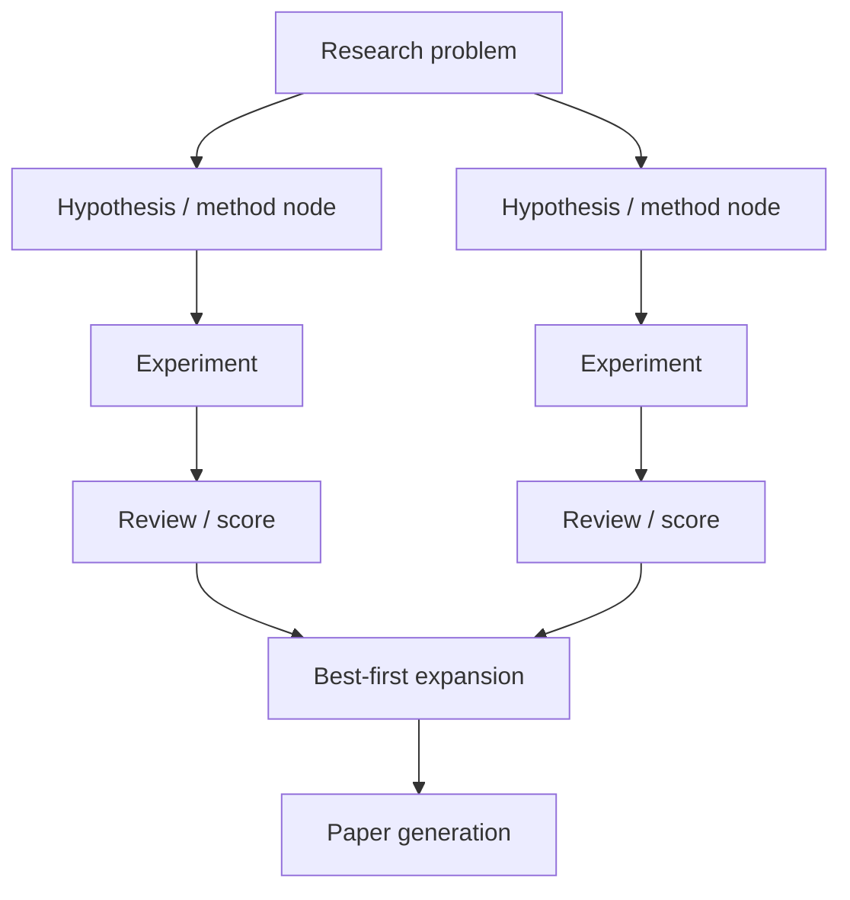
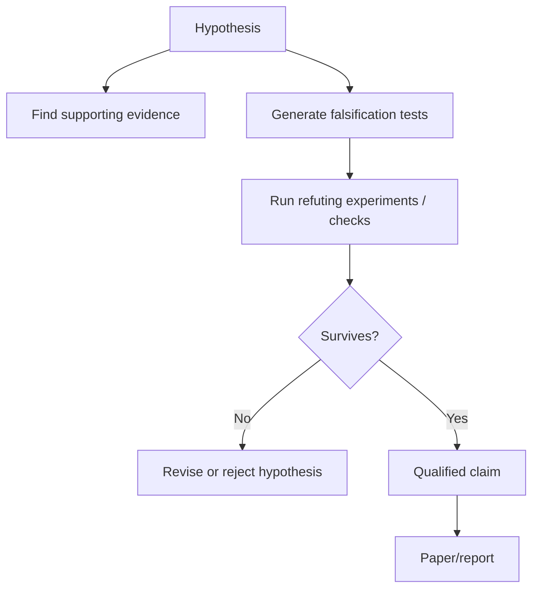
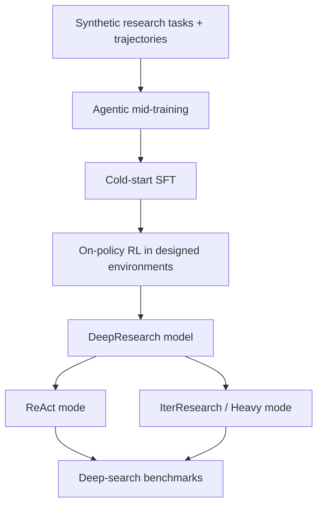
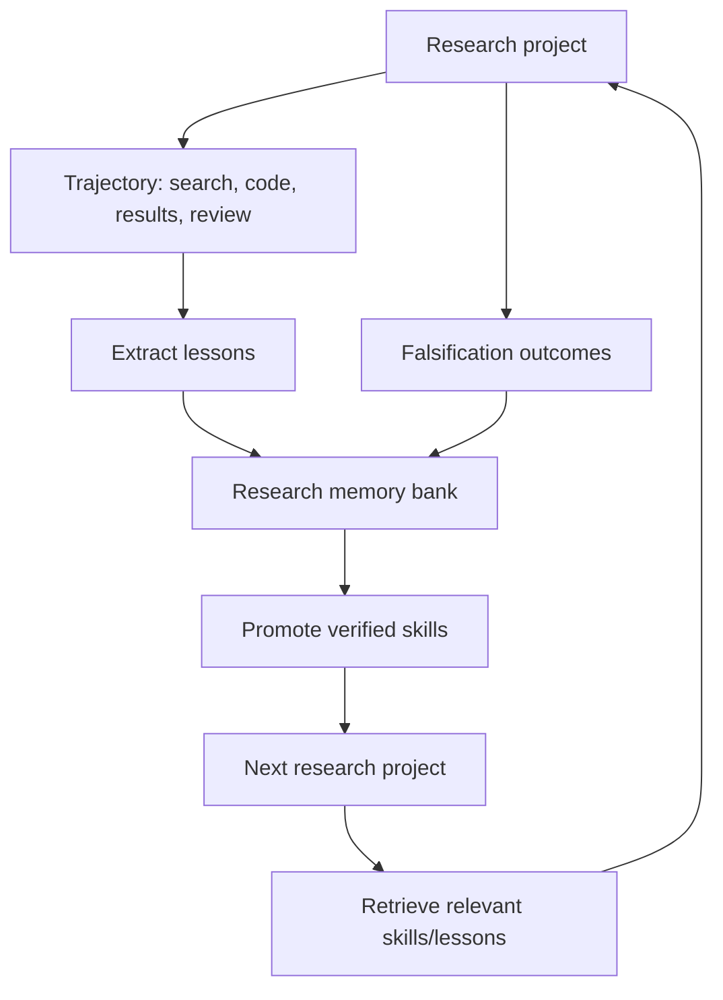
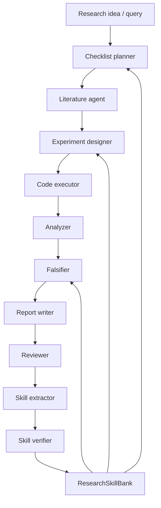

# 317 — AI Research Agents 2026: Deep Synthesis, Paper Atlas, Repo Landscape, and Next-Paper Ideas

**Scope.** One dense, interactive Markdown file synthesizing the supplied arXiv/OpenReview links, the local reference syntheses in `references/`, and additional high-impact papers/repos for **AI Research Agents**: Deep Research agents, automated scientific discovery, ML research agents, paper-writing agents, research-report evaluation, falsification, agentic science, research memory, and self-evolving research systems.

**Primary thesis.** AI Research Agents are converging on a four-layer stack: **Deep Research** (retrieve/synthesize/report), **Agentic Research** (hypothesize/design/critique), **Automated Experimentation** (code/run/analyze/iterate), and **Scientific Falsification** (actively refute claims). The first layer is now product-grade; the second is plausible; the third works mostly for ML-engineering/Kaggle-like tasks; the fourth is the biggest open gap.

---

## 0. Plan First

1. **Normalize the supplied links** into paper cards: title, venue/status, contribution, architecture, benchmark, headline numbers, and weaknesses.
2. **Separate research-agent capabilities by pipeline stage**: ideation, literature review, planning, experiment design, code, execution, analysis, report writing, peer review, falsification, and memory/continual learning.
3. **Compare against canonical systems**: AI Scientist v1/v2, Agent Laboratory, The Agentic Researcher, AgentRxiv, Co-Scientist, PaperQA2, GPT-Researcher, Tongyi DeepResearch, AIDE, MLGym, MLE-bench, ResearcherBench, DeepResearch-ReportEval, ReportBench, DeepResearch Bench, FML-bench.
4. **Add repo landscape** with high-star and research-relevant repositories: GPT-Researcher, PaperQA2, AI Scientist, AI Scientist v2, Agent Laboratory, The Agentic Researcher, Tongyi DeepResearch, MLGym, FML-bench, AutoResearch, OpenHands, MetaGPT, AutoGPT, RD-Agent, AIRA-dojo, ML-Master.
5. **Produce one dense file** with expandable `<details>` sections, comparison tables, a taxonomy, gap map, and concrete next-paper ideas.

---

## 1. TL;DR

- **The winning architecture is no longer a simple ReAct loop.** Strong AI Research Agents use an orchestrator plus specialist agents, explicit task/checklist state, tool-using search, code execution, report generation, citation grounding, and iterative critique; RhinoInsight makes this explicit with a Verifiable Checklist and Evidence Audit to reduce context rot and error accumulation [RhinoInsight](https://arxiv.org/abs/2511.18743).
- **Benchmarks are splitting by research depth.** DeepResearch-ReportEval evaluates reports across quality, redundancy, and factuality using 100 curated queries across 12 categories [Understanding DeepResearch via Reports](https://openreview.net/forum?id=LiZhqGZUsO); ResearcherBench tests frontier AI research questions across 65 questions and 35 AI subjects [ResearcherBench](https://openreview.net/forum?id=oj6A9hrNdL); MLGym tests 13 open-ended AI-research tasks and finds frontier models mostly tune hyperparameters rather than invent new algorithms [MLGym](https://openreview.net/forum?id=ryTr83DxRq); FML-bench targets 8 fundamental ML research problems and finds breadth of exploration beats narrow deep refinement [FML-bench](https://openreview.net/forum?id=h6BT8RhrNc).
- **Report writing is ahead of scientific falsification.** 42AI focuses on verifiable citations, chart integration, and multilingual paper authoring [42AI](https://openreview.net/forum?id=TM2j0oWC0Y), while "Falsify, Don't Just Discover" argues that automated discovery is not scientific unless agents explicitly automate falsification [Baby-AIGS](https://openreview.net/forum?id=gY0BOsPO0k).
- **The largest open research opportunity is memory + falsification + research skill reuse.** AgentRxiv shows collaborative autonomous labs can reuse prior agent papers [AgentRxiv](https://arxiv.org/html/2503.18102v1); ReasoningBank-style memory and the local memory synthesis suggest a missing substrate: durable **research skills** such as failed-experiment lessons, ablation templates, verifier scripts, falsification prompts, citation-check routines, and benchmark adapters.
- **Governance should measure action-sequence autonomy, not only model compute.** Osogami argues AI agents should be regulated by the extent of autonomous operation because inference-time planning/action sequences capture risks that training compute misses [AI Agents Should be Regulated Based on Autonomous Operations](https://openreview.net/forum?id=RyBZXCVr1k).

---

## 2. Unified Taxonomy of AI Research Agents

| Layer | What the agent does | Current strongest examples | Maturity | Main failure |
|---|---|---|---|---|
| **Deep Search** | Find facts across web/papers/tools | GPT-Researcher, PaperQA2, Gemini/OpenAI Deep Research, RhinoInsight, Tongyi DeepResearch | High | citation hallucination, source quality, context rot |
| **Deep Research Report** | Produce structured reports with citations/tables/charts | RhinoInsight, Tongyi DeepResearch, commercial DR systems, 42AI | Medium-high | factuality, redundancy, weak insight |
| **Research Copilot** | Human gives idea; agent does lit review, code, experiments, report | Agent Laboratory, The Agentic Researcher | Medium | autonomous quality below top-conference bar; automated reviewers over-score |
| **AI Scientist** | Agent generates ideas, runs experiments, writes papers, reviews itself | AI Scientist v1/v2 | Medium-low | novelty, hallucinated results, weak methodological rigor |
| **ML Research Agent** | Search over algorithms/experiments for ML tasks | MLGym, FML-bench agents, AIDE, RD-Agent, AIRA-dojo, ML-Master | Medium | hyperparameter search masquerades as invention |
| **Collaborative Research Society** | Multiple agents/labs share papers, knowledge, roles | AgentRxiv, Co-Scientist, Science-of-Science multi-agent demos | Early | memory consistency, duplicate work, evaluation attribution |
| **Falsification Agent** | Actively tries to refute hypotheses/results | Baby-AIGS | Very early | missing benchmarks and toolchains |
| **Governed Autonomous Research** | Measures autonomy, safety, action risk, human gates | Osogami position paper, AI Scientist safety incidents | Early | no standard autonomy metric |

### Pipeline Coverage

| Stage | Definition | Strong current systems | Weak spot |
|---|---|---|---|
| **Ideation** | Generate research questions and hypotheses | AI Scientist, Co-Scientist, ResearchAgent | feasibility and novelty |
| **Literature review** | Search, retrieve, summarize, synthesize prior work | PaperQA2, GPT-Researcher, RhinoInsight | citation verification |
| **Experiment design** | Choose methods, baselines, ablations, metrics | Agent Laboratory, Co-Scientist, AI Scientist v2 | methodological rigor |
| **Code generation** | Implement experiments | Agent Laboratory, The Agentic Researcher, AIDE, RD-Agent, AIRA-dojo | hidden leakage, brittle scripts |
| **Execution** | Run experiments, debug, collect results | MLGym, MLE-bench agents, Agent Laboratory, The Agentic Researcher | compute/time budgets |
| **Analysis** | Interpret results and decide next experiment | AI Scientist v2, RhinoInsight, Agent Laboratory | overclaiming |
| **Paper/report writing** | Draft report/manuscript with figures/citations | 42AI, RhinoInsight, AI Scientist, Agent Laboratory | hallucinated citations/results |
| **Peer review** | Critique outputs with rubric/reviewer agents | AI Scientist reviewer, Agent Laboratory reviewer agents | LLM judges over-score |
| **Falsification** | Attempt to refute claims and hypotheses | Baby-AIGS | almost empty field |
| **Memory/continual learning** | Reuse prior experiments, papers, failures, skills | AgentRxiv, ReasoningBank-like memory, Agent Laboratory + AgentRxiv | no standard research-skill memory |

---

## 3. Master Comparison Table — Supplied Primary Sources

| # | Paper | Status | Core contribution | Architecture / method | Benchmark / evidence | Research-agent relevance | Biggest weakness |
|---|---|---|---|---|---|---|---|
| 1 | [RhinoInsight](https://arxiv.org/abs/2511.18743) | arXiv 2025 | Control mechanisms for deep research: Verifiable Checklist + Evidence Audit | Plan/search/memory/draft/evidence/write pipeline with explicit state and evidence binding | Reports 50.92 on DeepResearch Bench RACE, 6.82 on DeepConsult, 68.9 on text-only GAIA in fetched text | Strong report-generation/control-plane design | Preprint; code not verified here |
| 2 | [Deep Research Agents: Systematic Examination and Roadmap](https://openreview.net/forum?id=FCRtTkjOvT) | TMLR rejected | Survey/taxonomy of DR agents | API vs browser search, static/dynamic workflow, planning strategies, single vs multi-agent | Critical benchmark discussion | Strong conceptual map despite rejection | Survey becomes stale quickly; rejected status |
| 3 | [AI Agents for Deep Scientific Research](https://openreview.net/forum?id=wODNrFtTT2) | UIUC workshop 2025 | Teaching-level survey of AI research agents | Narrative survey | Workshop submission | Useful educational snapshot | Not primary research |
| 4 | [Understanding DeepResearch via Reports](https://openreview.net/forum?id=LiZhqGZUsO) | ICLR 2026 submission | DeepResearch-ReportEval | Report evaluation across quality, redundancy, factuality using LLM-as-judge | 100 curated queries across 12 categories; evaluates 4 commercial systems | Strong output-level eval | LLM-as-judge validity and open-ended verification |
| 5 | [Environmental AI Research Priorities](https://openreview.net/forum?id=zhTwMZiW1j) | AFAA 2026 submission | Meta-analysis of environmental AI research priorities | Maps 106 Nature/Science papers, 2017–2024 | 73.6% forecasting, 19.8% monitoring/assessment, 6.6% mitigation | Useful meta-research domain case | Not an agent system |
| 6 | [AI-Driven Automation for Science of Science](https://openreview.net/forum?id=u0FB996GIH) | NeurIPS 2025 position | AI automation as next-era Science of Science substrate | Position + preliminary multi-agent research-society simulation | Conceptual/pilot | Connects research agents to SoS | Position paper, not benchmarked system |
| 7 | [MLGym](https://openreview.net/forum?id=ryTr83DxRq) | COLM 2025 | Gym framework and benchmark for AI research agents | 13 open-ended tasks across CV/NLP/RL/game theory; RL environment | Finds frontier models improve baselines mostly via hyperparameters, not novel algorithms | Core ML-research-agent benchmark | Frontier agents still weak on innovation |
| 8 | [FML-bench](https://openreview.net/forum?id=h6BT8RhrNc) | ICLR 2026 submission | Fundamental ML research benchmark | 8 diverse ML research problems; five complementary metrics | Broad exploration strategies outperform narrow deep exploration | Stronger scientific rigor than pure engineering benchmarks | Anonymous repo, limited public replication |
| 9 | [Regulate AI Agents by Autonomy](https://openreview.net/forum?id=RyBZXCVr1k) | NeurIPS 2025 position | Regulation based on autonomous operations/action sequences | Argues training/inference compute are insufficient proxies | Position argument | Important governance frame for research agents | No concrete metric suite yet |
| 10 | [EXAONE Deep](https://openreview.net/forum?id=XRlDtgUO7Y) / [PDF](https://arxiv.org/pdf/2503.12524v2) | CoRR 2025 | Reasoning-enhanced open models | Reasoning-specialized dataset with long thought processes | 2.4B/7.8B outperform comparable models; 32B competitive with open-weight models | Candidate backbone for research agents | Backbone paper, not an agent |
| 11 | [ResearcherBench](https://openreview.net/forum?id=oj6A9hrNdL) | ICLR 2026 submission | Benchmark for Deep AI Research Systems on frontier AI questions | 65 research questions, 35 AI subjects, technical/lit-review/open-consulting types | Rubric + factual assessment: faithfulness and groundedness | Direct benchmark for research insight quality | Small but high-quality dataset |
| 12 | [42AI](https://openreview.net/forum?id=TM2j0oWC0Y) | NLDL 2026 submission | Agentic paper authoring with verifiable citations and data integration | Citation management, chart integration, multilingual authoring | Concept/system proposal | Targets AI-written paper integrity | Needs strong empirical evaluation |
| 13 | [Falsify, Don't Just Discover / Baby-AIGS](https://openreview.net/forum?id=gY0BOsPO0k) | NeurIPS 2025 position | Automated falsification is required for scientific discovery | Reviews falsification stages; proposes Baby-AIGS proof of concept | Qualitative and quantitative studies claimed | Most important underexplored stage | Early PoC, needs benchmark standard |

---

## 4. Canonical Systems and Repos

| System / repo | Role | Reported status / stars from fetched sources | Why it matters | Main caveat |
|---|---|---:|---|---|
| [karpathy/autoresearch](https://github.com/karpathy/autoResearch) | autonomous LLM research experiments | search result reports 74,925 stars | Single-GPU overnight experiment iteration pattern | Star count should be rechecked before citation |
| [assafelovic/gpt-researcher](https://github.com/assafelovic/gpt-researcher) | web deep-research/report agent | local reference reports 26.8k stars | Most visible open-source deep-research report generator | Web provenance/SEO contamination |
| [Future-House/paper-qa](https://github.com/Future-House/paper-qa) | scientific literature RAG agent | fetched GitHub page reports 8,390 stars, Apache-2.0, latest release v2026.03.18 | Strong scientific QA/summarization/contradiction baseline | Literature access and metadata ambiguity |
| [SakanaAI/AI-Scientist](https://github.com/SakanaAI/AI-Scientist) | automated AI scientist v1 | local reference reports ~12.1k stars | First widely known end-to-end AI scientist pipeline | Safety incidents, templates, hallucinated papers |
| [SakanaAI/AI-Scientist-v2](https://github.com/SakanaAI/AI-Scientist-v2) | AI Scientist v2 | search result reports 5,721 stars | Agentic tree search and workshop-level automated discovery | Workshop acceptance is not full scientific validation |
| [SamuelSchmidgall/AgentLaboratory](https://github.com/SamuelSchmidgall/AgentLaboratory) | research copilot/lab pipeline | search result reports 5,465 stars | Human idea → lit review → experiments → report + code | Human reviewers rate autonomous outputs below top-conf bar |
| [ZIB-IOL/The-Agentic-Researcher](https://github.com/ZIB-IOL/The-Agentic-Researcher) | sandboxed AI-assisted research harness for math/ML | GitHub page reports 40 stars; paper arXiv:2603.15914 | Turns CLI coding agents into research associates inside Docker/Podman/Apptainer sandboxes, with GPU support, structured commandments, `report.tex`, `TODO.md`, and multi-node Slurm dispatch | Small repo; more practical framework than benchmarked discovery model |
| [Alibaba-NLP/DeepResearch](https://github.com/Alibaba-NLP/DeepResearch) | open-source deep-research agent/model family | GitHub page reports 18.9k stars; tech report arXiv:2510.24701 | Tongyi DeepResearch is a 30.5B total / 3.3B active agentic model trained with synthetic data, agentic mid-training, and RL for long-horizon information seeking; ships model/framework/evaluation code | Primarily deep information seeking, not full experiment-running AI scientist |
| [DCI-Agent/DCI-Agent-Lite](https://github.com/DCI-Agent/DCI-Agent-Lite) / [DCI paper](https://arxiv.org/abs/2605.05242) | direct-corpus deep-research agent | GitHub page reports 123 stars; paper reports strong BRIGHT/BEIR/BrowseComp-Plus results | Replaces fixed retriever APIs with raw-corpus terminal interaction (`rg`, file reads, scripts), giving agents high-resolution evidence access without embeddings or offline indexing | Great for local corpora; slower and more tool-policy-dependent than prebuilt retrieval |
| [Memento](https://arxiv.org/abs/2508.16153) | memory-based continual-learning deep-research agent | paper reports GAIA validation 87.88% Pass@3 and 79.40% test | Formalizes a Memory-Augmented MDP and case-based reasoning policy over an episodic Case Bank, enabling online adaptation without fine-tuning the base LLM | Retrieval/curation policy can swamp as case bank grows |
| [Darwin Gödel Machine](https://arxiv.org/abs/2505.22954) | self-improving coding-agent evolution | paper reports SWE-bench 20.0%→50.0% and Polyglot 14.2%→30.7% | Agents modify their own code, empirically validate changes, and keep an archive of diverse agent variants for open-ended exploration | Safety and eval misspecification risks grow with recursive self-modification |
| [Anthropic context engineering](https://www.anthropic.com/engineering/effective-context-engineering-for-ai-agents) | production context-engineering guidance | Anthropic engineering article, Sep 2025 | Frames context as finite attention budget; recommends just-in-time retrieval, compaction, structured notes/memory, and subagents for long-horizon work | Guidance article, not benchmarked system |
| [Dive into Claude Code](https://arxiv.org/abs/2604.14228) | source-level design-space analysis of Claude Code | arXiv 2026 | Extracts production design principles: permission modes, compaction, MCP/plugins/skills/hooks, subagents, append-oriented session storage | Depends on public-source analysis of a proprietary system |
| [OpenDev](https://arxiv.org/abs/2603.05344) | terminal-native coding-agent architecture | arXiv 2026 | Rust CLI coding agent with dual-agent planning/execution, model routing, lazy tool discovery, adaptive compaction, cross-session memory, event reminders, and defense-in-depth safety | Coding-agent focused, not research-discovery benchmark |
| [ruvnet/ruflo](https://github.com/ruvnet/ruflo) | Claude Code multi-agent orchestration/swarm platform | GitHub page reports 49.5k stars | Adds swarms, MCP/hooks/daemon, federated comms, self-learning memory, RAG/GraphRAG plugins, and 98-agent production install path around Claude Code | Very large surface area; repo-reported claims need independent validation |
| [everything-claude-code](https://github.com/affaan-m/everything-claude-code) | harness performance/config/skills corpus | GitHub page reports 180k stars; README reports 140k+ stars and 208 skills | Practical corpus of skills, instincts, memory optimization, security scanning, continuous learning, hooks, rules, MCP configs, and cross-harness packaging | Community/system corpus rather than single evaluated method |
| [Self-Improving Agent Skills](https://github.com/Shubhamsaboo/awesome-llm-apps/tree/main/awesome_agent_skills/self-improving-agent-skills) | multi-agent skill optimizer app | awesome-llm-apps subproject | Uses Google ADK + Gemini with Executor/Analyst/Mutator agents to test, diagnose, mutate, and keep/revert skill changes based on eval score | Optimizes skill prompts, not full research-agent policy |
| [facebookresearch/MLGym](https://github.com/facebookresearch/MLGym) | ML research agent benchmark | search result reports 592 stars | First Gym-style RL environment for ML research agents | Frontier agents still mostly tune hyperparameters |
| [qrzou/FML-bench](https://github.com/qrzou/FML-bench) | fundamental ML benchmark | search result reports 21 stars | Tests scientific exploration breadth on fundamental ML tasks | Early benchmark |
| [wecoai/aideml](https://github.com/wecoai/aideml) | ML engineering agent | cited in local reference | Strong MLE-bench/Kaggle-style solver lineage | Not full research loop |
| [microsoft/RD-Agent](https://github.com/microsoft/RD-Agent) | R&D / ML research engineering | local reference | Strong ML research engineering pipeline | Needs external benchmark scrutiny |
| [facebookresearch/aira-dojo](https://github.com/facebookresearch/aira-dojo) | ML research dojo/search policies | local reference | Search operators for ML-research experimentation | Long-horizon compute cost |
| [geekan/MetaGPT](https://github.com/geekan/MetaGPT) | multi-agent SOP framework | local reference reports large-star class | Strong orchestration substrate for research-agent teams | General framework, not research-specific |
| [Significant-Gravitas/AutoGPT](https://github.com/Significant-Gravitas/AutoGPT) | early autonomous agent | local reference reports very high-star class | Historical baseline for autonomous tool agents | Too general, old memory/tooling assumptions |
| [All-Hands-AI/OpenHands](https://github.com/All-Hands-AI/OpenHands) | coding/SWE agent | local reference | Useful experiment execution/coding substrate | Not a scientific researcher by itself |

---

## 5. Architecture Patterns

### Pattern A — Linear Deep Research Pipeline


**Used by:** early deep-research products, GPT-Researcher-like systems.  
**Weakness:** error accumulation and context rot, the exact failure RhinoInsight targets [RhinoInsight](https://arxiv.org/abs/2511.18743).

### Pattern B — Controlled Research Pipeline



**Used by:** RhinoInsight.  
**Key idea:** make goals checkable and evidence traceable before writing [RhinoInsight](https://arxiv.org/abs/2511.18743).

### Pattern C — Research Copilot Lab



**Used by:** Agent Laboratory, which outputs a code repository and report from a human-provided idea and supports co-pilot checkpoints [Agent Laboratory paper page](http://hf.co/papers/2501.04227).

### Pattern D — Agentic Tree Search Scientist



**Used by:** AI Scientist v2-style systems.  
**Strength:** broader exploration than one-shot pipelines.  
**Weakness:** tree search can optimize local benchmark artifacts rather than scientific novelty.

### Pattern E — Falsification-Centered Research Agent



**Used by:** Baby-AIGS direction.  
**Research gap:** almost every AI Scientist system has support/evidence generation; very few have robust falsification [Baby-AIGS](https://openreview.net/forum?id=gY0BOsPO0k).

### Pattern F — Sandboxed Research Associate Harness

```mermaid
flowchart TD
  Idea[Research idea + constraints] --> Setup[/setup_research_plan]
  Setup --> Instr[CLAUDE.md / GEMINI.md / AGENTS.md]
  Instr --> Box[Sandboxed container]
  Box --> Agent[CLI coding agent]
  Agent --> Experiments[GPU / CPU experiments]
  Experiments --> Report[report.tex]
  Experiments --> Todo[TODO.md]
  Report --> Review[Human PI review]
  Todo --> Agent
  Review --> Instr
```

**Used by:** The Agentic Researcher [GitHub](https://github.com/ZIB-IOL/The-Agentic-Researcher) / [paper](https://arxiv.org/abs/2603.15914).  
**Key idea:** keep the human as principal investigator while delegating long-running implementation, training, monitoring, and report-updating loops to a sandboxed CLI agent.  
**Why it matters:** this is a practical harness pattern for math/ML labs: filesystem isolation, GPU passthrough, Docker/Podman/Apptainer support, multi-node Slurm dispatch, and structured research commandments.

### Pattern G — Trained Deep Information-Seeking Model



**Used by:** Tongyi DeepResearch [GitHub](https://github.com/Alibaba-NLP/DeepResearch) / [technical report](https://arxiv.org/abs/2510.24701).  
**Key idea:** internalize deep-research behavior into the model through agentic mid-training, synthetic trajectory generation, and environment-coupled RL, while keeping inference compatible with ReAct and heavier test-time search.  
**Why it matters:** unlike prompt-only report agents, it treats deep research as a trained agentic capability and open-sources model/framework/evaluation artifacts.

---

## 6. Benchmark Landscape

| Benchmark | Focus | Size / scope | What it catches | What it misses |
|---|---|---|---|---|
| [DeepResearch-ReportEval](https://openreview.net/forum?id=LiZhqGZUsO) | report quality | 100 queries × 12 categories | quality, redundancy, factuality in reports | true experimental discovery |
| [ResearcherBench](https://openreview.net/forum?id=oj6A9hrNdL) | frontier AI research insight | 65 questions × 35 AI subjects | open consulting, literature insight, factuality/groundedness | large-scale experiment execution |
| [MLGym](https://openreview.net/forum?id=ryTr83DxRq) | ML research agent environment | 13 open-ended tasks | whether agents create novel ML ideas or only tune baselines | broader science domains |
| [FML-bench](https://openreview.net/forum?id=h6BT8RhrNc) | fundamental ML research | 8 fundamental problems | exploration breadth vs depth | early public replication |
| DeepResearch Bench | PhD-level DR reports | 100 PhD-level tasks across 22 fields per search result | report quality + citation count/accuracy | not always code/execution |
| ReportBench | academic survey tasks | arXiv survey-paper-derived tasks | citation/relevance/faithfulness | may reward survey-style writing |
| MLE-bench | ML competition/Kaggle-like tasks | 75 competitions in common references | real ML engineering performance | scientific novelty |
| MLAgentBench | ML experimentation | 13 tasks in common references | agent iteration over experiments | not full paper lifecycle |
| ScienceAgentBench | data-driven science | 102 tasks from 44 publications in local reference | science workflow QA | not full autonomous discovery |
| RE-Bench / LAB-Bench / DiscoveryBench | research and lab evaluation | varied | specialized research abilities | fragmented coverage |

**Key benchmark lesson:** no single benchmark jointly measures **ideation novelty**, **experimental rigor**, **citation faithfulness**, **code execution**, **report quality**, **memory reuse**, and **falsification**.

---

## 7. Deep Comparison: Research-Agent Capabilities

| Capability | Mature? | Best examples | Main evidence | Next research need |
|---|---:|---|---|---|
| Web/literature retrieval | High | PaperQA2, GPT-Researcher, commercial DR, RhinoInsight, DCI-Agent-Lite | PaperQA2 repo and scientific RAG focus [PaperQA2](https://github.com/Future-House/paper-qa); DCI shows raw-corpus tool interaction can beat fixed retriever interfaces [DCI](https://arxiv.org/abs/2605.05242) | citation provenance under adversarial sources |
| Report generation | Medium-high | RhinoInsight, 42AI, commercial DR | report-eval benchmarks [DeepResearch-ReportEval](https://openreview.net/forum?id=LiZhqGZUsO) | fine-grained claim verification |
| Research ideation | Medium-low | AI Scientist, Co-Scientist, ResearchAgent | local synthesis; MLGym says frontier models lack novel hypotheses [MLGym](https://openreview.net/forum?id=ryTr83DxRq) | feasibility + novelty metrics |
| Experiment design | Medium | Agent Laboratory, Co-Scientist | Agent Laboratory phases and human eval [Agent Laboratory](http://hf.co/papers/2501.04227) | baseline/ablation correctness |
| Code + execution | Medium | Agent Laboratory, AIDE, RD-Agent, OpenHands | Agent Laboratory mle-solver results [Agent Laboratory](http://hf.co/papers/2501.04227) | leakage-safe execution |
| Analysis and iteration | Medium | AI Scientist v2, FML-bench broad exploration | FML-bench breadth finding [FML-bench](https://openreview.net/forum?id=h6BT8RhrNc) | search policies with scientific priors |
| Sandboxed long-running research | Medium | The Agentic Researcher | Runs CLI agents inside isolated containers with GPU/HPC support and structured research instructions [The Agentic Researcher](https://arxiv.org/abs/2603.15914) | security guarantees and scientific verification still need human PI review |
| Trained deep information seeking | Medium-high | Tongyi DeepResearch | 30.5B total / 3.3B active model with agentic mid-training + RL and reported SOTA on deep-search benchmarks [Tongyi DeepResearch](https://arxiv.org/abs/2510.24701) | information seeking is not the same as full experiment-driven discovery |
| Peer review | Low-medium | AI Scientist reviewer, Agent Laboratory reviewers | Agent Laboratory automated reviewers overestimated vs humans [Agent Laboratory](http://hf.co/papers/2501.04227) | calibrated reviewer agents |
| Falsification | Very low | Baby-AIGS | falsification position [Baby-AIGS](https://openreview.net/forum?id=gY0BOsPO0k) | falsification benchmarks/toolchains |
| Continual research memory | Medium-low | AgentRxiv, Memento, ReasoningBank-like memory | AgentRxiv collaborative preprint reuse [AgentRxiv](https://arxiv.org/html/2503.18102v1); Memento uses case-based memory and M-MDP for online adaptation [Memento](https://arxiv.org/abs/2508.16153) | research-skill libraries and case-bank curation |
| Self-improving agent design | Early | Darwin Gödel Machine, self-improving-agent-skills | DGM evolves coding agents by self-modifying code and validating on benchmarks [DGM](https://arxiv.org/abs/2505.22954); ADK skill optimizer mutates SKILL.md artifacts with Executor/Analyst/Mutator roles [Self-Improving Agent Skills](https://github.com/Shubhamsaboo/awesome-llm-apps/tree/main/awesome_agent_skills/self-improving-agent-skills) | safety, eval hacking, and runaway artifact drift |
| Governance/autonomy | Low | Osogami position | action-sequence autonomy [Osogami](https://openreview.net/forum?id=RyBZXCVr1k) | standard autonomy risk score |

---

## 8. What Current AI Research Agents Get Wrong

1. **They confuse plausible writing with discovery.** A well-written report is not a valid scientific result unless claims survive evidence checks and falsification.
2. **They overfit to engineering benchmarks.** MLE-bench-like tasks reward working code and leaderboard improvement; they do not measure new theory or robust scientific insight.
3. **They under-measure novelty.** LLM judges and reviewer agents often reward fluency, coherence, and apparent significance.
4. **They lack durable research memory.** Most agents do not carry forward failed experiments, negative results, ablation templates, or benchmark harnesses as reusable artifacts.
5. **They lack falsification loops.** Baby-AIGS is early evidence that this should be a first-class stage [Baby-AIGS](https://openreview.net/forum?id=gY0BOsPO0k).
6. **They lack calibrated self-review.** Agent Laboratory reports automated reviewers overestimate outputs compared with human reviewers [Agent Laboratory](http://hf.co/papers/2501.04227).
7. **They lack safety metrics based on autonomy.** Osogami's position suggests action sequences better capture agent risk than training compute [Autonomy Regulation](https://openreview.net/forum?id=RyBZXCVr1k).

---

## 9. Research Memory for AI Research Agents

The three local reference syntheses point to the same missing substrate: **research memory**.

| Memory artifact | Example | Why it matters |
|---|---|---|
| **Research checklist** | "For benchmark papers, always include leakage analysis, task diversity, metric validity, human baseline" | prevents recurring methodological omissions |
| **Failed experiment memory** | "Prompt-only novelty scoring correlates poorly with human novelty" | avoids repeating bad paths |
| **Ablation template** | "No memory / no verifier / no search / no human checkpoint / no falsifier" | standardizes empirical rigor |
| **Citation verifier skill** | claim → source span → citation consistency | reduces hallucinated citations |
| **Benchmark adapter** | wrappers for MLGym, FML-bench, ResearcherBench, ReportEval | makes cross-paper comparison feasible |
| **Falsification recipe** | generate counterexamples, stress tests, negative controls | turns discovery into science |
| **Reviewer memory** | common reviewer objections and rebuttal evidence | improves paper iteration |
| **Research-skill library** | reusable code/tools/checklists/protocols | bridges AgentRxiv, ReasoningBank, and skill memory |

### Proposed memory loop



This is the whitespace between AgentRxiv, ReasoningBank, A-Mem/Mem0-style memory, and AI Scientist-style autonomous experimentation.

---

## 10. Next-Paper Ideas

### Idea 1 — ResearchSkillBank

**Thesis:** AI Research Agents improve more reliably when prior research trajectories are distilled into typed, verifiable research skills rather than raw papers or chat logs.

**Core artifacts:** literature-review pattern, experiment template, ablation template, citation verifier, falsification recipe, debugging patch, benchmark adapter.

**Evaluate on:** ResearcherBench, MLGym, FML-bench, DeepResearch-ReportEval.

### Idea 2 — FalsificationBench for AI Research Agents

**Thesis:** Current AI Scientist systems can propose and support claims but cannot systematically refute them.

**Task design:** each task gives a plausible hypothesis and asks the agent to design/run refuting tests.

**Baselines:** AI Scientist-style reviewer, Agent Laboratory reviewer, RhinoInsight evidence audit, Baby-AIGS-style falsifier.

### Idea 3 — Checklist-Controlled Deep Research

**Thesis:** RhinoInsight's Verifiable Checklist should be persistent and reusable across projects.

**Contribution:** a memory-augmented checklist compiler that retrieves prior checklists and adapts them to new topics.

**Metric:** fewer unsupported claims, better ReportEval factuality, higher ResearcherBench rubric scores.

### Idea 4 — Calibrated Research Reviewer Agents

**Thesis:** LLM reviewers systematically over-score AI-generated papers; calibration against human reviews reduces false confidence.

**Contribution:** train/calibrate reviewer agents with human-review residuals.

**Metric:** correlation with human reviewers, accepted/rejected prediction, overclaim detection.

### Idea 5 — Negative Results Memory for Automated Science

**Thesis:** Research agents need durable memory of failed experiments, not only successful methods.

**Contribution:** store negative results with trigger conditions and retrieve them during ideation/planning.

**Metric:** repeated-failure reduction, exploration diversity, better falsification performance.

### Idea 6 — Action-Sequence Autonomy Score

**Thesis:** Agent risk can be measured by the length, reversibility, and consequence level of autonomous action sequences.

**Contribution:** operationalize Osogami's autonomy-regulation proposal into a measurable score.

**Metric:** correlation with human risk ratings and incident classes.

### Idea 7 — Breadth-vs-Depth Search Policy for ML Research

**Thesis:** FML-bench suggests broad exploration beats narrow refinement; learn a policy that chooses breadth/depth based on task uncertainty.

**Contribution:** tree-search controller with diversity constraints.

**Metric:** FML-bench, MLGym, MLE-bench; track novelty and improvement.

### Idea 8 — Citation-Grounded Paper Authoring Agent

**Thesis:** Paper-writing agents should bind every claim to source spans and refuse unsupported claims.

**Contribution:** combine 42AI-style citation verification with RhinoInsight evidence audit.

**Metric:** citation precision/recall, hallucinated-citation rate, ReportBench faithfulness.

### Idea 9 — Collaborative Agent Lab with Shared Preprint Memory

**Thesis:** AgentRxiv-style collaboration improves when agents share structured, queryable research artifacts rather than whole papers.

**Contribution:** shared knowledge base with result cards, method cards, failure cards, and falsification cards.

**Metric:** cumulative improvement across agent generations, duplicate-work reduction.

### Idea 10 — DeepResearch Agent Security Benchmark

**Thesis:** Deep research agents are vulnerable to SEO spam, citation injection, malicious PDFs, and poisoned repos.

**Contribution:** benchmark for adversarial research sources.

**Metric:** source trust calibration, poison block rate, unsupported claim rate.

---

## 11. Recommended Strongest Paper Direction

### Title

**ResearchSkillBank: Verifiable Research-Skill Memory for Self-Evolving AI Research Agents**

### Core claim

AI Research Agents fail because they treat each project as isolated. A durable research-skill memory can store verified lessons, negative results, benchmark adapters, ablation recipes, citation-verification routines, and falsification templates, enabling agents to improve across research projects without unsafe weight updates.

### System



### Memory schema

```yaml
ResearchSkill:
  id: string
  type: literature_review | experiment_design | ablation | citation_check | falsification | debugging | benchmark_adapter | reviewer_objection
  domain: ai_research | biology | chemistry | climate | general
  trigger: "When to retrieve this skill"
  procedure: "Step-by-step reusable method"
  evidence:
    source_project: string
    source_span: string
    result_delta: string
  verifier:
    test_command: string?
    human_reviewed: boolean
    citation_grounded: boolean
  failure_modes:
    - string
  valid_until: date?
```

### Experiments

| Experiment | Dataset | Compare against |
|---|---|---|
| Report quality | DeepResearch-ReportEval | RhinoInsight-style no-memory baseline |
| Research insight | ResearcherBench | commercial DR / static report agent |
| ML experimentation | MLGym + FML-bench | Agent Laboratory / AIDE-like baseline |
| Falsification | new FalsificationBench | reviewer-only agent |
| Citation grounding | ReportBench / 42AI-style tasks | citation-free report writer |
| Continual improvement | AgentRxiv-style multi-generation setup | whole-paper retrieval vs typed skill memory |

### Ablations

1. no research memory,
2. raw paper memory only,
3. no negative results,
4. no falsification skills,
5. no citation verifier,
6. no human-review calibration,
7. no breadth/diversity search.

### Expected contribution

This paper would unify the strongest open threads: RhinoInsight control, AgentRxiv cumulative research, ReasoningBank-style experience memory, AI Scientist/Agent Laboratory execution, and Baby-AIGS falsification.

---

## 12. Reading Order

1. **Start with surveys/evals:** [Deep Research Agents roadmap](https://openreview.net/forum?id=FCRtTkjOvT), [DeepResearch-ReportEval](https://openreview.net/forum?id=LiZhqGZUsO), [ResearcherBench](https://openreview.net/forum?id=oj6A9hrNdL).
2. **Then research execution:** [MLGym](https://openreview.net/forum?id=ryTr83DxRq), [FML-bench](https://openreview.net/forum?id=h6BT8RhrNc), Agent Laboratory [HF paper page](http://hf.co/papers/2501.04227), [The Agentic Researcher](https://arxiv.org/abs/2603.15914).
3. **Then open deep-search models/repos:** [Tongyi DeepResearch](https://arxiv.org/abs/2510.24701), [Alibaba-NLP/DeepResearch](https://github.com/Alibaba-NLP/DeepResearch).
4. **Then retrieval/context interface:** [DCI](https://arxiv.org/abs/2605.05242), [DCI-Agent-Lite](https://github.com/DCI-Agent/DCI-Agent-Lite), [Anthropic context engineering](https://www.anthropic.com/engineering/effective-context-engineering-for-ai-agents).
5. **Then coding-agent harness architecture:** [Dive into Claude Code](https://arxiv.org/abs/2604.14228), [OpenDev](https://arxiv.org/abs/2603.05344), [everything-claude-code](https://github.com/affaan-m/everything-claude-code).
6. **Then control/report writing:** [RhinoInsight](https://arxiv.org/abs/2511.18743), [42AI](https://openreview.net/forum?id=TM2j0oWC0Y).
7. **Then falsification/governance:** [Baby-AIGS](https://openreview.net/forum?id=gY0BOsPO0k), [Autonomy regulation](https://openreview.net/forum?id=RyBZXCVr1k).
8. **Then memory/self-evolution:** `references/LLM Agent Memory Systems...`, `references/Experience-Driven Lifelong Learning...`, [Memento](https://arxiv.org/abs/2508.16153), [Darwin Gödel Machine](https://arxiv.org/abs/2505.22954), [AgentRxiv](https://arxiv.org/html/2503.18102v1), [PaperQA2](https://github.com/Future-House/paper-qa).

---

## 13. Sources

- [RhinoInsight: Improving Deep Research through Control Mechanisms for Model Behavior and Context](https://arxiv.org/abs/2511.18743)
- [Deep Research Agents: A Systematic Examination And Roadmap](https://openreview.net/forum?id=FCRtTkjOvT)
- [AI Agents for Deep Scientific Research](https://openreview.net/forum?id=wODNrFtTT2)
- [Understanding DeepResearch via Reports / DeepResearch-ReportEval](https://openreview.net/forum?id=LiZhqGZUsO)
- [Environmental AI Research Priorities](https://openreview.net/forum?id=zhTwMZiW1j)
- [AI-Driven Automation Can Become the Foundation of Next-Era Science of Science Research](https://openreview.net/forum?id=u0FB996GIH)
- [MLGym: A New Framework and Benchmark for Advancing AI Research Agents](https://openreview.net/forum?id=ryTr83DxRq)
- [FML-bench: A Benchmark for Automatic ML Research Agents](https://openreview.net/forum?id=h6BT8RhrNc)
- [AI Agents Should be Regulated Based on Autonomous Operations](https://openreview.net/forum?id=RyBZXCVr1k)
- [EXAONE Deep](https://openreview.net/forum?id=XRlDtgUO7Y)
- [EXAONE Deep PDF](https://arxiv.org/pdf/2503.12524v2)
- [ResearcherBench](https://openreview.net/forum?id=oj6A9hrNdL)
- [42AI: Agentic AI for Enhanced Research Paper Authoring](https://openreview.net/forum?id=TM2j0oWC0Y)
- [Falsify, Don't Just Discover / Baby-AIGS](https://openreview.net/forum?id=gY0BOsPO0k)
- [AgentRxiv](https://arxiv.org/html/2503.18102v1)
- [Agent Laboratory paper page](http://hf.co/papers/2501.04227)
- [The Agentic Researcher paper](https://arxiv.org/abs/2603.15914)
- [The Agentic Researcher GitHub](https://github.com/ZIB-IOL/The-Agentic-Researcher)
- [Tongyi DeepResearch Technical Report](https://arxiv.org/abs/2510.24701)
- [Alibaba-NLP/DeepResearch GitHub](https://github.com/Alibaba-NLP/DeepResearch)
- [DCI-Agent-Lite GitHub](https://github.com/DCI-Agent/DCI-Agent-Lite)
- [Beyond Semantic Similarity / Direct Corpus Interaction](https://arxiv.org/abs/2605.05242)
- [Memento: Fine-tuning LLM Agents without Fine-tuning LLMs](https://arxiv.org/abs/2508.16153)
- [Darwin Gödel Machine](https://arxiv.org/abs/2505.22954)
- [Effective context engineering for AI agents](https://www.anthropic.com/engineering/effective-context-engineering-for-ai-agents)
- [Dive into Claude Code](https://arxiv.org/abs/2604.14228)
- [OpenDev terminal coding-agent report](https://arxiv.org/abs/2603.05344)
- [Active Context Compression / Focus](https://arxiv.org/abs/2601.07190)
- [ruvnet/ruflo](https://github.com/ruvnet/ruflo)
- [everything-claude-code](https://github.com/affaan-m/everything-claude-code)
- [Self-Improving Agent Skills](https://github.com/Shubhamsaboo/awesome-llm-apps/tree/main/awesome_agent_skills/self-improving-agent-skills)
- [PaperQA2 GitHub](https://github.com/Future-House/paper-qa)
- [AI Scientist v2 arXiv page](https://arxiv.gg/abs/2504.08066)
- [ReportBench](https://arxiv.org/abs/2508.15804)
- [Deep Research Agents arXiv mirror](https://arxiv.gg/abs/2506.18096)

