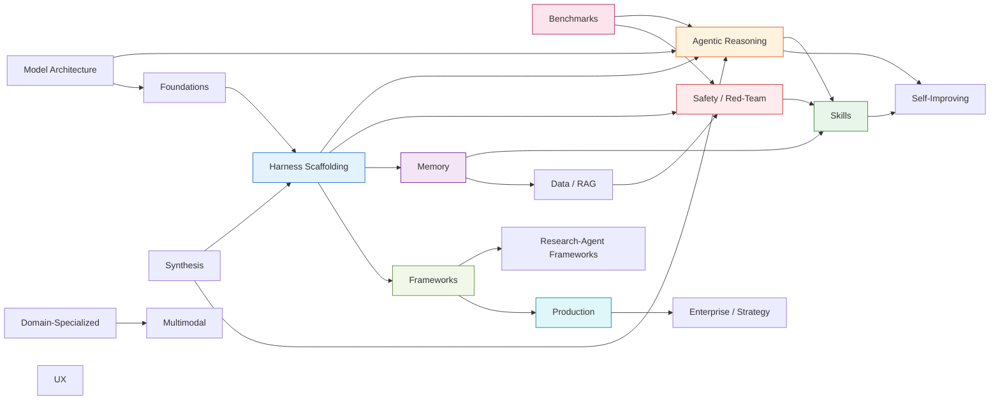

# Knowledge Graph — Harness Engineering & Agentic AI Research Collection

Built 2026-05-08 from 180 deep-dive docs in `docs/`. 
**799 edges** across **18 clusters** with a controlled vocabulary of 11 relationship types.

## Layer 1 — Cluster overview

Edges in the diagram are directional dependencies ("X informs Y"). The graph in `knowledge-graph.json` has the precise per-doc edges.

## Layer 2 — Docs per cluster

### Harness Scaffolding — 29 docs

| ID | Title | TLDR |
|----|-------|------|
| 01 | [Agent Loop Architecture](docs/01-agent-loop-architecture.md) | Core control structure for LLM agents: model generates actions, harness executes, results feed back into context until terminat... |
| 02 | [Subagent Delegation](docs/02-subagent-delegation.md) | Orchestrator agent spawns isolated worker agents with their own context and tools, merges distilled outputs. |
| 03 | [Plan Mode](docs/03-plan-mode.md) | Read-only phase before execution where agent produces explicit plan artifact approved by user before mutations. |
| 04 | [Skills](docs/04-skills.md) | Model-invocable capability packages loaded on-demand into context with allowed-tools list. |
| 05 | [Hooks](docs/05-hooks.md) | Deterministic shell/HTTP/LLM/agent commands executing at harness events for enforcement and injection. |
| 06 | [Permission Modes](docs/06-permission-modes.md) | Named postures (Plan, Default, acceptEdits, bypass) controlling which tools auto-run, prompt, or block. |
| 08 | [Context Compaction](docs/08-context-compaction.md) | Summarize long transcripts at threshold to prevent context rot while keeping recent turns raw. |
| 09 | [Memory Files](docs/09-memory-files.md) | Durable, human-editable files (CLAUDE.md, memory/) persisting knowledge across sessions. |
| 10 | [Multi-Session Continuity](docs/10-multi-session-continuity.md) | Initializer + coder loop with STATE.md handoffs allowing long-running tasks across sessions. |
| 12 | [Todo / Scratchpad State](docs/12-todo-scratchpad-state.md) | Agent-maintained structured task list with one-at-a-time in-progress tracking to anchor planning. |
| 40 | [Harness Engineering Principles](docs/40-harness-engineering-principles.md) | Three signal patterns from Claude Code leak: state-management loop, memory persistence daemon, opinionated tools. |
| 43 | [Twelve Harness Patterns](docs/43-twelve-harness-patterns.md) | Pattern catalog: 5 memory/context, 3 workflow, 3 tools/permissions, 1 automation lifecycle. |
| 44 | [Four Pillars of Harness Engineering](docs/44-four-pillars-harness-engineering.md) | State Management, Context Architecture, Deterministic Guardrails, Entropy Management. |
| 46 | [Six Components of a Coding Agent](docs/46-components-of-coding-agent.md) | Live repo context, prompt caching, typed tools, context reduction, structured memory, bounded subagents. |
| 53 | [Chaos Engineering for Agents](docs/53-chaos-engineering-next-era.md) | Chaos engineering for agents as next frontier after harness engineering, addressing reliability at scale. |
| 54 | [SemaClaw General-Purpose Agent](docs/54-semaclaw-general-purpose-agent.md) | Multi-agent framework with DAG orchestration, PermissionBridge safety, three-tier context, agentic wiki. |
| 67 | [Recommended Breakthrough — Gnomon](docs/67-recommended-breakthrough-project.md) | Proposed harness IR with harness-aware failure classifier and chaos substrate to unify SEA reward signals. |
| 71 | [Karpathy Skills](docs/71-karpathy-skills-single-file-guardrails.md) | 60-line CLAUDE.md with 4 behavioral principles (Think/Simplicity/Surgical/Goal-Driven). |
| 83 | [SemaClaw Deep](docs/83-semaclaw-deep.md) | Paper-grounded deep-dive on SemaClaw event-facade, DAG Teams, hybrid BM25+vector search. |
| 102 | [ClawGym](docs/102-clawgym-scalable-claw-agents.md) | Lifecycle for Claw-style agents: task synthesis, resource generation, hybrid verification, RL training. |
| 108 | [Memento Codebase MCP](docs/108-memento-codebase-mcp.md) | Reference implementation: planner-executor loop, MCP tool servers, modular interpreters. |
| 111 | [Prompt Engineering as Discipline](docs/111-prompt-engineering-as-discipline.md) | Four subproblems: template design, few-shot selection, reasoning elicitation, optimization loops. |
| 112 | [Constrained Decoding](docs/112-constrained-decoding.md) | Logits masking by grammar constraints guarantees structurally valid output. |
| 115 | [Evaluating LLM Systems](docs/115-evaluating-llm-systems.md) | Four eval disciplines: offline, online, human, trajectory. Eval sets are the most important artifact. |
| 155 | [Feynman Multi-Agent Research Harness](docs/155-feynman-multi-agent-research-harness.md) | MIT-licensed harness: 4 subagents × 19 skills, source-grounded outputs, file-based handoffs. |
| 161 | [Paper-Researcher-AI-Agent (CrewAI)](docs/161-paper-researcher-ai-agent.md) | Minimal 100-line CrewAI deep-research MVP: Researcher → Writer pipeline. |
| 163 | [DeerFlow 2.0 Revisited](docs/163-deer-flow-revisited-may-2026.md) | Ground-up rewrite to super-agent harness: LangGraph gateway, 6 IM channels, MCP+OAuth, Docker/K8s sandboxes. |
| 164 | [CrewAI Multi-Agent Framework](docs/164-crewai-multi-agent-framework.md) | Lean Python multi-agent framework: Crews (autonomy) + Flows (control); zero LangChain dependency. |
| 165 | [Ralph Autonomous Loop](docs/165-ralph-autonomous-loop.md) | 150-line bash loop spawning fresh AI instances; memory via git history + progress.txt + prd.json. |

### Agentic Reasoning — 27 docs

| ID | Title | TLDR |
|----|-------|------|
| 11 | [Verifier / Evaluator Loops](docs/11-verifier-evaluator-loops.md) | Separate generator + evaluator agents with different prompts to break self-bias in output scoring. |
| 13 | [ReAct](docs/13-react.md) | Prompting paradigm alternating Thought-Action-Observation cycles with structured tool call grammars. |
| 14 | [Reflexion](docs/14-reflexion.md) | Post-episode self-reflection loop writing verbal lessons appended to episodic memory for next episodes. |
| 15 | [Tree of Thoughts & LATS](docs/15-tree-of-thoughts-lats.md) | Explore multiple reasoning paths with value function and prune vs. backtrack for hard problems. |
| 16 | [Plan-and-Solve](docs/16-plan-and-solve.md) | Two-phase: plan generates explicit subtask list, then executor handles each step using plan as scaffold. |
| 17 | [ReWOO](docs/17-rewoo.md) | Plan with symbolic placeholders, execute all tool calls in parallel, solve once over all evidence. |
| 18 | [Chain-of-Verification & Self-Refine](docs/18-chain-of-verification-self-refine.md) | Self-critique loop: generate → feedback → refine or verify via sub-questions answered independently. |
| 25 | [Agentic RAG with Self-Critique](docs/25-agentic-rag.md) | Agent decides retrieval timing/source/retry with relevance grading and citation verification. |
| 37 | [Neuro-Symbolic AI](docs/37-neuro-symbolic-ai.md) | Hybrid systems pairing neural perception with explicit symbolic reasoning for reliability and explainability. |
| 39 | [AI and Mathematics Structure](docs/39-ai-and-mathematics-structure.md) | Program for AI-driven mathematics discovery via universal proof/structural hypergraphs with formal verification. |
| 47 | [Adaptation of Agentic AI Survey](docs/47-adaptation-of-agentic-ai-survey.md) | Four-paradigm taxonomy for post-training adaptation: agent-side vs tool-side, execution-signaled vs output-signaled. |
| 50 | [METCL: Metaphor Reasoning](docs/50-metcl-metaphor-reasoning.md) | Neuro-symbolic typicality-based compositional logic for metaphor identification and generation. |
| 51 | [ReBalance](docs/51-rebalance-efficient-reasoning.md) | Training-free framework that controls thinking depth via real-time confidence to avoid over/underthinking. |
| 77 | [Meta TTS Agentic Coding](docs/77-meta-tts-agentic-coding.md) | Test-time scaling via trajectory summary + Recursive Tournament Voting + Parallel-Distill-Refine. |
| 79 | [Skill-RAG](docs/79-skill-rag.md) | Adaptive RAG with hidden-state prober and prompt-based skill router for failure diagnosis. |
| 80 | [KnowRL](docs/80-knowrl.md) | Process-level factuality reward via atomic-fact verification combined with format/correctness in GRPO. |
| 84 | [SWE-Search MCTS](docs/84-swe-search-mcts.md) | Intra-attempt MCTS over agent action trees with Value Agent and Discriminator: +23% on SWE-Bench Lite. |
| 85 | [AlphaEvolve](docs/85-alphaevolve.md) | Gemini-orchestrated evolutionary search with MAP-Elites, 4×4 complex matmul in 48 mults, datacenter wins. |
| 86 | [FrugalGPT](docs/86-frugalgpt.md) | LLM cascade: prompt adaptation + completion cache + cost-threshold early exit, 98% cost cut at parity. |
| 87 | [RouteLLM](docs/87-routellm.md) | Binary router on Chatbot Arena preferences predicts P(win_strong\|q): 75% cost cut at PGR 50%. |
| 88 | [Confidence-Driven Router](docs/88-confidence-driven-router.md) | Semantic-entropy router via bidirectional NLI clustering, calibration-based escalation without preferences. |
| 90 | [Reflexion Deep](docs/90-reflexion-deep.md) | Verbal reinforcement: Actor → Evaluator → Self-Reflection into episodic memory, 91% HumanEval pass@1. |
| 103 | [Eywa](docs/103-eywa-heterogeneous-fm-collaboration.md) | Framework where LLMs coordinate non-LLM foundation models (Chronos, TabPFN) via Tsaheylu bond. |
| 114 | [Workflows vs Agents](docs/114-workflows-vs-agents.md) | Workflows are deterministic graphs; agents make dynamic choices. Tradeoffs: predictability vs breadth. |
| 121 | [Multi-Agent Coordination Patterns](docs/121-multi-agent-coordination-patterns.md) | Six patterns: hierarchical, blackboard, contract-net, peer-mesh, pipeline, supervisor. |
| 142 | [Trajectory Simulation Agents](docs/142-trajectory-simulation-agents.md) | LLM proposes hypotheses, simulator evaluates, agent synthesizes: turns what-if into grounded forecast. |
| 162 | [Paper2Agent](docs/162-paper2agent-reimagining-papers-as-agents.md) | Transforms papers into MCP agents via 5-step pipeline: tutorials → execution → tools → MCP → agent. ~$15/paper. |

### Frameworks — 21 docs

| ID | Title | TLDR |
|----|-------|------|
| 07 | [Model Context Protocol](docs/07-model-context-protocol.md) | Open JSON-RPC standard for agent harnesses to connect tools, resources, and prompts from MCP servers. |
| 20 | [MetaGPT Role-Based Workflows](docs/20-metagpt-role-based-workflows.md) | Multi-agent SDLC with PM/Architect/Engineer/QA roles exchanging structured artifacts via SOPs. |
| 29 | [Dive Into Claude Code](docs/29-dive-into-claude-code.md) | Reverse-engineered audit of Claude Code naming 13 principles from 5 values (decision authority, safety, reliability). |
| 42 | [LangChain Deep Agents](docs/42-langchain-deep-agents.md) | LangChain harness with built-in planning tool, virtual filesystem, subagent delegation, async subagents. |
| 52 | [Dive Into OpenClaw](docs/52-dive-into-open-claw.md) | MIT-licensed self-hosted personal AI agent framework with Gateway and pluggable Agent Harness. |
| 60 | [Top SEA GitHub Repos](docs/60-sea-top-github-repos.md) | 8 production SEA implementations including Hermes, DSPy, Voyager with architecture analysis. |
| 61 | [Archon Harness Builder](docs/61-archon-harness-builder.md) | YAML-first workflow engine with DAG nodes, worktree isolation, declarative meta-harness. |
| 62 | [Everything Claude Code](docs/62-everything-claude-code.md) | Community config bundle with 116+ skills, 48+ agents, 79+ commands, AgentShield security auditor. |
| 63 | [RAGFlow](docs/63-ragflow-agent-patterns.md) | Apache-licensed document-to-structure RAG engine with cyclic graph runtime, DeepDoc vision, MCP. |
| 64 | [LobeHub](docs/64-lobehub-ai-framework.md) | Next.js monolith with multi-agent teams, MCP marketplace, skill library, 50+ model providers. |
| 65 | [DeerFlow ByteDance](docs/65-deer-flow-bytedance.md) | Two-version framework: v1 deterministic research pipeline, v2 lead-agent + dynamic-subagent with sandboxes. |
| 66 | [Meta-Harness Landscape](docs/66-meta-harness-landscape.md) | Classification of meta-harness frameworks along Declarative/Programmatic and Aware/Agnostic axes. |
| 73 | [Multica Managed-Agents Platform](docs/73-multica-managed-agents-platform.md) | Vendor-neutral agent abstraction with PostgreSQL + pgvector skill storage and local daemon. |
| 75 | [gstack Garry Tan Setup](docs/75-gstack-garry-tan-claude-code-setup.md) | Production Claude Code config with 23 specialist skills in 7-phase sprint. |
| 91 | [MetaGPT Deep](docs/91-metagpt-deep.md) | SDLC SOPs as multi-agent message routing with pub/sub pool: 3.75 executability vs ChatDev 2.25. |
| 92 | [ChatDev](docs/92-chatdev.md) | Chat-chain waterfall SDLC with dyadic subtasks, communicative dehallucination: 0.3953 quality score. |
| 93 | [DSPy](docs/93-dspy.md) | Programming model: declarative signatures + composable modules + teleprompter optimizers compiling prompts. |
| 126 | [Frameworks Comparison 2026](docs/126-frameworks-comparison.md) | Seven major frameworks: LangGraph, Semantic Kernel, AutoGen, CrewAI, OpenAI SDK, DSPy, Llama-Index/Haystack. |
| 144 | [Build Your Own Harness](docs/144-build-your-own-harness.md) | Four scenarios justify building: regulatory, novel pattern, vertical specialization, scale leverage. |
| 145 | [Comparing Coding Harnesses 2026](docs/145-comparing-coding-harnesses.md) | Nine harnesses across nine axes: Claude Code, Cursor, Cline, Devin, Aider, Continue, Windsurf, Cody, Replit. |
| 176 | [OSS Skill Landscape May 2026](docs/176-skill-discovery-curator-oss-landscape-may-2026.md) | Agent Skills standard adopted by 26+ platforms; 130K refs, MCP servers (21.6K), marketplaces. |

### Skills — 15 docs

| ID | Title | TLDR |
|----|-------|------|
| 68 | [Atomic Skills Scaling Coding Agents](docs/68-atomic-skills-scaling-coding-agents.md) | Coding decomposition into 5 atomic skills with joint RL and 10K-concurrent sandboxes. |
| 89 | [Voyager Deep](docs/89-voyager-deep.md) | Black-box GPT-4 Minecraft agent: automatic curriculum + iterative code prompting + vector skill library. |
| 154 | [Ctx2Skill](docs/154-ctx2skill-self-evolving-context-skills.md) | Self-evolving multi-agent framework discovering context skills via 5-role adversarial self-play + Cross-Time Replay. |
| 156 | [HeavySkill](docs/156-heavyskill-parallel-reasoning-deliberation.md) | Parallel reasoning + sequential deliberation as portable Markdown skill; RLVR-internalisable. |
| 167 | [AutoSkill](docs/167-autoskill-experience-driven-lifelong-learning.md) | Training-free lifelong learning: dialogue patterns into versioned SKILL.md; hybrid retrieval. |
| 168 | [EvoSkill](docs/168-evoskill-coding-agent-skill-discovery.md) | Failure-driven skill discovery with Pareto frontier; three-agent loop; +7-12pp gains on frozen model. |
| 169 | [CoEvoSkills](docs/169-coevoskills-co-evolutionary-verification.md) | Co-evolution: Skill Generator + information-isolated Surrogate Verifier; beats human-curated by 17.6pp. |
| 170 | [SkillRL](docs/170-skillrl-recursive-skill-augmented-rl.md) | Co-trains policy and skill library during RL; three-tier SkillBank; 10-20% context compression. |
| 171 | [Skill Self-Evolution 2026 Synthesis](docs/171-skill-self-evolution-2026-synthesis.md) | Four corners of skill design space: AutoSkill / EvoSkill / CoEvoSkills / SkillRL. |
| 173 | [Offline-Sim Skill Discovery](docs/173-offline-sim-skill-discovery.md) | Offline simulators between ground-truth and surrogate verifier; API-relationship GNN drives task generation. |
| 174 | [EXIF Autonomous Skill Exploration](docs/174-autonomous-skill-exploration-iterative-feedback.md) | EXIF: exploration agent (Alice) + target agent (Bob) with iterative feedback; same-model self-evolution. |
| 177 | [Strongest 2026 Skills Techniques](docs/177-skills-discovery-curator-strongest-2026-techniques.md) | Five convergence commitments: skills are files, evolution beats one-shot, curator non-optional, metadata activates, online beat... |
| 178 | [Online Skill Discovery](docs/178-online-skill-discovery-and-curation-on-the-go.md) | Runtime skill extraction: live execution feedback, marketplace hot-load, dialogue extraction. |
| 179 | [Skill Retrieval, Routing, Activation](docs/179-skill-retrieval-routing-and-activation.md) | Progressive disclosure works to ~50 skills; SkillRouter achieves 74% Hit@1 on 80K registry. |
| 180 | [Argus Skill-Loading Agent](docs/180-argus-skill-router-agent-design.md) | Specialized agent for skill activation across 22K+ catalogs: layered routing + 5 duties. |

### Memory — 11 docs

| ID | Title | TLDR |
|----|-------|------|
| 72 | [Claude-Mem](docs/72-claude-mem-persistent-memory-compression.md) | Persistent memory compression: 5 hooks, Worker Service API, 3-layer progressive disclosure. |
| 81 | [ReasoningBank + MaTTS](docs/81-reasoningbank.md) | Test-time memory framework distilling trajectories into reasoning items with Memory-Aware TTS. |
| 100 | [Contextual Memory Is a Memo](docs/100-contextual-memory-is-a-memo.md) | Formal proof retrieval-only memory needs Ω(k²) examples vs Ω(d) for parametric; existing systems are C-engineering. |
| 106 | [Memento Theory](docs/106-memento-paper-theory.md) | Memory-augmented MDP framework where agents improve via case-bank rewriting and learned retrieval. |
| 107 | [Memento CBR Memory](docs/107-memento-cbr-memory.md) | Case-based reasoning memory with dual-encoder retriever and K=4 sweet spot. |
| 109 | [Memento Results](docs/109-memento-results-and-harness.md) | Top-1 GAIA validation with frozen LLM and K=4 ablation showing CBR memory works within C-engineering bounds. |
| 130 | [Distributed SQL as Agent Memory](docs/130-distributed-sql-as-agent-memory.md) | Distributed SQL unifies relational state, vectors, temporal reasoning, multi-agent consistency. |
| 131 | [Temporal Bitemporal Tables](docs/131-temporal-bitemporal-tables.md) | Track valid time and transaction time separately; answer what-we-knew-when questions. |
| 151 | [MEMTIER I: Why Flat Memory Breaks at 72h](docs/151-memtier-why-flat-memory-breaks-at-72-hours.md) | Tripartite memory architecture; measures 14pp degradation across 72-hour operations. |
| 152 | [MEMTIER II: 3-Tier Architecture](docs/152-memtier-3-tier-architecture-and-retrieval.md) | Episodic/semantic/procedural memory tiers, two-stage scoping, five-signal linear scoring. |
| 153 | [MEMTIER III: LLM Distillation & Invariance](docs/153-memtier-llm-distillation-and-the-three-invariants.md) | 164× distillation reduction; three-layer invariance shows BM25 retrieval is the binding ceiling. |

### Benchmarks & Evaluation — 10 docs

| ID | Title | TLDR |
|----|-------|------|
| 21 | [LLM-as-Judge & Trajectory Evaluation](docs/21-llm-as-judge-trajectory-eval.md) | LLM scores outputs on multiple dimensions; trajectory eval grades the path not just the destination. |
| 26 | [LinuxArena: Production Agent Safety](docs/26-linuxarena-production-agent-safety.md) | Benchmark on live multi-service Linux envs with 1671 tasks + 184 adversarial sabotage tasks. |
| 27 | [HORIZON: Long-Horizon Degradation Diagnosis](docs/27-horizon-long-horizon-degradation.md) | Trajectory-grounded LLM-as-Judge attributes failures to categories (context-forget, plan-divergence, etc). |
| 34 | [ClawBench: Live Web Tasks](docs/34-clawbench-live-web-tasks.md) | 153 tasks on 144 live production websites with submission interception; 33.3% success rate for Claude Sonnet. |
| 38 | [Claw-Eval](docs/38-claw-eval.md) | Multi-channel (execution trace, audit log, env snapshot) evaluation on 2159 rubrics per task. |
| 69 | [Agent-World Training Arena](docs/69-agent-world-self-evolving-training-arena.md) | Self-evolving training arena: 1,978 environments + 19,822 tools mined from MCP servers and web. |
| 95 | [OSWorld](docs/95-osworld.md) | 369-task real OS benchmark (Ubuntu/Windows) with execution-based scoring: best 12% vs human 72%. |
| 96 | [GDPval](docs/96-gdpval.md) | 1,320 tasks × 44 occupations × 9 GDP sectors with pairwise human-vs-AI judgment. |
| 97 | [Qwen2.5-Math PRM](docs/97-qwen-prm.md) | PRM lessons: LLM-as-judge step labels harm process F1; consensus-filtered MC+LLM is the recipe. |
| 101 | [AutoResearchBench](docs/101-autoresearchbench.md) | Benchmark for AI agents on scientific paper discovery: 1000 tasks across precise identification and exhaustive set retrieval. |

### Safety & Red-Teaming — 10 docs

| ID | Title | TLDR |
|----|-------|------|
| 22 | [Guardrails & Prompt-Injection Defense](docs/22-guardrails-prompt-injection.md) | Pre/post-processing layers + instruction-boundary defenses + output validation blocking unsafe actions. |
| 23 | [Human-in-the-Loop Approval](docs/23-human-in-the-loop.md) | High-stakes actions routed through human approver before execution via sync/async HITL pattern. |
| 35 | [Malicious Intermediary Attacks](docs/35-malicious-intermediary-attacks.md) | Third-party LLM routers can intercept/modify prompts; four attack classes with defensive proxy (Mine). |
| 49 | [Agents of Chaos: Red-Teaming](docs/49-agents-of-chaos-red-teaming.md) | 84-page red-team study: 20 researchers, real capabilities, 11 failure categories from unauthorized compliance to false success. |
| 82 | [PoisonedRAG](docs/82-poisonedrag.md) | Knowledge corruption via crafted documents: 97% attack success with minimal poison budget. |
| 98 | [Diversity Collapse MAS](docs/98-diversity-collapse-mas.md) | Multi-agent ≠ multi-perspective: structural coupling collapses diversity; NGT/Subgroups/Vertical mitigations. |
| 122 | [Explainability & Compliance](docs/122-explainability-compliance.md) | Trajectory traces, decision records, policy enforcement, audit logs as baked-in patterns. |
| 123 | [Robustness & Fault Tolerance](docs/123-robustness-fault-tolerance.md) | Adaptive retry, circuit breaker, bulkhead, parallel consensus, graceful degradation. |
| 135 | [Trustworthy Generation](docs/135-trustworthy-generation.md) | Grounded generation, inline citation, faithfulness verification, refusal-on-unknown. |
| 175 | [Agent Skills Ecosystem & Security](docs/175-agent-skills-ecosystem-and-security.md) | 26.1% of community skills have vulnerabilities; four-tier trust framework (Untrusted/Scanned/Reviewed/Pinned). |

### Domain-Specialized — 9 docs

| ID | Title | TLDR |
|----|-------|------|
| 28 | [RadAgent: Agentic Radiology](docs/28-radagent-agentic-radiology.md) | Tool-using agent for stepwise CT interpretation with append-only trace and per-finding citations. |
| 30 | [GPT-Rosalind: Domain-Specialized Agents](docs/30-gpt-rosalind-domain-specialized.md) | Life-sciences specialist model with native database interfaces and workflow post-training. |
| 33 | [dnaHNet: Genomic Foundation Model](docs/33-dnahnet-genomic-foundation.md) | Hierarchical tokenizer-free DNA model with dynamic chunking as specialized tool for agent composition. |
| 48 | [VoiceAgentRAG: Dual-Agent Voice](docs/48-voiceagentrag-dual-agent.md) | Slow Thinker predicts topics + prefetches RAG; Fast Talker serves sub-millisecond semantic cache. |
| 74 | [Kronos Financial FM](docs/74-kronos-foundation-model-financial-markets.md) | First open-source FM for financial K-line data with hierarchical tokenizer. |
| 138 | [Text-to-SQL Agents](docs/138-text-to-sql-agents.md) | Schema-aware retrieval, constrained generation, query repair, safety wrapping. |
| 139 | [OCR Document Agents](docs/139-ocr-document-agents.md) | Pipeline of Tesseract, LayoutLM, vision LLMs with type-based routing and human-in-loop fallback. |
| 141 | [E-Commerce / Marketing Agents](docs/141-e-commerce-marketing-agents.md) | Classical ML for personalization volume; LLM for conversational and generation; hybrid by necessity. |
| 149 | [Sector Use-Case Catalog](docs/149-sector-use-case-catalog.md) | Per-sector dominant patterns: healthcare, finance, legal, customer support, manufacturing, education. |

### Model Architecture — 8 docs

| ID | Title | TLDR |
|----|-------|------|
| 31 | [GLM-5](docs/31-glm-5-agentic-engineering.md) | Model trained with async RL on agent trajectories for long-horizon tool-integrated software tasks. |
| 32 | [Recurrent-Depth Transformers](docs/32-recurrent-depth-implicit-reasoning.md) | Iterate transformer layers multiple times over same tokens for multi-hop reasoning without CoT. |
| 78 | [Neural Garbage Collection](docs/78-ngc-neural-garbage-collection.md) | RL-trained KV-cache eviction policy with reasoning, 2-4× compression at parity. |
| 94 | [EAGLE-3](docs/94-eagle3-spec-decoding.md) | Lossless speculative decoding via training-time test removing feature prediction: ~6× Llama 70B speedup. |
| 104 | [GLM-5V-Turbo](docs/104-glm-5v-turbo-native-multimodal-agents.md) | Frontier multimodal agent FM with CogViT vision encoder and MMTP for native perception-action. |
| 105 | [Visual Generation Taxonomy](docs/105-agentic-world-modeling-visual-generation.md) | Five-level taxonomy from atomic generation to world-modeling with stress-tests exposing FID/CLIP limits. |
| 116 | [Adapter Tuning / LoRA](docs/116-adapter-tuning-lora-peft-for-agents.md) | PEFT: 0.1-3% parameters, high-leverage for narrow tasks. |
| 117 | [Small Language Models](docs/117-small-language-models.md) | 1-8B SLMs for narrow high-volume tasks via cascades; 30-100x cost reduction vs frontier. |

### Production & Reliability — 8 docs

| ID | Title | TLDR |
|----|-------|------|
| 24 | [Observability, Tracing & Cost Attribution](docs/24-observability-tracing.md) | OpenTelemetry spans + metrics (latency, tokens, cost) + logs with per-feature/user attribution. |
| 41 | [Product Control Plane](docs/41-product-control-plane.md) | Governance layer above models: Permissions, Handoffs, Visibility, Recovery for multi-agent systems. |
| 124 | [Agent-Level Production Patterns](docs/124-agent-level-production-patterns.md) | Cold start, warm-up, graceful shutdown, state checkpointing, idempotency, dead-letter. |
| 125 | [System-Level Production Patterns](docs/125-system-level-production-patterns.md) | Multi-tenancy, quotas, multi-region, blue/green, FinOps, observability, secrets, DR. |
| 127 | [Loan Processing Case Study](docs/127-loan-processing-multi-agent-case-study.md) | End-to-end multi-agent system with six specialists coordinated hierarchically. |
| 140 | [Traditional ML + GenAI Hybrid](docs/140-traditional-ml-genai-hybrid.md) | XGBoost for tabular, classical CV for vision, Prophet for time-series; LLM for unstructured. |
| 150 | [Temporal Durable Execution](docs/150-temporal-durable-execution-substrate.md) | Event-history replay preserves workflow state across failures, crashes, deploys for long-running agents. |
| 160 | [Deep Researcher Agent 24x7](docs/160-deep-researcher-agent-24x7.md) | Zero-cost monitoring, 5K-char constant-size memory, minimal-toolset workers: 500+ cycles at $0.08/cycle. |

### Self-Improving Agents — 8 docs

| ID | Title | TLDR |
|----|-------|------|
| 19 | [Voyager-Style Skill Libraries](docs/19-voyager-skill-libraries.md) | Agent learns by writing, verifying, and indexing executable skills that compose for subsequent tasks. |
| 36 | [Autogenesis: Self-Evolving Agents](docs/36-autogenesis-self-evolving-agents.md) | Protocol for agent self-improvement via versioned resources (RSPL) with propose-assess-commit-rollback (SEPL). |
| 45 | [Hyperagents: Self-Modification](docs/45-hyperagents-self-modification.md) | Task + meta agents unified in editable program; meta-level itself editable; population-based search. |
| 55 | [Hermes Agent](docs/55-hermes-agent-self-improving.md) | Self-improving agent converting workflows to skills with cache-aware memory and multi-channel gateway. |
| 56 | [SEA Landscape 2026](docs/56-sea-landscape-2026.md) | Self-Evolving Agents landscape across What/When/How/Where axes with 100+ system taxonomy. |
| 57 | [Autogenesis Revisited](docs/57-sea-arxiv-2604-15034.md) | Deep-dive on Autogenesis RSPL/SEPL for versioned resources and closed-loop self-evolution. |
| 58 | [SEA What/When/How/Where Survey](docs/58-sea-arxiv-2507-21046.md) | Large organizing survey with four-axis taxonomy and evaluation framework across 100+ systems. |
| 59 | [SEA Comprehensive Survey](docs/59-sea-arxiv-2508-07407.md) | Unified four-component framework (Inputs/Agent/Env/Optimizers) with MOP-MOA-MAO-MASE maturity curve. |

### Data / RAG — 6 docs

| ID | Title | TLDR |
|----|-------|------|
| 120 | [RAG to Fine-Tuning Spectrum](docs/120-rag-to-finetuning-spectrum.md) | Six positions from prompting to FT; RAG for knowledge gaps, PEFT for skill gaps. |
| 128 | [Knowledge Graphs as Substrate](docs/128-knowledge-graphs-as-substrate.md) | Typed entity-relationship graphs preserve relational structure where chunked text RAG loses it. |
| 129 | [KG + RAG Hybrid Retrieval](docs/129-kg-rag-hybrid-retrieval.md) | Combine vector similarity and graph traversal: 30-50% improvement on multi-hop reasoning. |
| 132 | [Vector + CDC Pipelines](docs/132-vector-cdc-pipelines.md) | Change data capture streams source updates to vector index for embedding freshness in seconds. |
| 133 | [Reranking for Agentic Retrieval](docs/133-reranking-for-agentic-retrieval.md) | Cross-encoder reranker promotes right answers from top-20 to top-2: 10-30% precision lift. |
| 134 | [Semantic Indexing](docs/134-semantic-indexing.md) | Hierarchy of indexes: chunked vector, sentence vector, summary, lexical, metadata, sparse. |

### Research-Agent Frameworks — 5 docs

| ID | Title | TLDR |
|----|-------|------|
| 157 | [May 2026 Synthesis: Memory + Skills](docs/157-may-2026-synthesis-memory-and-skills.md) | Memory and skills as two trainable substrates; retrieval architecture (not model scale) is binding ceiling. |
| 158 | [Deep Research Agents Survey (Huang)](docs/158-deep-research-agents-survey-huang-et-al.md) | Foundational taxonomy of DR agents: workflow type, planning, single/multi-agent, tuning. |
| 159 | [Deep Research Survey (Zhang)](docs/159-deep-research-survey-zhang-et-al.md) | Capability-centric four-stage pipeline: Planning → Question Developing → Web Exploration → Report Generation. |
| 166 | [Research-Agent Frameworks Synthesis](docs/166-research-agent-frameworks-synthesis.md) | Build-vs-buy-vs-fork decision tree across architecture (Huang) + capability (Zhang) + operational (160) dimensions. |
| 172 | [Polaris 2026 Roadmap](docs/172-polaris-2026-deep-research-roadmap.md) | Polaris wins on discipline (ClaimGate, typed federation) but behind on mechanics (not RL-trained). |

### Enterprise / Strategy — 4 docs

| ID | Title | TLDR |
|----|-------|------|
| 118 | [GenAI Maturity Models](docs/118-genai-maturity-models.md) | Five-stage ladder: experimentation, pilots, scaled, integrated, operational. |
| 119 | [Agent-Ready LLM Selection](docs/119-agent-ready-llm-selection.md) | Six-axis trade-off per subtask: capability, latency, cost, context, tool-use, deployment. |
| 146 | [Business Case & ROI](docs/146-business-case-roi.md) | Quantified costs, benefits, risk-adjusted returns, payback windows defend agentic-AI investments. |
| 147 | [Vendor Lock-In Avoidance](docs/147-vendor-lock-in.md) | Protocol-first design with model gateways, prompt variants, vector abstraction, MCP. |

### Foundations — 3 docs

| ID | Title | TLDR |
|----|-------|------|
| 110 | [Transformer Architecture for Agent Builders](docs/110-transformer-llm-architecture-for-agent-builders.md) | Minimum viable transformer knowledge for agent builders: attention, KV-cache, tokenization, decoding. |
| 113 | [From Tokens to Agents Onramp](docs/113-from-tokens-to-agents-onramp.md) | Gentle introduction: LLM as text engine, wrapped with goals/tools/loop/memory. |
| 148 | [Beginner Onramp](docs/148-beginner-onramp-what-is-agentic-ai.md) | Gentlest explanation of agentic AI for non-technical stakeholders. |

### Synthesis & Other — 3 docs

| ID | Title | TLDR |
|----|-------|------|
| 70 | [VoltAgent Awesome AI Agent Papers](docs/70-voltagent-awesome-ai-agent-papers.md) | Hand-curated weekly ledger of 363+ arXiv papers organized into 5 buckets. |
| 76 | [Ten-Link Synthesis](docs/76-ten-links-synthesis.md) | Synthesis of 10 April-2026 artifacts: 10 cross-cutting themes + 3 emergent stack patterns. |
| 99 | [Lyra Paper-Set Synthesis](docs/99-papers-deep-dive-synthesis.md) | Synthesis of 22 papers identifying 10 cross-cutting themes (TTS/Memory/Routing/Skills/RAG/MAS/Eval/SE/Econ/Decl). |

### Multimodal — 2 docs

| ID | Title | TLDR |
|----|-------|------|
| 136 | [Multimodal RAG](docs/136-multimodal-rag.md) | Index images, audio, video, documents by modality; cross-modal retrieval. |
| 137 | [Voice Agents](docs/137-voice-agents.md) | ASR → LLM → TTS in real-time; modular pipeline (1-3s) vs integrated (200-500ms). |

### UX & Strategy — 1 docs

| ID | Title | TLDR |
|----|-------|------|
| 143 | [UX Design for Agentic Systems](docs/143-ux-design-for-agentic-systems.md) | Progress disclosure, intervention affordances, cost transparency, trust calibration. |

## Layer 3 — Most-referenced docs

Highest in-degree — the canonical references that other docs build on.

| Rank | ID | Title | Refs in |
|------|----|-------|---------|
| 1 | 09 | Memory Files | 21 |
| 2 | 19 | Voyager-Style Skill Libraries | 19 |
| 3 | 02 | Subagent Delegation | 16 |
| 4 | 04 | Skills | 16 |
| 5 | 11 | Verifier / Evaluator Loops | 15 |
| 6 | 14 | Reflexion | 15 |
| 7 | 25 | Agentic RAG with Self-Critique | 14 |
| 8 | 06 | Permission Modes | 13 |
| 9 | 07 | Model Context Protocol | 13 |
| 10 | 01 | Agent Loop Architecture | 12 |
| 11 | 56 | SEA Landscape 2026 | 12 |
| 12 | 177 | Strongest 2026 Skills Techniques | 12 |
| 13 | 175 | Agent Skills Ecosystem & Security | 11 |
| 14 | 08 | Context Compaction | 10 |
| 15 | 21 | LLM-as-Judge & Trajectory Evaluation | 10 |
| 16 | 166 | Research-Agent Frameworks Synthesis | 10 |
| 17 | 171 | Skill Self-Evolution 2026 Synthesis | 10 |
| 18 | 16 | Plan-and-Solve | 9 |
| 19 | 26 | LinuxArena: Production Agent Safety | 9 |
| 20 | 05 | Hooks | 9 |

## Layer 4 — Bridge docs

Docs connecting the most clusters — the conceptual hubs where ideas cross over.

| Rank | ID | Title | Clusters touched |
|------|----|-------|------------------|
| 1 | 19 | Voyager-Style Skill Libraries | 9 |
| 2 | 56 | SEA Landscape 2026 | 8 |
| 3 | 76 | Ten-Link Synthesis | 8 |
| 4 | 99 | Lyra Paper-Set Synthesis | 8 |
| 5 | 157 | May 2026 Synthesis: Memory + Skills | 8 |
| 6 | 04 | Skills | 7 |
| 7 | 09 | Memory Files | 7 |
| 8 | 21 | LLM-as-Judge & Trajectory Evaluation | 7 |
| 9 | 25 | Agentic RAG with Self-Critique | 7 |
| 10 | 55 | Hermes Agent | 7 |
| 11 | 69 | Agent-World Training Arena | 7 |
| 12 | 71 | Karpathy Skills | 7 |
| 13 | 127 | Loan Processing Case Study | 7 |
| 14 | 151 | MEMTIER I: Why Flat Memory Breaks at 72h | 7 |
| 15 | 152 | MEMTIER II: 3-Tier Architecture | 7 |
| 16 | 154 | Ctx2Skill | 7 |
| 17 | 02 | Subagent Delegation | 6 |
| 18 | 07 | Model Context Protocol | 6 |
| 19 | 11 | Verifier / Evaluator Loops | 6 |
| 20 | 22 | Guardrails & Prompt-Injection Defense | 6 |

## Layer 5 — Top recurring entities (concepts, frameworks, papers)

Entities that appear across the most docs — the load-bearing names of the corpus.

| Entity | Type | Appearances | First seen |
|--------|------|-------------|------------|
| Anthropic | org | 18 | 01 |
| ClaudeCode | concept | 16 | 01 |
| GPT-4 | model | 11 | 01 |
| HotpotQA | benchmark | 8 | 129 |
| OpenAI | org | 8 | 01 |
| OpenClaw | framework | 8 | 102 |
| HumanEval | benchmark | 7 | 115 |
| MCP | framework | 7 | 07 |
| LangChain | framework | 6 | 126 |
| LangGraph | framework | 6 | 126 |
| Microsoft | org | 6 | 112 |
| Stanford | org | 6 | 126 |
| Claude Code | model | 5 | 104 |
| CrewAI | framework | 5 | 121 |
| DSPy | framework | 5 | 111 |
| SkillLibrary | concept | 5 | 19 |
| Tsinghua | org | 5 | 104 |
| AutoGen | framework | 4 | 02 |
| GSM8K | benchmark | 4 | 87 |
| Google | org | 4 | 13 |
| HybridRetrieval | concept | 4 | 120 |
| MT-Bench | benchmark | 4 | 115 |
| Memento | framework | 4 | 106 |
| ProgressiveDisclosure | concept | 4 | 04 |
| Voyager | framework | 4 | 178 |
| ByteDance | org | 3 | 163 |
| ClawBench | benchmark | 3 | 102 |
| Cursor | framework | 3 | 07 |
| Devin | framework | 3 | 01 |
| GAIA | benchmark | 3 | 101 |
| GPT-4o | model | 3 | 84 |
| LinuxArena | benchmark | 3 | 26 |
| LongMemEval-S | benchmark | 3 | 151 |
| MEMTIER | paper | 3 | 151 |
| MMLU | benchmark | 3 | 119 |
| Meta | org | 3 | 173 |
| MetaGPT | framework | 3 | 121 |
| NTU | org | 3 | 105 |
| NUS | org | 3 | 105 |
| Netflix | org | 3 | 123 |

## Layer 6 — Relationship vocabulary

| Edge type | Count | Meaning |
|-----------|-------|---------|
| `cites` | 427 | A references B as background |
| `complements` | 100 | A and B address the same problem from different angles |
| `uses` | 87 | A applies/depends on B as a building block |
| `part_of` | 59 | A is a chapter / component of B |
| `extends` | 40 | B builds on A, deepens or generalizes |
| `instance_of` | 29 | A is a concrete realization of pattern B |
| `motivates` | 16 | A surfaces a problem that B is designed to solve |
| `predecessor_of` | 15 | B follows A in time / capability |
| `defends_against` | 13 | A names a threat that B mitigates |
| `competes_with` | 7 | A and B are alternatives addressing the same niche |
| `evaluates` | 6 | A measures or benchmarks B |

## Layer 7 — Strongest cross-cluster flows

Where ideas migrate between clusters (top 25 directional pairs).

| From cluster | To cluster | Edge count |
|--------------|------------|------------|
| Frameworks | Harness Scaffolding | 47 |
| Harness Scaffolding | Agentic Reasoning | 18 |
| Harness Scaffolding | Frameworks | 17 |
| Agentic Reasoning | Harness Scaffolding | 11 |
| Skills | Safety & Red-Teaming | 11 |
| Research-Agent Frameworks | Harness Scaffolding | 10 |
| Model Architecture | Agentic Reasoning | 9 |
| Skills | Frameworks | 9 |
| Synthesis & Other | Agentic Reasoning | 9 |
| Self-Improving Agents | Agentic Reasoning | 8 |
| Skills | Harness Scaffolding | 7 |
| Memory | Harness Scaffolding | 7 |
| Harness Scaffolding | Memory | 7 |
| Harness Scaffolding | Research-Agent Frameworks | 7 |
| Skills | Memory | 7 |
| Harness Scaffolding | Self-Improving Agents | 6 |
| Agentic Reasoning | Self-Improving Agents | 6 |
| Safety & Red-Teaming | Harness Scaffolding | 6 |
| Production & Reliability | Harness Scaffolding | 6 |
| Self-Improving Agents | Harness Scaffolding | 6 |
| Benchmarks & Evaluation | Agentic Reasoning | 6 |
| Synthesis & Other | Frameworks | 6 |
| Skills | Self-Improving Agents | 6 |
| Frameworks | Skills | 6 |
| Harness Scaffolding | Safety & Red-Teaming | 5 |

## Layer 8 — How to use this graph

- **Reading paths**: pick a cluster from Layer 2 and follow `extends` / `complements` edges in `knowledge-graph.json`.
- **Bridge docs (Layer 4)**: read these first to understand cross-cluster connective tissue.
- **Most-cited docs (Layer 3)**: foundational references — most other docs assume these.
- **Strongest flows (Layer 7)**: tell you which clusters are tightly coupled (e.g., harness ↔ reasoning, memory ↔ skills).
- **Machine-readable**: `knowledge-graph.json` has `docs[]`, `edges[]`, `entity_index{}`, and `stats{}` for downstream tools (graph DBs, vector retrieval, agent reading queues).

## Build provenance

- Source corpus: `docs/` (180 numbered deep-dives, README index)
- Extraction: 4 parallel Explore agents, each handling 30-50 docs (top-of-file scan + cross-ref capture)
- Merge: `.kg-build/merge.py` normalizes edge types, dedupes, derives missing edges from `cross_refs`, and computes graph statistics
- Edge-type vocabulary chosen for analytic utility, not to capture every nuance — see Layer 6 for definitions
